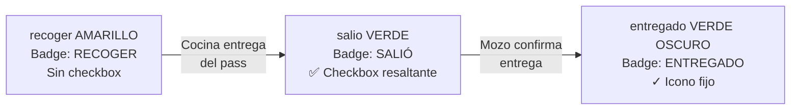
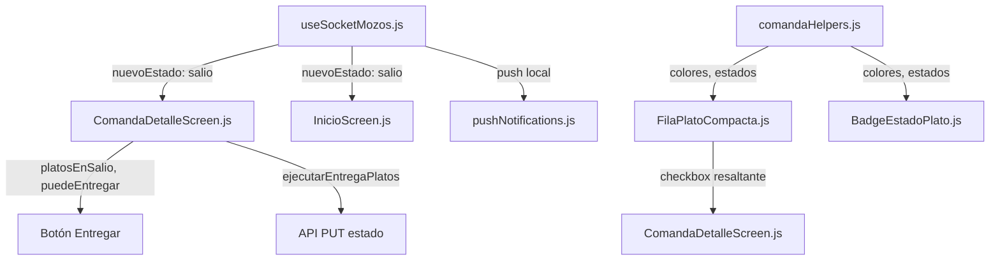

# Plan de Implementación SALIO — App Mozos

**Fecha:** Junio 2026  
**Versión:** 1.0  
**App:** Mozos (React Native + Expo)  
**Plan maestro:** [`../../docs/PLAN_FLUJO_SALIO_ENTREGA_PLATOS.md`](../../docs/PLAN_FLUJO_SALIO_ENTREGA_PLATOS.md)

---

## 1. Resumen ejecutivo

Hoy el mozo puede marcar un plato como "entregado" directamente desde el estado `recoger`, sin que cocina confirme la salida física del plato del pass. Eso mezcla la responsabilidad del cocinero (el plato salió de cocina) con la del mozo (el plato llegó al comensal).

La nueva responsabilidad del mozo es clara: **solo puede marcar como entregado un plato que ya esté en estado `salio`**, lo que significa que cocina confirmó que el plato salió del pass. El estado `recoger` se convierte en un **aviso informativo** — el mozo ve "RECOGER" en amarillo pero no puede seleccionar ni entregar ese plato.

### Antes y después

| Estado | Antes (app mozos) | Después (app mozos) |
|--------|-------------------|---------------------|
| `recoger` | Amarillo, checkbox habilitado, se puede entregar | Amarillo, **sin checkbox**, solo aviso "RECOGER" |
| `salio` (nuevo) | No existía | Verde, **checkbox resaltante**, se puede seleccionar y entregar |
| `entregado` | Verde claro | Verde oscuro/saturado, icono ✓ fijo |

---

## 2. Modelo de estados y responsabilidades

### 2.1 Estados relevantes para el mozo

| Estado | Quién lo asigna | Significado para el mozo | Interacción |
|--------|----------------|--------------------------|-------------|
| `recoger` | Cocina (Finalizar) | "El plato está listo, ve a recogerlo" | **Solo lectura** — aviso, sin checkbox |
| `salio` | Cocina (Entregar del pass) | "El plato ya salió de cocina, puedes entregarlo" | **Checkbox resaltante** — seleccionar y entregar |
| `entregado` | Mozo (Entregar) | "Confirmo que el plato llegó al comensal" | **Sin interacción** — icono ✓ fijo |

La transición `recoger → entregado` **ya no es posible**. El mozo solo puede hacer `salio → entregado`.

### 2.2 Flujo visual del mozo



### 2.3 Notificaciones

| Evento | Push actual | Push nuevo |
|--------|-------------|------------|
| Plato pasa a `recoger` | "Ceviche listo para recoger. Mesa 5" | Sin cambio |
| Plato pasa a `salio` | — | **"Ceviche salió de cocina. Mesa 5"** + haptic success |
| Plato pasa a `entregado` | — | Sin push (o confirmación opcional) |

---

## 3. Comportamiento detallado en ComandaDetalle

### 3.1 Estado `recoger` — Solo aviso

Cuando un plato está en `recoger`, el mozo ve:

- **Fondo amarillo** (`#FEF3C7` / dark `#D97706`) — colores actuales sin cambio.
- **Badge "RECOGER"** con icono informativo (🔔 campana o 🕐 reloj).
- **Sin checkbox**: la columna de acción muestra solo el badge, sin `TouchableOpacity` ni icono de check.
- **Sin interacción**: el mozo entiende que el plato está listo pero aún no salió de cocina; debe esperar la notificación "salió de cocina".

```javascript
// FilaPlatoCompacta.js — rama esSoloAviso (recoger)
<View style={styles.avisoContainer}>
  <MaterialCommunityIcons name="bell-outline" size={16} color="#F59E0B" />
  <View style={[styles.badge, { backgroundColor: '#F59E0B' }]}>
    <Text style={styles.badgeText}>RECOGER</Text>
  </View>
</View>
```

### 3.2 Estado `salio` — Checkbox resaltante

Cuando un plato pasa a `salio`, el mozo ve de inmediato el control de selección:

| Aspecto | Especificación |
|---------|----------------|
| **Fondo** | Verde claro (`#D1FAE5` / dark `rgba(16,185,129,0.3)`) |
| **Badge** | "SALIÓ" en verde `#10B981` |
| **Icono check** | **Siempre visible** en la columna de acción |
| **Tamaño del icono** | **26 px** (antes 20 px) — `checkbox-marked-circle` / `checkbox-blank-circle-outline` |
| **Sin seleccionar** | `checkbox-blank-circle-outline` color `#065F46` (verde oscuro) |
| **Seleccionado** | `checkbox-marked-circle` color `#10B981` (verde saturado) |
| **Área táctil** | `TouchableOpacity` cubre icono + badge, con `hitSlop` amplio |
| **Refuerzo visual** | Borde izquierdo más grueso (6 px) o halo verde suave (`rgba(16,185,129,0.12)`) alrededor del check para llamar la atención |
| **Al seleccionar** | Fila intensifica borde/fondo (borde `#065F46`, tinte más saturado) |

```javascript
// FilaPlatoCompacta.js — rama esSalio (salio)
<TouchableOpacity style={styles.checkboxButtonResaltante} onPress={handleToggle}
  hitSlop={{ top: 8, bottom: 8, left: 8, right: 8 }}>
  <MaterialCommunityIcons
    name={seleccionado ? 'checkbox-marked-circle' : 'checkbox-blank-circle-outline'}
    size={26}
    color={seleccionado ? '#10B981' : '#065F46'}
  />
  <View style={[styles.badge, { backgroundColor: '#10B981' }]}>
    <Text style={styles.badgeText}>SALIÓ</Text>
  </View>
</TouchableOpacity>
```

Estilos sugeridos:

```javascript
checkboxButtonResaltante: {
  flexDirection: 'row',
  alignItems: 'center',
  gap: 8,
  paddingVertical: 4,
  paddingHorizontal: 4,
  borderRadius: 8,
  backgroundColor: 'rgba(16, 185, 129, 0.12)',
},
```

### 3.3 Estado `entregado` — Confirmación fija

La fila muestra **verde oscuro** (`#047857` fondo, texto blanco) con un icono `check-circle` fijo (sin interacción).

```javascript
// FilaPlatoCompacta.js — rama entregado
<View style={styles.entregadoContainer}>
  <MaterialCommunityIcons name="check-circle" size={18} color="#047857" />
  <View style={[styles.badge, { backgroundColor: '#065F46' }]}>
    <Text style={[styles.badgeText, { color: '#FFFFFF' }]}>ENTREGADO</Text>
  </View>
</View>
```

### 3.4 Cálculo del botón "Entregar (N)"

| Variable actual | Nuevo valor |
|----------------|-------------|
| `platosEnRecoger` | Se mantiene para mostrar platos, pero **no habilita** el botón |
| `platosEnSalio` (nuevo) | `todosLosPlatos.filter(p => p.estado === 'salio')` |
| `puedeEntregar` | `platosEnSalio.length > 0` |
| `platosSeleccionadosEntregar` | Solo platos con `estado === 'salio'` |
| `ejecutarEntregaPlatos` | Cada plato: `PUT .../estado { nuevoEstado: 'entregado' }` — desde `salio`, no `recoger` |

El botón "Entregar (N)" solo aparece cuando hay platos en `salio` seleccionados. Su color cambia a **verde oscuro `#065F46`** (antes amarillo `#F59E0B`).

### 3.5 Orden visual de platos

Nueva prioridad en la lista de platos de ComandaDetalle:

| Prioridad | Estado | Posición | Color |
|-----------|--------|----------|-------|
| 1 | `salio` | Arriba | Verde con checkbox resaltante |
| 2 | `recoger` | Debajo de salio | Amarillo, solo aviso |
| 3 | `pedido` / `en_espera` | Debajo | Celeste |
| 4 | `entregado` | Al final | Verde oscuro, sin interacción |

Esto asegura que los platos listos para entregar (`salio`) aparezcan primero.

### 3.6 Leyenda de colores

Actualizar la leyenda en ComandaDetalle:

| Color | Estado | Significado |
|-------|--------|-------------|
| Celeste | Pedido | En cocina |
| Amarillo | Recoger | Listo, esperando que salga de cocina |
| Verde | Salió | Disponible para entregar al comensal |
| Verde oscuro | Entregado | Confirmado al comensal |

### 3.7 Scroll automático al recibir `salio`

Opcionalmente, al recibir un evento socket con `nuevoEstado === 'salio'`, hacer scroll suave (`FlatList.scrollToIndex` o `ScrollView.scrollTo`) al primer plato `salio` sin seleccionar, para que el mozo vea inmediatamente el check resaltante.

---

## 4. Cambios en Inicio y otros componentes

### 4.1 `InicioScreen.js`

**Estado de mesa `preparado`:** Actualmente se activa cuando hay platos en `recoger`. debe continuar activándose pero ahora también cuando hay platos en `salio`.

| Condición actual | Condición nueva |
|-----------------|-----------------|
| Mesa en `preparado` si algún plato está en `recoger` | Mesa en `preparado` si algún plato está en `recoger` **o** `salio` |

**Cambios en código:**

- En el cálculo de estado de mesa: agregar verificación de `salio` además de `recoger`.
- Animación bounce: mantener para ambos estados.
- Socket listener: escuchar `nuevoEstado === 'salio'` para actualizar la tarjeta de mesa.

### 4.2 `comandaHelpers.js`

**Nueva paleta de colores `salio`:**

```javascript
salio: {
  backgroundColor: '#D1FAE5',   // verde claro
  textColor: '#065F46',
  borderColor: '#10B981',
  badgeColor: '#10B981',
  textoEstado: 'SALIÓ'
},
entregado: {
  backgroundColor: '#047857',   // verde oscuro/saturado (antes claro)
  textColor: '#FFFFFF',         // texto blanco (antes oscuro)
  borderColor: '#065F46',
  badgeColor: '#065F46',
  textoEstado: 'ENTREGADO'
}
```

**Funciones a actualizar:**

| Función | Cambio |
|---------|--------|
| `obtenerColoresEstadoAdaptados` | Agregar rama `salio` y actualizar `entregado` a verde oscuro |
| `obtenerColoresPorEstado` | Agregar rama `salio` |
| `calcularEstadoGlobalPlatos` | Incluir `salio` en la prioridad: `salio > recoger > pedido > entregado > pagado` |
| `hayPlatosEnRecoger` | Renombrar o agregar `hayPlatosEnRecogerOSalio` para mesa `preparado` |
| `filtrarPlatosPorEstado` | Agregar `salio` en reglas de edición/eliminación (no se puede eliminar un plato en `salio`) |

### 4.3 `BadgeEstadoPlato.js`

Agregar badge para estado `salio`:

- Icono: 📤 (envío/salida) o 🚶 (caminando)
- Texto: "SALIÓ"
- Color fondo: `#10B981` (verde)
- Color texto: blanco

Actualizar badge `entregado`:
- Color fondo: `#065F46` (verde oscuro)
- Icono: ✓ (check)

### 4.4 `useSocketMozos.js`

| Evento | Acción actual | Acción nueva |
|--------|---------------|--------------|
| `nuevoEstado === 'recoger'` | Push "listo para recoger" + haptic | Sin cambio |
| `nuevoEstado === 'salio'` | — | **Push "salió de cocina" + haptic success** |
| `comanda-actualizada` con `salio` | — | Actualizar comanda en estado local |

Funciones a agregar:

- `notifyPlatoSalioLocal(data)`: notificación local con canal `plato-salio`, mensaje "Plato salió de cocina — {nombre}. Mesa {mesa}".
- Haptic: `Haptics.notificationAsync(Haptics.NotificationFeedbackType.Success)` al recibir `salio`.

### 4.5 `pushNotifications.js`

- Nueva función `notifyPlatoSalioLocal(data)`.
- Canal de notificación dedicado `plato-salio` (similar a `plato-listo` existente).
- Deduplicación: asegurarse de no duplicar si se recibe tanto socket como push remoto.

### 4.6 `MasScreen.js` / `NotificationsScreen.js`

- Agregar preferencia `mozos_push_plato_salio` (toggle para activar/desactivar notificaciones de "salió de cocina").

---

## 5. Listado de archivos y funciones a tocar

### 5.1 Archivos principales

| Archivo | Función/sección | Cambio | Relación con backend/sockets |
|---------|----------------|--------|------------------------------|
| `Components/FilaPlatoCompacta.js` | Lógica de `puedeMarcarEntregado` y render de columnaAccion | Reemplazar `recoger` por `salio` como estado habilitador de checkbox. Agregar rama `esSoloAviso` para `recoger`. Checkbox resaltante (26px, circle) para `salio` | N/A — puramente UI |
| `Pages/ComandaDetalleScreen.js` | `platosEnSalio`, `puedeEntregar`, `platosSeleccionadosEntregar`, `ejecutarEntregaPlatos` | Nueva lógica: `platosEnSalio` filtra por `estado === 'salio'`; botón Entregar solo con `salio`; API manda `nuevoEstado: 'entregado'` desde `salio` | API `PUT .../estado` |
| `utils/comandaHelpers.js` | `obtenerColoresEstadoAdaptados`, `obtenerColoresPorEstado`, `calcularEstadoGlobalPlatos`, `filtrarPlatosPorEstado` | Agregar paleta `salio`; actualizar `entregado` a verde oscuro; incluir `salio` en prioridades | N/A — helpers |
| `Components/BadgeEstadoPlato.js` | Render de badges por estado | Agregar badge `salio` con icono y color verde; actualizar `entregado` a oscuro | N/A |
| `Pages/navbar/screens/InicioScreen.js` | Cálculo de estado `preparado` de mesa | Incluir `salio` además de `recoger` para activar `preparado` | Socket |
| `hooks/useSocketMozos.js` | Handlers `plato-actualizado`, `comanda-actualizada` | Agregar caso `nuevoEstado === 'salio'` con haptic y notificación local | Socket |
| `services/pushNotifications.js` | Sistema de notificaciones | Agregar `notifyPlatoSalioLocal` con canal `plato-salio` | Push local |
| `Pages/navbar/screens/MasScreen.js` | Preferencias de notificación | Toggle `mozos_push_plato_salio` | N/A |

### 5.2 Dependencias entre archivos



---

## 6. Consideraciones de UX y pruebas

### 6.1 Diferenciación visual clara

El mozo debe entender de inmediato la diferencia entre:

| Estado | Color | Interacción | Mensaje visual |
|--------|-------|-------------|----------------|
| `recoger` | Amarillo | Ninguna (solo aviso) | Badge "RECOGER" + icono campana. Sin checkbox. |
| `salio` | Verde | Checkbox grande resaltante | Badge "SALIÓ" + icono check de 26px. Halo verde. |
| `entregado` | Verde oscuro | Ninguna (confirmación) | Badge "ENTREGADO" + check fijo |

**Prueba manual:** Abrir ComandaDetalle. Tocar repetidamente un plato en `recoger`. Verificar que no hay respuesta (sin checkbox). Cuando el plato pase a `salio`, el check resaltante debe aparecer de inmediato con contraste alto.

### 6.2 Flujo completo de prueba manual

| Paso | Acción | Resultado esperado |
|------|--------|-------------------|
| 1 | Cocina finaliza plato → `recoger` | Mozo recibe push "listo para recoger" · fila amarilla · sin checkbox |
| 2 | Mozo entra a ComandaDetalle | Ve plato en amarillo con badge "RECOGER" · no puede seleccionar |
| 3 | Cocina entrega plato → `salio` | Mozo recibe push "salió de cocina" + haptic · fila cambia a verde · check resaltante aparece |
| 4 | Mozo toca el check | Check se llena verde · borde/fondo se intensifica |
| 5 | Mozo pulsa "Entregar (1)" | Confirmación · API `PUT .../estado { nuevoEstado: 'entregado' }` · fila cambia a verde oscuro · check fijo |
| 6 | Mozo intenta tocar plato `entregado` | Sin interacción · icono `check-circle` fijo |

### 6.3 Prueba de borde: plato que vuelve a `recoger`

Si un plato se revierte de `salio` a `recoger` (cocina lo devuelve), el mozo debe ver:

- Fila cambia de verde a amarillo.
- Checkbox resaltante desaparece.
- Badge cambia a "RECOGER".
- Si estaba seleccionado, se deselecciona automáticamente.

### 6.4 Prueba de borde: múltiples platos en la misma comanda

| Escenario | Comportamiento |
|-----------|---------------|
| 2 platos en `recoger`, 1 en `salio` | Botón "Entregar (1)" habilitado · los `recoger` no son seleccionables |
| 2 platos en `salio`, seleccionar ambos | Botón "Entregar (2)" · ambos pasan a `entregado` en una llamada batch |
| 1 en `salio` seleccionado, 1 en `recoger` | Solo el `salio` se entrega · el `recoger` permanece con aviso |

### 6.5 Prueba de regresión: compatibilidad con APKs antiguas

La transición `recoger → entregado` queda **bloqueada en el backend**. Si un mozo con APK antigua intenta entregar directamente desde `recoger`, recibirá error 400 "Transición inválida". Esto fuerza la actualización.

**Verificación:** Intentar `PUT .../estado { nuevoEstado: 'entregado' }` desde un plato en `recoger`. Debe fallar con error.

---

## 7. Referencias cruzadas

| Documento | Ubicación |
|-----------|-----------|
| Plan maestro | [`../../docs/PLAN_FLUJO_SALIO_ENTREGA_PLATOS.md`](../../docs/PLAN_FLUJO_SALIO_ENTREGA_PLATOS.md) |
| Plan App Cocina | [`../../appcocina/docs/APP_COCINA_PLAN_IMPLEMENTACION_SALIO.md`](../../appcocina/docs/APP_COCINA_PLAN_IMPLEMENTACION_SALIO.md) |
| Documentación completa Mozos | `gambusinas/docs/APP_MOZOS_DOCUMENTACION_COMPLETA.md` |
| Diagrama flujo datos | `appcocina/docs/automated/DIAGRAMA_FLUJO_DATOS_Y_FUNCIONES.md` |

---

*Documento v1.0 — Junio 2026. Generado a partir del análisis de `gambusinas`, `appcocina` y `backend-gambusinas`.*