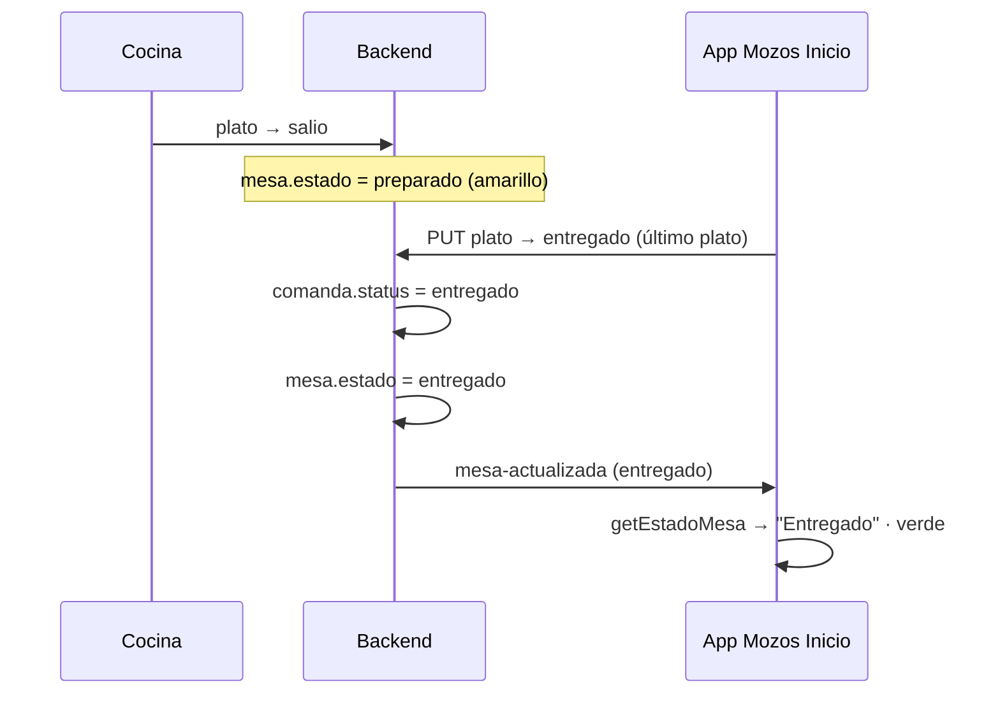

# Bug: Mesa aparece Libre tras confirmar entrega de todos los platos

**Fecha:** 2026-06-21  
**Audiencia:** glm-5.2 (agente de corrección)  
**Pantalla afectada:** App Mozos → `InicioScreen` (mapa de mesas)  
**Síntoma:** Tras cocina marcar plato `salio` y mozo confirmar entrega de todos los platos, la mesa se ve **Libre (gris)** en lugar de **Entregado (verde)**.

---

## 1. Resumen ejecutivo

El estado **`entregado` existe en el dominio** (platos y comandas), pero **no está cableado como estado de mesa** en varias capas. Además, un bloque legacy en el backend **sobrescribe la mesa a `libre`** justo después de la entrega del último plato.

| Capa | ¿Existe `entregado`? | Estado actual |
|------|----------------------|---------------|
| Plato (`platos.estado`) | ✅ Sí | `entregado` — verde oscuro en detalle |
| Comanda (`comanda.status`) | ✅ Sí | `entregado` vía `actualizarComandaSiTodosEntregados` |
| Mesa (`mesa.estado`) | ❌ **Falta en enum y flujos** | Backend pone `libre` o `preparado`; nunca `entregado` |
| App Mozos mapa (`getEstadoColor`) | ❌ **Falta** | Sin color ni rama `entregado`; cae a gris si backend dice `libre` |

---

## 2. Flujo esperado



**Regla de negocio:** Mesa `entregado` = todos los platos activos de las comandas del ciclo están `entregado`, pendiente de cobro. No es `libre` hasta liberar o cerrar el ciclo con pago total + liberación según flujo.

---

## 3. Causa raíz

### 3.1 Backend — bloque legacy en `cambiarEstadoPlato` (crítico)

Archivo: `backend-gambusinas/src/repository/comanda.repository.js` (~1876–1907).

Tras marcar un plato `entregado`:

1. `actualizarComandaSiTodosEntregados` pone `comanda.status = 'entregado'` y llama `recalcularEstadoMesa`.
2. Inmediatamente después, un bloque inline recalcula la mesa **sin contemplar** comandas en `entregado` ni `salio`:
   - `hayComandasPreparadas` solo si todos los platos están en `recoger`.
   - `hayComandasActivas` solo si `status` es `en_espera` o `recoger`.
3. Resultado: **`mesa.estado = 'libre'`** aunque la comanda siga activa en `entregado`.

### 3.2 Backend — `recalcularEstadoMesa` usa `preparado` en lugar de `entregado`

Archivo: `backend-gambusinas/src/repository/comanda.repository.js` (~2577–2583).

Cuando hay comandas con `status === 'entregado'`, asigna `nuevoEstadoMesa = 'preparado'`, no `entregado`. Aunque se corrija el bloque legacy, la mesa no llegaría al estado visual esperado.

### 3.3 Modelo de mesa — `entregado` ausente del enum

Archivo: `backend-gambusinas/src/database/models/mesas.model.js` (línea 10).

```javascript
enum: ['libre', 'esperando', 'pedido', 'preparado', 'pagado', 'reservado', 'pendiente_pago', 'pendiente_aprobar', 'reportado']
```

Falta `'entregado'`. Mongoose puede rechazar o no persistir el valor si se intenta guardar.

### 3.4 Transiciones de mesa — sin ruta hacia `entregado`

Archivo: `backend-gambusinas/src/repository/mesas.repository.js` (~116–126).

No hay transición `preparado → entregado` ni `entregado → pagado`.

### 3.5 Frontend — prioridad absoluta a `libre` del backend

Archivo: `gambusinas/Pages/navbar/screens/InicioScreen.js` → `getEstadoMesa` (~1840–1842).

Si `mesa.estado === 'libre'` (valor erróneo del backend), retorna `"Libre"` sin mirar comandas activas con platos `entregado`.

### 3.6 Frontend — comandas entregadas se mapean a `"Preparado"`, no `"Entregado"`

Mismo archivo (~1931–1933, ~1962):

```javascript
if (hayComandasEntregadas) {
  return "Preparado";  // debería ser "Entregado"
}
```

### 3.7 Frontend — sin color para mesa `entregado`

Archivos:

- `gambusinas/constants/theme.js` — `mesaEstado` sin clave `entregado`.
- `InicioScreen.js` → `getEstadoColor` — sin `case "entregado"`; cae al `default` gris.

### 3.8 Frontend — `handleComandaActualizada` no actualiza mesa cuando todos están `entregado`

`InicioScreen.js` (~1216–1222): solo asigna estado si hay platos `recoger`/`salio` o pendientes; con todos `entregado`, `nuevoEstadoMesa` queda `null`.

---

## 4. Referencia: dónde SÍ existe `entregado`

| Ubicación | Uso |
|-----------|-----|
| `comandaHelpers.js` → `obtenerEstadoMesa` | `if (todosEntregados) return 'entregado'` |
| `comanda.repository.js` → `actualizarComandaSiTodosEntregados` | `comanda.status = 'entregado'` |
| `BUG_PAGOS_PARCIALES_LISTA_PLATOS_POST_CARGA.md` | Mesa en estado *preparado / entregado* antes de Pagar |
| `ComandaDetalleScreen.js` | Platos y badges `entregado` (verde oscuro) |

---

## 5. Corrección propuesta para glm-5.2

### Fase A — Backend (obligatorio)

#### A.1 Agregar `entregado` al modelo de mesa

**Archivo:** `backend-gambusinas/src/database/models/mesas.model.js`

```javascript
enum: [..., 'preparado', 'entregado', 'pagado', ...]
```

Migración: documentos existentes con comandas `entregado` y mesa `preparado`/`libre` pueden corregirse con script opcional o al siguiente `recalcularEstadoMesa`.

#### A.2 Transiciones permitidas

**Archivo:** `backend-gambusinas/src/repository/mesas.repository.js`

```javascript
'preparado': ['pagado', 'entregado', 'pendiente_pago', 'pendiente_aprobar', 'libre'],
'entregado': ['pagado', 'pendiente_pago', 'libre'],
```

Ajustar según reglas PPA / aprobación cocina ya existentes.

#### A.3 `recalcularEstadoMesa` — comandas entregadas → mesa `entregado`

**Archivo:** `backend-gambusinas/src/repository/comanda.repository.js` (~2577)

```javascript
// Antes:
nuevoEstadoMesa = 'preparado';

// Después:
nuevoEstadoMesa = 'entregado';
```

Prioridad sugerida: `en_espera` → `pedido` · `recoger`/`salio` → `preparado` · `entregado` (todos) → `entregado`.

#### A.4 Eliminar bloque legacy en `cambiarEstadoPlato`

**Archivo:** `backend-gambusinas/src/repository/comanda.repository.js` (~1876–1924)

Reemplazar por una sola llamada:

```javascript
await recalcularEstadoMesa(mesaId);
```

Evitar duplicar lógica; `actualizarComandaSiTodosEntregados` ya invoca `recalcularEstadoMesa` — el bloque posterior **pisa** ese resultado.

#### A.5 Alinear otros puntos que setean mesa tras comandas entregadas

Revisar y unificar:

- `eliminarComanda` (~1105–1110): hoy pone `preparado` si hay comandas `entregado` → cambiar a `entregado`.
- Cualquier otro handler inline que ignore `status === 'entregado'`.

---

### Fase B — Frontend App Mozos (obligatorio)

#### B.1 Tema — color mesa `entregado`

**Archivo:** `gambusinas/constants/theme.js`

```javascript
entregado: '#00C851',  // Verde — lista para cobrar (distinto de pagado #2E7D32)
```

Replicar en `themeLight` / `themeDark` si aplica.

#### B.2 `getEstadoColor` — rama `entregado`

**Archivo:** `InicioScreen.js` (~2081)

```javascript
case "entregado":
  return theme.colors.mesaEstado.entregado || "#00C851";
```

#### B.3 `getEstadoMesa` — devolver `"Entregado"` y no confiar en `libre` erróneo

Cambios:

1. **No** retornar `"Libre"` con prioridad 0 si hay comandas activas con todos los platos `entregado` o `comanda.status === 'entregado'`.
2. Donde hoy dice `return "Preparado"` por `hayComandasEntregadas` → `return "Entregado"`.
3. En fallback sin comandas locales (~1878): incluir `estadoBackend === 'entregado'` junto a `pedido`/`preparado`.

#### B.4 `handleComandaActualizada` — mesa `entregado`

Si todos los platos activos están `entregado` o `comanda.status === 'entregado'`:

```javascript
nuevoEstadoMesa = 'entregado';
```

#### B.5 `MesaAnimada` — animación para `entregado`

**Archivo:** `InicioScreen.js` (~336–399): rama visual coherente (p. ej. pulse suave verde, similar a `pagado` pero distinguible).

#### B.6 Acciones de mesa en estado `Entregado`

**Archivo:** `InicioScreen.js` → `handleSelectMesa` / modal opciones:

- Mostrar **Pagar** (igual que hoy con Preparado cuando todo está entregado).
- Referencia: `BUG_PAGOS_PARCIALES` asume mesa *preparado / entregado* para navegar a `PagosScreen`.

Tratar `estado === "Entregado"` en las mismas ramas que `"Preparado"` donde el criterio sea “listo para cobrar”.

#### B.7 `getMozoMesa` — no ocultar mozo en `entregado`

Hoy oculta mozo solo si `libre`; verificar que `entregado` siga mostrando mozo asignado.

---

### Fase C — Defensa y consistencia (recomendado)

| Tarea | Archivo |
|-------|---------|
| Usar `obtenerEstadoMesa` de `comandaHelpers.js` como helper compartido o alinear lógica | `comandaHelpers.js`, `InicioScreen.js` |
| Socket: verificar payload `mesa-actualizada` incluye `estado: 'entregado'` | `useSocketMozos.js` |
| Dashboard admin (opcional): leyenda de estados con `entregado` | `public/*.html` |

---

## 6. Qué no hacer

- No usar `preparado` como sinónimo permanente de “todo entregado”; son fases distintas (`salio`/`recoger` vs listo para cobrar).
- No dejar el bloque legacy de `cambiarEstadoPlato` conviviendo con `recalcularEstadoMesa`.
- No mapear mesa `entregado` al mismo verde que `pagado` sin distinguir en UI (cobro vs aprobación cocina).

---

## 7. Criterios de aceptación

- [ ] Mesa con N platos: cocina `salio` → mapa **Preparado (amarillo)**.
- [ ] Mozo entrega el último plato → mapa **Entregado (verde)**, no Libre ni Preparado.
- [ ] `GET /mesas` y socket `mesa-actualizada` devuelven `estado: "entregado"`.
- [ ] Tras recargar Inicio, la mesa sigue verde Entregado.
- [ ] Botón **Pagar** disponible en mesa Entregado.
- [ ] Tras pago total → **Pagado** (verde oscuro) o flujo PPA según reglas.
- [ ] Liberar mesa → **Libre** (gris).
- [ ] Sin regresión: mesas con platos en `salio` siguen en Preparado.

---

## 8. Pruebas manuales

1. **Un plato:** pedido → cocina salio → mozo entrega → verificar verde Entregado en Inicio.
2. **Varios platos:** entregar uno a uno; solo al último debe pasar a Entregado.
3. **Socket:** segundo dispositivo mozo ve el cambio sin refrescar.
4. **AsyncStorage / cold start:** cerrar y abrir app; mesa sigue Entregado.
5. **Pagar desde Entregado:** navegación a PagosScreen OK.
6. **Mesa con plato aún en salio:** debe quedar Preparado, no Entregado.

---

## 9. Archivos a modificar (checklist glm-5.2)

| Prioridad | Archivo | Cambio |
|-----------|---------|--------|
| P0 | `backend-gambusinas/src/repository/comanda.repository.js` | Quitar legacy en `cambiarEstadoPlato`; `recalcularEstadoMesa` → `entregado` |
| P0 | `backend-gambusinas/src/database/models/mesas.model.js` | Enum `entregado` |
| P0 | `backend-gambusinas/src/repository/mesas.repository.js` | Transiciones con `entregado` |
| P0 | `gambusinas/Pages/navbar/screens/InicioScreen.js` | `getEstadoMesa`, `getEstadoColor`, `handleComandaActualizada`, acciones mesa |
| P1 | `gambusinas/constants/theme.js` | `mesaEstado.entregado` |
| P1 | `gambusinas/utils/comandaHelpers.js` | Verificar alineación `obtenerEstadoMesa` (ya retorna `entregado`) |
| P2 | Tests backend | Caso: último plato entregado → mesa `entregado` |

---

## 10. Nota para el implementador (glm-5.2)

**Prioridad:** corregir **§3.1** (bloque legacy que pone `libre`) y **agregar `entregado` al modelo + recalcularEstadoMesa** en el mismo PR. Sin el enum, guardar `entregado` puede fallar silenciosamente.

El síntoma *mesa gris Libre* se explica por la secuencia: `actualizarComandaSiTodosEntregados` calcula bien → bloque legacy (~1900) pisa a `libre` → `getEstadoMesa` prioriza `libre` del servidor.

Tras el fix backend, aplicar **Fase B** para que el mapa muestre **verde Entregado** y no amarillo Preparado ni gris Libre.
