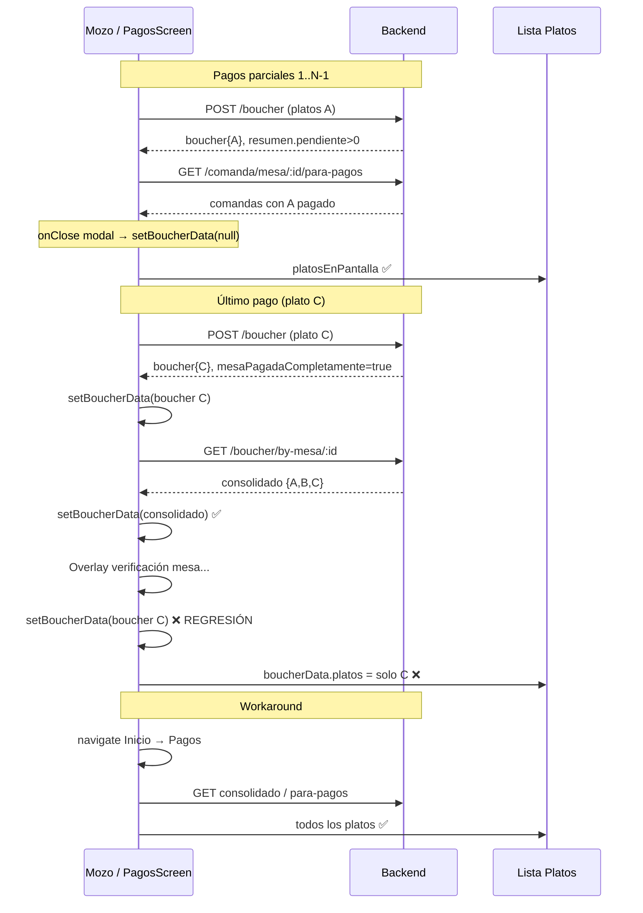

# Bug: lista de platos incompleta tras pantalla de carga en pagos parciales

**Fecha:** 18 de junio de 2026  
**Audiencia:** glm-5.2 (agente de corrección)  
**App:** Mozos (`gambusinas`)  
**Pantalla principal:** `Pages/navbar/screens/PagosScreen.js`  
**Documentación relacionada:**
- [PLAN_PAGOS_PARCIALES_Y_VOUCHERS_AGRUPADOS.md](./PLAN_PAGOS_PARCIALES_Y_VOUCHERS_AGRUPADOS.md)
- [backend-gambusinas/docs/PAGOS_PARCIALES.md](../../backend-gambusinas/docs/PAGOS_PARCIALES.md)

---

## 1. Resumen del problema

Cuando un pedido se cobra **en varios pagos parciales** y el mozo realiza el **último cobro** (mesa 100% pagada), aparece una pantalla de carga con mensajes como *"Procesando pago"*, *"Confirmando pago"* y *"Verificando estado de mesa"*. Al terminar esa carga, en la sección **Platos** de `PagosScreen` solo se muestra **el último plato cobrado en ese pago**, en lugar de **todos los platos del pedido** (incluidos los pagados en cobros anteriores).

**Workaround actual del mozo:** volver a `InicioScreen`, entrar de nuevo a `PagosScreen` → entonces sí se ven todos los platos pagados en partes.

El backend y la consolidación de bouchers **sí tienen los datos correctos**; el fallo es de **estado y renderizado en el cliente** después del último pago.

---

## 2. Flujo funcional esperado (pagos parciales)

### 2.1 Entrada a PagosScreen

1. En `InicioScreen`, el mozo elige una mesa en estado *preparado* / *entregado* y pulsa **Pagar**.
2. Se llama a `GET /comanda/comandas-para-pagar/:mesaId` (sin `incluirPagados`).
3. Se navega a `Pagos` con `route.params`:
   - `mesa`
   - `comandasParaPagar`
   - `totalPendiente`

`PagosScreen` trata `route.params` como fuente inicial; el estado local `comandas` se sincroniza con esos params.

### 2.2 Cobro parcial (uno o más platos)

1. El mozo marca platos en la lista (`platosSeleccionadosPago`).
2. Si la selección es menor al total de platos pagables, aparece confirmación *"Pago parcial"*.
3. Se activa el overlay `procesandoPago` con `mensajeCarga` (p. ej. *"Procesando pago..."*, *"Creando boucher y procesando pago..."*).
4. `POST /boucher` con cuerpo:
   ```json
   {
     "mesaId": "...",
     "mozoId": "...",
     "clienteId": "...",
     "platosSeleccionados": [
       { "comandaId": "...", "platoIndex": 0, "platoSubdocId": "...", "cantidad": 1 }
     ]
   }
   ```
5. El backend (`boucherPagoService.procesarPagoBoucher`):
   - Crea un boucher con **solo los platos de ese cobro** (`boucher.platos`).
   - Marca esos platos como `estado: "pagado"`.
   - Devuelve `{ boucher, resumen }` donde `resumen.mesaPagadaCompletamente === false` si aún hay pendiente.
6. En el cliente, si **aún hay pendiente**:
   - `fetchComandasCicloParaPagos(mesaId)` → `GET /comanda/mesa/:mesaId/para-pagos` (incluye platos `entregado` + `pagado` del ciclo).
   - `setComandas(comandasCiclo)` actualiza la lista con checks verdes en platos ya pagados (`listarPlatosEnPantallaPago`).
   - `setHayPendienteTrasPago(true)`, `setTotalRestante(resumen.totalPendiente)`.
7. Se abre `ModalPagoExitoso`. Si el mozo cierra el modal y sigue cobrando, `onClose` hace `setBoucherData(null)` para volver a la vista de selección de platos.

### 2.3 Último cobro (mesa completamente pagada)

1. Mismo `POST /boucher` con los platos restantes.
2. `resumen.mesaPagadaCompletamente === true`.
3. El cliente entra en el **bloque de verificación de mesa** (solo en este caso):

| Paso | `mensajeCarga` | Acción |
|------|----------------|--------|
| 1 | `"Confirmando pago..."` | `PUT /mesas/:id/estado` → `{ estado: "pagado" }` (hasta 5 reintentos) |
| 2 | `"Verificando estado de mesa..."` | `GET /mesas` y buscar mesa por `_id`; comprobar `estado === "pagado"` |
| 3 | `"¡Pago confirmado!"` o `"¡Pago procesado!"` | Cierra overlay (`setProcesandoPago(false)`) |

4. Si la mesa quedó 100% pagada, **antes** de la verificación el código ya intenta cargar el boucher consolidado:
   - `cargarBoucherConsolidadoMesa(mesaId)` → `GET /boucher/by-mesa/:mesaId`
   - El backend une todos los bouchers del ciclo (`consolidarBouchersMesa` en `boucher.repository.js`) con **todos** los `platos` de cada pago parcial.

5. Se abre `ModalPagoExitoso` con opciones: imprimir, propina, ir a inicio.

### 2.4 Cómo debería verse la lista de Platos

| Momento | Fuente de datos esperada | Qué debe mostrar |
|---------|--------------------------|------------------|
| Durante cobros parciales (sin modal) | `platosEnPantalla` desde `comandas` actualizadas | Todos los platos: pendientes seleccionables + pagados con etiqueta *"· Pagado"* |
| Tras último cobro (mesa pagada) | `boucherData` **consolidado** o `platosEnPantalla` completos | **Todos** los platos del pedido, no solo los del último boucher |
| Re-entrada desde Inicio | `cargarBoucherConsolidadoMesa` o sync al enfocar | Correcto (por eso el workaround funciona) |

---

## 3. Síntoma y reproducción

### Pasos para reproducir

1. Mesa con al menos **3 platos entregados** (misma comanda o varias).
2. Ir a **Pagos** desde Inicio.
3. **Pago parcial 1:** cobrar solo el plato A → cerrar modal → verificar que A aparece como pagado (puede fallar aquí también; ver §4.3).
4. **Pago parcial 2:** cobrar solo el plato B → cerrar modal.
5. **Pago final:** cobrar el plato C (último pendiente).
6. Observar overlay: *Procesando pago* → *Confirmando pago* → *Verificando estado de mesa*.
7. Tras cerrar el modal (o mirar la lista detrás del modal): en **Platos** solo aparece **C** (último cobrado).

### Comportamiento correcto tras workaround

8. Navegar a **Inicio** y volver a **Pagos** (o abrir *Imprimir boucher*).
9. La lista muestra **A, B y C** (o el boucher consolidado con los tres).

---

## 4. Análisis de causa raíz

Hay **tres factores** que explican el bug; el más grave es el **#1** (regresión al abrir el modal tras pago total).

### 4.1 Causa principal — sobrescritura del boucher consolidado (BUG CONFIRMADO)

**Archivo:** `PagosScreen.js`, función `procesarPagoConCliente`.

Tras un pago exitoso, el flujo hace lo siguiente:

```javascript
// ~línea 1552-1565
let boucherParaUI = boucherCreado;
setBoucherData(boucherCreado);  // boucher del ÚLTIMO cobro solamente

if (resumenPago?.mesaPagadaCompletamente && mesaIdFinal) {
  const consolidado = await cargarBoucherConsolidadoMesa(mesaIdFinal);
  if (consolidado?.platos?.length) {
    boucherParaUI = consolidado;
    setBoucherData(consolidado);  // ✅ Correcto: todos los platos
  }
}

// ... bloque de verificación de mesa (overlay de carga) ...

// ~línea 1757-1759 — REGRESIÓN
setClientePagoExitoso(cliente);
setBoucherData(boucherCreado);  // ❌ SOBRESCRIBE el consolidado con el último boucher
setModalPagoExitosoVisible(true);
```

- `boucherCreado` contiene **únicamente** los platos del cobro actual (`platosParaBoucher` en backend).
- `boucherParaUI` / `consolidado` contiene **todos** los platos de los N pagos parciales.
- La línea `setBoucherData(boucherCreado)` **deshace** la consolidación justo antes de mostrar la UI.

`irAlInicio` en el mismo bloque sí pasa `boucher: boucherParaUI` (consolidado), pero la lista en pantalla usa `boucherData` del estado, que ya quedó mal.

### 4.2 Causa secundaria — rama de render prioriza `boucherData.platos`

**Archivo:** `PagosScreen.js`, sección JSX ~líneas 2124-2161.

```javascript
{(boucherData || boucherFromParams)?.platos ? (
  // Renderiza SOLO boucherData.platos
  (boucherData || boucherFromParams).platos.map(...)
) : platosEnPantalla.length > 0 ? (
  // Renderiza desde comandas (entregado + pagado)
  platosEnPantalla.map(...)
) : ...}
```

En cuanto `boucherData` tiene `platos` (tras cualquier cobro), la lista **deja de usar** `platosEnPantalla`, que es la fuente correcta para pagos parciales en curso.

Mientras `boucherData` apunte al último boucher, la UI muestra solo esos platos aunque `comandas` esté bien actualizado.

### 4.3 Causa terciaria — no se refrescan comandas cuando la mesa queda 100% pagada

**Archivo:** `PagosScreen.js`, ~líneas 1572-1590.

```javascript
if (!resumenPago.mesaPagadaCompletamente && mesaIdFinal) {
  const comandasCiclo = await fetchComandasCicloParaPagos(mesaIdFinal);
  if (comandasCiclo.length > 0) {
    setComandas(comandasCiclo);
  } else if (resumenPago.comandas?.length) {
    setComandas(resumenPago.comandas);
  }
  // ...
}
```

Cuando `mesaPagadaCompletamente === true`:

- **No** se llama a `fetchComandasCicloParaPagos`.
- `resumen.comandas` viene de `getComandasParaPagar` (solo comandas **con pendiente**); tras el último cobro suele ser **array vacío**.
- El estado local `comandas` puede quedar **desactualizado** (sin marcar todos los platos como `pagado`).
- La UI depende casi por completo de `boucherData.platos` → si `boucherData` es el último boucher (§4.1), solo se ve un plato.

No hay fallback útil en `platosEnPantalla` porque `comandas` no se actualizó.

### 4.4 Por qué el workaround (Inicio → Pagos) lo arregla

Al re-entrar a `PagosScreen`, `useFocusEffect` / `useEffect` sobre `route.params` ejecutan:

1. **`cargarBoucherConsolidadoMesa(mesaId)`** si viene `boucher` en params o al enfocar con mesa pagada.
2. **`fetchComandasBackendParaMesa`** → `fetchComandasCicloParaPagos` → datos frescos del servidor con todos los estados `pagado`.
3. En navegación desde Inicio con *Imprimir boucher*, se carga el consolidado explícitamente sin pasar por `setBoucherData(boucherCreado)` al final de `procesarPagoConCliente`.

Por eso el backend “siempre estuvo bien” y el bug es **solo de sincronización post-pago en memoria**.

---

## 5. Diagrama del flujo con el bug



---

## 6. Archivos involucrados

| Archivo | Rol |
|---------|-----|
| `gambusinas/Pages/navbar/screens/PagosScreen.js` | Flujo de pago, overlay, estado `boucherData`/`comandas`, render de platos |
| `gambusinas/utils/pagoParcialHelpers.js` | `listarPlatosEnPantallaPago`, payload de selección |
| `gambusinas/Pages/navbar/screens/InicioScreen.js` | Navegación inicial a Pagos con `comandasParaPagar` |
| `backend-gambusinas/src/services/boucherPagoService.js` | `procesarPagoBoucher`, `construirResumenPago` |
| `backend-gambusinas/src/repository/boucher.repository.js` | `consolidarBouchersMesa` |
| `backend-gambusinas/src/repository/comanda.repository.js` | `getComandasCicloParaPagos` |

**No modificar el backend** para este bug salvo que los tests demuestren respuesta incorrecta en `GET /boucher/by-mesa/:id` (no es el caso reportado).

---

## 7. Corrección propuesta para glm-5.2

### Fix mínimo (obligatorio)

En `procesarPagoConCliente`, al abrir el modal de éxito, usar el boucher ya resuelto:

```javascript
// Reemplazar:
setBoucherData(boucherCreado);

// Por:
setBoucherData(boucherParaUI);
```

Asegurarse de que `boucherParaUI` siga en scope (ya existe como `let` desde ~1552).

### Fix recomendado (completo)

1. **Consolidado al abrir modal:** `setBoucherData(boucherParaUI)` como arriba.

2. **Refrescar comandas también cuando la mesa queda pagada** (fallback si falla consolidado):
   ```javascript
   if (mesaIdFinal) {
     const comandasCiclo = await fetchComandasCicloParaPagos(mesaIdFinal);
     if (comandasCiclo.length > 0) setComandas(comandasCiclo);
   }
   ```
   Mover fuera del `if (!resumenPago.mesaPagadaCompletamente)` o duplicar la rama para `mesaPagadaCompletamente`.

3. **Render de platos — prioridad explícita:**
   - Si `hayPendienteTrasPago` → usar siempre `platosEnPantalla` (no `boucherData.platos`).
   - Si mesa pagada y `boucherData.esConsolidado` o `boucherData.platos.length` cubre todo el pedido → usar `boucherData.platos`.
   - Evitar que un boucher parcial suelto reemplace la lista mientras el mozo sigue en la misma sesión de cobro.

4. **`onIrAlInicio` del modal:** pasar `boucher: boucherParaUI` o `boucherData` ya consolidado (hoy usa `boucherData || boucherFromParams`, que tras el fix #1 ya sería correcto).

5. **No llamar `setBoucherData(boucherCreado)` antes del consolidado** si se va a cargar consolidado en el mismo tick; o usar una sola asignación al final del flujo para evitar parpadeos.

### Qué no hacer

- No volver a habilitar WebSocket para mezclar comandas en `PagosScreen` (comentarios en código advierten de loops).
- No usar solo `resumenPago.comandas` tras pago total (suele venir vacío).
- No depender de `route.params.comandasParaPagar` sin refrescar tras cobros parciales (queda obsoleto).

---

## 8. Criterios de aceptación

- [ ] Mesa con 3+ platos, 3 cobros parciales: tras el **último** cobro y overlay de verificación, la sección **Platos** muestra **todos** los platos del pedido sin volver a Inicio.
- [ ] Tras un cobro parcial intermedio (modal cerrado, sigue pendiente), la lista muestra platos pagados (check verde *"· Pagado"*) y los pendientes seleccionables.
- [ ] `GET /boucher/by-mesa` consolidado y la lista en pantalla coinciden en cantidad de platos.
- [ ] Imprimir boucher desde el modal post-pago total imprime todos los platos (consolidado).
- [ ] Sin regresión en pago total legacy (todos los platos en un solo cobro, sin parciales).

---

## 9. Pruebas manuales sugeridas

1. **Parcial × 3 + total:** como en §3.
2. **Un solo cobro total** (seleccionar todos): lista completa al terminar.
3. **Descuento en comanda + parciales:** totales y lista coherentes.
4. **Cerrar modal tras parcial sin ir a Inicio:** segundo parcial debe seguir mostrando platos ya pagados.
5. **Red lenta:** verificar que durante overlay no parpadee lista con un solo plato y al final quede consolidado.

---

## 10. Referencias de código (líneas aproximadas)

| Ubicación | Descripción |
|-----------|-------------|
| `PagosScreen.js` ~78-107 | `fetchComandasCicloParaPagos` |
| `PagosScreen.js` ~379-400 | `cargarBoucherConsolidadoMesa` |
| `PagosScreen.js` ~1205-1800 | `procesarPagoConCliente` |
| `PagosScreen.js` ~1559-1590 | Consolidado + actualización comandas solo si pendiente |
| `PagosScreen.js` ~1599-1718 | Overlay verificación mesa pagada |
| `PagosScreen.js` ~1757-1759 | **Línea a corregir:** `setBoucherData(boucherCreado)` |
| `PagosScreen.js` ~921-926 | `platosEnPantalla` desde `comandas` |
| `PagosScreen.js` ~2124-2161 | Rama render que prioriza `boucherData.platos` |
| `PagosScreen.js` ~2517-2522 | `onClose` modal limpia `boucherData` si hay pendiente |
| `pagoParcialHelpers.js` ~45-74 | `listarPlatosEnPantallaPago` |
| `boucher.repository.js` ~264-333 | `consolidarBouchersMesa` |

---

## 11. Nota para el implementador (glm-5.2)

Prioridad: **cambio de una línea** (`boucherParaUI` en lugar de `boucherCreado`) + **tests manuales del §9**. Si tras eso aún fallan cobros parciales intermedios (antes del último), aplicar fixes §7.2 y §7.3 sobre render y refresco de `comandas`.

El síntoma reportado (*solo el último plato tras la pantalla de carga de verificación de mesa*) corresponde casi con certeza a la regresión en **§4.1**, porque esa pantalla de carga solo corre cuando `mesaPagadaCompletamente === true`, es decir, en el último pago de una secuencia parcial.
