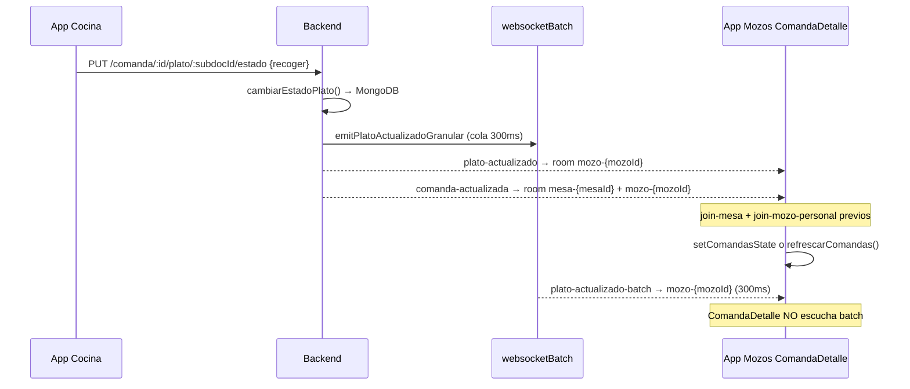

# ComandaDetalleScreen — Tiempo real y diagnóstico por dispositivo

**Versión:** 1.1  
**Fecha:** Junio 2026  
**Pantalla:** `Pages/ComandaDetalleScreen.js`  
**Contexto reportado:** Varios teléfonos muestran el cambio `pedido` → `recoger` en tiempo real en ComandaDetalle; en Samsung Galaxy Tab A11 no se observa ese cambio de estado (el flujo cocina → mozos funciona en los demás dispositivos).

---

## 0. Flujo completo: Cocina marca plato listo → Mozos ve `recoger`

Este es el recorrido exacto del código cuando cocina indica que un plato está listo para recoger.

### 0.1 App Cocina — qué dispara el cambio

Cocina puede finalizar un plato por **dos rutas HTTP**:

| Ruta en UI | Endpoint | Archivo |
|------------|----------|---------|
| Finalizar plato(s) en batch (flujo habitual en `comandastyle.jsx`) | `PUT /api/comanda/:id/plato/:platoId/estado` con `{ nuevoEstado: "recoger", cocineroId }` | `appcocina/src/components/Principal/comandastyle.jsx` → `batchFinalizarPlatos` |
| Finalizar plato individual (hook) | `PUT /api/comanda/:id/plato/:platoId/finalizar` con `{ cocineroId }` | `appcocina/src/hooks/useProcesamiento.js` → `finalizarPlato` |

En ambos casos cocina envía como `platoId` el **`_id` del subdocumento** de la línea en la comanda (no el ID del catálogo de platos):

```1826:1841:appcocina/src/components/Principal/comandastyle.jsx
          const platoIdFinal = plato._id?.toString() || plato.plato?._id?.toString() || platoId?.toString();
          // ...
          const response = await axios.put(
            `${apiUrl}/${comandaId}/plato/${platoIdFinal}/estado`,
            { nuevoEstado: "recoger", cocineroId: userId }
          );
```

Cocina **no espera** la respuesta para pintar su UI: confía en los eventos socket del namespace `/cocina` (`plato-actualizado`, `plato-actualizado-batch`).

### 0.2 Backend — persistencia y emisión socket

#### Ruta `PUT .../estado` (la más usada desde cocina)

```
comandaController.js
  └─ cambiarEstadoPlato(id, platoId, 'recoger')     [repository]
       └─ emitPlatoActualizadoGranular()            → cola websocketBatch (300 ms)
  └─ emitPlatoActualizado(id, platoId, 'recoger')   [events.js]  ← inmediato
  └─ emitComandaActualizada(id, ...)                [events.js]  ← inmediato
```

#### Ruta `PUT .../finalizar`

```
procesamientoController.js
  └─ Actualiza MongoDB directamente (estado → recoger)
  └─ emitPlatoActualizado(comandaId, platoId, 'recoger')
  └─ emitComandaActualizada(...) solo si TODOS los platos quedaron listos
```

#### Destino de los eventos hacia mozos (clave para `recoger`)

El backend **no envía todos los eventos a la misma room**:

```17:31:backend-gambusinas/src/socket/events.js
function emitToMozoAsignado(comanda, eventName, eventData) {
  const mozoId = comanda.mozos?._id || comanda.mozos;
  if (mozoId) {
    mozosNamespace.to(`mozo-${mozoId}`).emit(eventName, eventData);
    return;
  }
  // fallback: mesa-{mesaId} o broadcast
}
```

| Evento | Estado `recoger` | Room destino en `/mozos` |
|--------|------------------|--------------------------|
| `plato-actualizado` | Sí | **`mozo-{mozoId}`** del mozo asignado a la comanda (no `mesa-{id}`) |
| `plato-actualizado-batch` | Sí | **`mozo-{mozoId}`** (batch desde `websocketBatch.js`, ~300 ms después) |
| `comanda-actualizada` | Siempre | **`mesa-{mesaId}`** y también `mozo-{mozoId}` |
| Push Expo | Sí | Dispositivo con token del mozo asignado |

**Implicación:** Para ver `recoger` en tiempo real, la tablet debe tener el socket conectado y haber entrado a:

1. Room **`mozo-{suUserId}`** — automático al conectar (`join-mozo-personal` en `useSocketMozos.js`).
2. Room **`mesa-{mesaId}`** — al abrir ComandaDetalle (`join-mesa`).

Si la comanda tiene mozo asignado, el evento principal `plato-actualizado` de `recoger` **solo llega por room de mozo**, no por room de mesa.

### 0.3 App Mozos — cómo ComandaDetalle reacciona

```
SocketContext (global, siempre activo)
  └─ useSocketMozos → conecta /mozos, join-mozo-personal(mozoId)

ComandaDetalleScreen (al estar abierta)
  └─ join-mesa(mesaId)
  └─ socket.on('plato-actualizado')  → intenta actualizar estado en memoria
  └─ socket.on('comanda-actualizada') → llama refrescarComandas() (HTTP)
  └─ NO escucha 'plato-actualizado-batch'
```

Cadena hasta que el mozo ve el plato en amarillo (`recoger`):

```
Cocina PUT /estado
    → Backend emite plato-actualizado → mozo-{id}
    → ComandaDetalle listener recibe
    → Busca plato en comandas[] por platoId
    → Si encuentra: setComandasState (UI al instante)
    → Si NO encuentra: refrescarComandas() a los 100 ms (HTTP)

En paralelo:
    → Backend emite comanda-actualizada → mesa-{id} + mozo-{id}
    → ComandaDetalle listener → refrescarComandas() (HTTP)
```

### 0.4 Diagrama de secuencia



---

## 1. Resumen ejecutivo

`ComandaDetalleScreen` depende casi por completo de **WebSocket (Socket.io, namespace `/mozos`)** para reflejar cambios que hace cocina (estado `pedido` → `recoger` → `entregado`). No tiene **polling de respaldo** propio (a diferencia de `InicioScreen`).

Si el socket está desconectado, entra en room incorrecta, o los listeners se desmontan en el momento del evento, la tablet **no verá cambios** hasta que el mozo haga pull-to-refresh, pulse sincronizar en el header, o salga y vuelva a entrar a la pantalla.

La diferencia S24 FE vs Tab A11 suele deberse a una combinación de:

1. **Conexión WebSocket inestable en la tablet** (Wi‑Fi, optimización de batería Samsung).
2. **Bugs en el cliente** que empeoran en dispositivos más lentos (re-registro de listeners al parpadear el indicador `online-active`).
3. **Eventos que la pantalla no escucha** (`plato-actualizado-batch`, ruta principal del backend desde cocina).

---

## 2. Arquitectura de tiempo real

### 2.1 Flujo general

```
App Cocina                    Backend                         App Mozos (ComandaDetalle)
──────────                    ───────                         ─────────────────────────
PUT /comanda/:id/plato/:id/estado
        │
        ├─► cambiarEstadoPlato() ──► emitPlatoActualizadoGranular()
        │                              └─► cola websocketBatch (300 ms)
        │                                      └─► plato-actualizado-batch → room mesa-{id} o mozo-{id}
        │
        ├─► emitPlatoActualizado() ──► plato-actualizado → room mesa o mozo asignado
        │
        └─► emitComandaActualizada() ──► comanda-actualizada → room mesa-{id} + mozo asignado

ComandaDetalleScreen:
  1. join-mesa(mesaId)  → entra a room mesa-{mesaId}
  2. socket.on('plato-actualizado', ...)     → actualización granular en memoria
  3. socket.on('comanda-actualizada', ...)   → refrescarComandas() vía HTTP
  4. useFocusEffect → refrescarComandas() al ganar foco
```

### 2.2 Rooms Socket.io relevantes

| Room | Quién se une | Eventos que recibe |
|------|--------------|-------------------|
| `mesa-{mesaId}` | `join-mesa` al abrir ComandaDetalle | `plato-actualizado` (estados ≠ recoger), `plato-actualizado-batch`, `comanda-actualizada` |
| `mozo-{mozoId}` | Automático al conectar (`join-mozo-personal`) | `plato-actualizado` y batch cuando estado = `recoger` |

**Importante:** Si la tablet no está en `mesa-{id}` en el instante del evento (desconexión, `leave-mesa` accidental, reconexión sin rejoin), pierde eventos dirigidos solo a esa room.

### 2.3 Fuentes de datos en la pantalla

| Mecanismo | Cuándo | Archivo |
|-----------|--------|---------|
| Parámetros de navegación (`comandasIniciales`) | Solo al entrar | `route.params` |
| `refrescarComandas()` | Foco, pull-to-refresh, botón sync, eventos socket | GET `/comanda/mesa/:id/activas` o `/fecha/:hoy` |
| `plato-actualizado` | Cocina cambia un plato | Actualización local sin HTTP |
| `comanda-actualizada` | Cualquier cambio de comanda | Dispara `refrescarComandas()` (HTTP completo) |
| Polling fallback | **No existe** en esta pantalla | — |

`InicioScreen` sí tiene polling cada 30 s si el socket está desconectado; **ComandaDetalle no**.

---

## 3. Implementación actual (código)

### 3.1 Unión a room y listeners

```405:576:gambusinas/Pages/ComandaDetalleScreen.js
  useEffect(() => {
    if (!socket || !connected || !mesaId) return;

    if (joinMesa) {
      joinMesa(mesaId);
    } else {
      socket.emit('join-mesa', mesaId);
    }

    socket.on('plato-actualizado', (data) => { /* actualización granular */ });
    socket.on('plato-agregado', ...);
    socket.on('plato-entregado', ...);
    socket.on('comanda-actualizada', ...);
    // ... más listeners

    return () => {
      if (leaveMesa) leaveMesa(mesaId);
      else socket.emit('leave-mesa', mesaId);
      socket.off('plato-actualizado');
      // ... quita todos los listeners
    };
  }, [socket, connected, mesaId, joinMesa, leaveMesa, connectionStatus, navigation]);
```

### 3.2 Indicador de conexión en header

`HeaderComandaDetalle` muestra el estado (`conectado`, `reconectando`, `desconectado`, `online-active`). El parpadeo verde (`online-active`) indica que **llegó un evento socket** en los últimos ~2 segundos.

### 3.3 Configuración del socket global

```101:128:gambusinas/hooks/useSocketMozos.js
    const socket = io(wsURL, {
      transports: ['websocket', 'polling'],
      reconnection: true,
      reconnectionDelay: initialDelay,
      reconnectionDelayMax: maxDelay,
      reconnectionAttempts: maxReconnectAttempts,
      timeout: 20000,
      pingTimeout: 60000,
      pingInterval: 25000,
      auth: { token: token }
    });
```

Heartbeat cada 25 s y rejoin automático de rooms tras reconexión (`roomsJoinedRef` + `trackRoom` en `SocketContext`).

---

## 4. Problemas identificados en el código

### 4.1 🔴 CRÍTICO — `connectionStatus` en dependencias del `useEffect`

El effect que registra listeners incluye `connectionStatus` en el array de dependencias.

Cada vez que cocina actualiza un plato:

1. `useSocketMozos` pone `connectionStatus` en `'online-active'` durante 2 s.
2. El `useEffect` de ComandaDetalle **se desmonta**: `leave-mesa`, `socket.off(...)`.
3. Tras el re-render, vuelve a ejecutarse: `join-mesa`, registra listeners de nuevo.

**Ventana de ~1–2 s sin estar en la room `mesa-{id}` y sin listeners activos.**

En un S24 FE (CPU rápida, React más ágil) la actualización granular a menudo ya se aplicó antes del teardown. En Tab A11 (SoC más modesto, más carga de UI en tablet) es más probable **perder el evento** o el `refrescarComandas()` disparado por `comanda-actualizada`.

**Corrección recomendada:** quitar `connectionStatus` de las dependencias; el parpadeo debe usar solo `localConnectionStatus` (ya existe en la pantalla).

---

### 4.2 🔴 CRÍTICO — No escucha `plato-actualizado-batch`

Desde la Fase 5 del backend, `cambiarEstadoPlato()` encola eventos en `websocketBatch.js` y emite **`plato-actualizado-batch`** cada 300 ms. El emit individual granular está deshabilitado (`emitPlatoActualizadoGranular` hace `return` temprano).

`useSocketMozos` sí escucha el batch y lo reenvía a `InicioScreen` vía `onComandaActualizada`, pero **ComandaDetalleScreen no tiene listener** para `plato-actualizado-batch`.

La pantalla depende de:

- `plato-actualizado` individual (segunda emisión desde el controller), y/o
- `comanda-actualizada` + HTTP.

Si en la tablet falla el timing del punto 4.1, y el HTTP de `refrescarComandas` tarda o falla, **no hay actualización visible**.

**Corrección recomendada:** añadir `socket.on('plato-actualizado-batch', ...)` con la misma lógica granular que `plato-actualizado`, o aplicar `data.platos` en bloque.

---

### 4.3 🟠 MEDIO — `comanda-actualizada` no usa el payload

El listener llama siempre a `refrescarComandas()` (varias peticiones HTTP) en lugar de fusionar `data.comanda` del evento. En red lenta de tablet, la UI queda congelada más tiempo y un timeout puede dejar datos viejos sin aviso claro.

---

### 4.4 🟠 MEDIO — Coincidencia de `platoId` en actualización granular

Al buscar el plato en memoria se compara `data.platoId` con el ID del **catálogo** (`plato._id`), no con el `_id` del **subdocumento** de la línea de comanda:

```439:446:gambusinas/Pages/ComandaDetalleScreen.js
          const platoIdStr = data.platoId?.toString ? data.platoId.toString() : data.platoId;
          const platoIndex = comanda.platos.findIndex(p => {
            const pId = p.plato?._id?.toString ? p.plato._id.toString() : ...
            return pId === platoIdStr;
          });
          if (platoIndex === -1) {
            setTimeout(() => refrescarComandasRef.current?.(), 100);
```

Si no hay match, debería refrescar por HTTP a los 100 ms. Si el HTTP falla en la tablet, no hay cambio visual. La actualización “en vivo” que se ve en el S24 puede ser el match exitoso; en la Tab, solo el fallback HTTP (más frágil).

---

### 4.5 🟡 BAJO — Sin polling de respaldo en ComandaDetalle

`InicioScreen` (líneas ~1698–1716) activa polling cada 30 s cuando `socketConnected === false`. ComandaDetalle **no tiene equivalente**. Un socket “zombie” (UI muestra conectado pero el transporte no recibe) dejaría la pantalla estática indefinidamente.

---

## 5. Por qué funciona en teléfonos pero no en la Tab A11

Dado que **otros teléfonos con la misma app sí actualizan** el estado `recoger` en ComandaDetalle, el backend y cocina están operativos. El fallo está en **cómo la Tab A11 recibe o procesa** los eventos, no en la lógica de negocio del restaurante.

### 5.1 Hipótesis ordenadas por probabilidad

| # | Causa | Explicación técnica | Cómo comprobarlo en la Tab |
|---|--------|---------------------|----------------------------|
| **1** | **Socket degradado en la tablet** | Samsung Tab A11 suele tener optimización de batería agresiva que suspende WebSocket con pantalla atenuada o en reposo. El header puede seguir mostrando “conectado” unos segundos tras perder el transporte real. | Al finalizar en cocina, ¿parpadea verde el indicador del header? Si no parpadea, el evento no llegó. |
| **2** | **Race por `connectionStatus` en deps del effect** | Cada `plato-actualizado` pone el socket global en `online-active` → el `useEffect` de ComandaDetalle hace `leave-mesa` + `socket.off(...)` + vuelve a registrar. En hardware lento la ventana es más larga y se pierde el evento. | Más probable en tablet que en teléfonos rápidos. |
| **3** | **La UI depende de HTTP, no de update granular** | Cocina manda `platoId` = `_id` subdocumento. ComandaDetalle busca por ID de catálogo (`p.plato._id`), no por `p._id`. Falla el match → `refrescarComandas()` HTTP. En teléfonos la red responde rápido; en la Tab el HTTP puede tardar o fallar silenciosamente. | Pull-to-refresh en la Tab: si **sí** muestra `recoger`, el backend está bien y falla el socket o el timing del refresh automático. |
| **4** | **Sesión de mozo distinta en la tablet** | `plato-actualizado` de `recoger` va a `mozo-{mozoAsignado}`. Si la comanda la tomó otro mozo y la tablet tiene otra cuenta, no recibe ese evento (sí debería recibir `comanda-actualizada` por room `mesa-{id}` si el join es correcto). | Verificar que el mozo logueado en la Tab es el asignado a la comanda. |
| **5** | **Batch no escuchado** | Tras 300 ms el backend emite `plato-actualizado-batch` a `mozo-{id}`. ComandaDetalle **no tiene listener**; solo `useSocketMozos` lo recibe para InicioScreen. Si fallan los dos eventos inmediatos (`plato-actualizado` + `comanda-actualizada`), el batch no salva ComandaDetalle. | Afecta a todos los dispositivos por igual en código; en la Tab pesa más si los eventos inmediatos se pierden. |
| **6** | **Wi‑Fi / posición fija de la tablet** | Tablet en mostrador lejos del AP, interferencias, o red congestionada → `ping timeout` y reconexión. ComandaDetalle no tiene polling de respaldo (InicioScreen sí cada 30 s si socket cae). | Comparar señal Wi‑Fi Tab vs teléfono en el mismo momento. |

### 5.2 Lo que NO explica bien el caso (mismo código, distinto dispositivo)

- **Bug solo en backend o cocina:** Otros teléfonos recibirían lo mismo; no es coherente con tu prueba.
- **Room `mesa` incorrecta:** `comanda-actualizada` también se emite a `mesa-{id}`; ComandaDetalle hace `join-mesa` al abrir. Salvo desconexión, debería refrescar por HTTP aunque falle room de mozo.
- **Versión distinta de APK:** Solo aplica si la Tab tiene un build anterior; conviene confirmar misma versión en Ajustes → Acerca de.

### 5.3 Prueba decisiva (sin cambiar código)

1. En la **Tab A11**, abrir ComandaDetalle de una mesa con platos en `pedido`.
2. En cocina, finalizar **un** plato de esa mesa.
3. Observar:
   - **Indicador header** → ¿parpadea verde?
   - **Lista de platos** → ¿cambia a RECOGER?
4. Sin salir de la pantalla, hacer **pull-to-refresh**.

| Resultado | Diagnóstico |
|-----------|-------------|
| No parpadea + refresh manual **sí** actualiza | Socket en la Tab no recibe eventos (batería, Wi‑Fi, room, race del effect). |
| Parpadea + lista **no** cambia | Evento llega pero falla render (muy raro) o `refrescarComandas` / match de plato. |
| No parpadea + refresh manual **tampoco** actualiza | Red HTTP de la Tab hacia el backend (IP, firewall, timeout). |
| Parpadea + lista **sí** cambia | El tiempo real funciona; el caso estaría resuelto o era intermitente. |

---

## 6. Causas en el código (afectan todos; más visibles en Tab A11)

### 6.1 Prueba rápida (2 minutos)

1. Abrir ComandaDetalle en la **Tab A11** con una mesa activa y platos en `pedido`.
2. Observar el **punto/indicador de conexión** en el header (junto al botón sincronizar).
   - **Rojo / reconectando:** el problema es conexión socket, no la pantalla en sí.
   - **Verde fijo:** socket conectado; si no parpadea al cambiar plato en cocina, **no llegan eventos** (room, batería, o bug de listeners).
   - **Verde parpadeante** al cambiar en cocina: eventos llegan; si la lista no cambia, el bug es de **mapeo de plato o render**, no de red.
3. **Pull-to-refresh** en la lista de platos.
   - Si **sí** actualiza: socket no funciona; HTTP sí. Confirma problema de WebSocket / rooms / batería.
   - Si **no** actualiza: problema de red HTTP (IP del servidor, firewall, `apiConfig`) en esa tablet.
4. Pulsar **botón sincronizar** del header (`onSync={refrescarComandas}`).

### 6.2 Configuración Samsung Tab A11

En **Ajustes → Batería → Límites de uso en segundo plano** (nombres pueden variar por One UI):

- Desactivar suspensión para **App Mozos** / `com.carlos121.appmozo`.
- Añadir la app a **“Sin restricciones”** o **“No optimizar”**.
- Mantener la tablet **encendida y en primer plano** durante el servicio (evitar bloqueo automático agresivo).

### 6.3 Verificación de red

- Misma red Wi‑Fi que el servidor backend y que el S24 que sí funciona.
- En la tablet: misma URL/IP configurada en login que en el teléfono (`apiConfig` / pantalla de configuración de servidor).
- Ver [NETWORK_ERROR_APK_VS_EXPO_GO.md](./NETWORK_ERROR_APK_VS_EXPO_GO.md) si hay errores HTTP en APK.

### 6.4 Logs (desarrollo / USB debugging)

Buscar en logcat o consola Metro:

```
✅ [MOZOS] Socket conectado
📌 [MOZOS] Uniéndose a room mesa-{id}
📥 FASE4: [MOZOS] Plato actualizado granular recibido
📥 FASE5: [MOZOS] Batch de platos actualizados recibido
🔄 [MOZOS] Rejoin N rooms después de reconexión
❌ [MOZOS] Socket desconectado: ping timeout
```

Si en la Tab no aparecen líneas `Plato actualizado` ni `Batch` mientras cocina cambia estados, el fallo está **antes** del render (socket/room/red).

---

## 7. Correcciones recomendadas (prioridad)

| Prioridad | Cambio | Impacto esperado |
|-----------|--------|------------------|
| P0 | Quitar `connectionStatus` de deps del `useEffect` de listeners | Evita leave/join cíclico; mejora tablets lentas |
| P0 | Listener `plato-actualizado-batch` en ComandaDetalle | Alineado con backend Fase 5 |
| P1 | Polling fallback 15–30 s en ComandaDetalle si `!connected` | Paridad con InicioScreen |
| P1 | En `comanda-actualizada`, usar `data.comanda` si viene en el payload | Menos HTTP, más rápido en red lenta |
| P2 | Matching de plato por `_id` de subdocumento además de `platoId` catálogo | Actualización granular más fiable |
| Ops | Whitelist batería Samsung en tablets del local | Menos desconexiones socket |

---

## 8. Comparativa de dispositivos (referencia)

| Aspecto | Samsung S24 FE | Samsung Galaxy Tab A11 |
|---------|----------------|-------------------------|
| Uso típico en local | Teléfono mozo móvil | Tablet fija en mesón |
| SoC / RAM | Gama media-alta | Gama entrada |
| Optimización batería | Menos agresiva en uso activo | Suele ser más restrictiva en tablets |
| Wi‑Fi | Suele ir con el mozo (cerca del AP) | Fija; depende de cobertura del salón |
| Comportamiento esperado tras fixes | Sigue funcionando igual o mejor | Debería igualar experiencia “en vivo” |

---

## 9. Documentos relacionados

| Documento | Contenido |
|-----------|-----------|
| [APP_MOZOS_DOCUMENTACION_COMPLETA.md](./APP_MOZOS_DOCUMENTACION_COMPLETA.md) | Arquitectura general, eventos socket |
| [App Mozos, App Cocina, Backend Las Gambusinas.md](./App%20Mozos%2C%20App%20Cocina%2C%20Backend%20Las%20Gambusinas.md) | Flujo de notificaciones cocina → mozos |
| [INSTALACION_Y_ACTUALIZACION_APP_MOZOS.md](./INSTALACION_Y_ACTUALIZACION_APP_MOZOS.md) | Instalación APK en tablets |
| [NETWORK_ERROR_APK_VS_EXPO_GO.md](./NETWORK_ERROR_APK_VS_EXPO_GO.md) | Errores de red en APK |

---

## 10. Conclusión

El comportamiento “en tiempo real” en ComandaDetalle **no es magia del dispositivo**: es WebSocket + room `mesa-{id}` + listeners activos. El S24 FE probablemente muestra el comportamiento correcto porque tiene conexión más estable y aplica la actualización antes de que el bug de `connectionStatus` desmonte los listeners.

La Tab A11 encaja con un escenario donde el socket se degrada (batería/Wi‑Fi) **y** la pantalla no tiene respaldo de polling, **y** los bugs de re-registro de listeners / batch sin escuchar amplifican el problema en hardware más lento.

**Prueba decisiva:** si en la Tab el pull-to-refresh sí muestra los estados nuevos pero el tiempo real no, el diagnóstico apunta a **WebSocket**, no al backend ni a la lógica de negocio.
