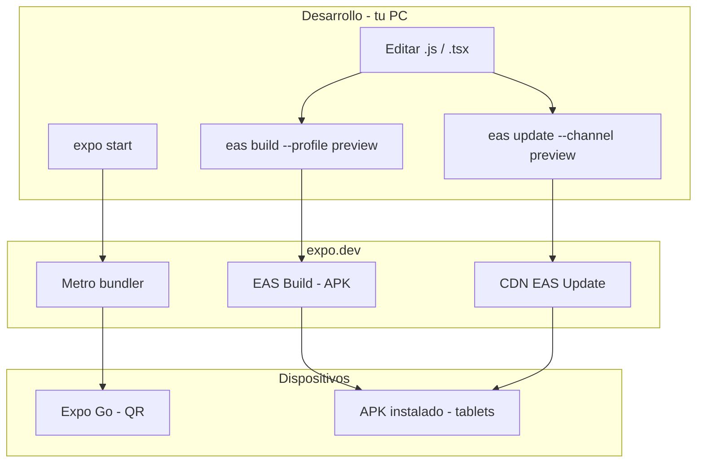
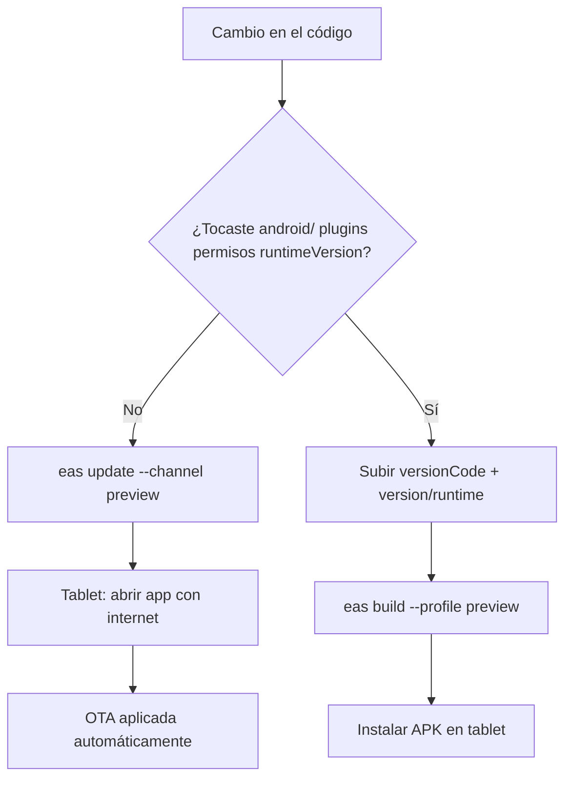

# Expo Dev / EAS: desarrollo, APK y actualizaciones (App Mozos)

**Versión del documento:** 2.0  
**Última actualización:** Mayo 2026  
**Proyecto Expo:** [@hgartemis/appmozo](https://expo.dev/accounts/hgartemis/projects/appmozo)  
**Project ID:** `afcea184-5e43-4fc0-8fb9-553db952ce44`  
**Cuenta:** `hgartemis` · **Package Android:** `com.carlos121.appmozo`

Guía operativa completa: desarrollo con **Expo Dev**, generación de **APK** sin Play Store, **actualizaciones OTA** automáticas en tablets y cuándo hace falta un APK nuevo.

| Documento relacionado | Contenido |
|----------------------|-----------|
| [INSTALACION_Y_ACTUALIZACION_APP_MOZOS.md](./INSTALACION_Y_ACTUALIZACION_APP_MOZOS.md) | Instalación en tablets del restaurante |
| [NETWORK_ERROR_APK_VS_EXPO_GO.md](./NETWORK_ERROR_APK_VS_EXPO_GO.md) | Network Error en APK vs Expo Go |

---

## Índice

1. [Resumen: tres formas de ejecutar la app](#1-resumen-tres-formas-de-ejecutar-la-app)
2. [Expo Dev: desarrollo en tu PC (expo start)](#2-expo-dev-desarrollo-en-tu-pc-expo-start)
3. [Expo Go vs APK vs Development Client](#3-expo-go-vs-apk-vs-development-client)
4. [Requisitos y primera configuración](#4-requisitos-y-primera-configuración)
5. [Configuración del proyecto en el repo](#5-configuración-del-proyecto-en-el-repo)
6. [Generar APK con EAS Build](#6-generar-apk-con-eas-build)
7. [Instalar y actualizar APK en tablets](#7-instalar-y-actualizar-apk-en-tablets)
8. [Actualizaciones OTA (sin descargar APK)](#8-actualizaciones-ota-sin-descargar-apk)
9. [Flujo de trabajo recomendado (día a día)](#9-flujo-de-trabajo-recomendado-día-a-día)
10. [Versionado, canales y runtimeVersion](#10-versionado-canales-y-runtimeversion)
11. [Build local con Gradle (alternativa)](#11-build-local-con-gradle-alternativa)
12. [Solución de problemas](#12-solución-de-problemas)
13. [Comandos de referencia](#13-comandos-de-referencia)
14. [Enlaces útiles](#14-enlaces-útiles)

---

## 1. Resumen: tres formas de ejecutar la app

| Modo | Comando / origen | Uso | ¿Recibe OTA? | ¿Push remoto? |
|------|------------------|-----|--------------|---------------|
| **Expo Dev** (`expo start` + QR) | `npx expo start` | Programar y probar en el momento | No | Limitado en Expo Go |
| **APK preview** (EAS Build) | `eas build --profile preview` | Tablets del restaurante | **Sí**, canal `preview` | Sí |
| **APK production** | `eas build --profile production` | Entorno real separado | **Sí**, canal `production` | Sí |



**Respuesta corta:** con el APK **v1.0.1** (build actual) instalas **una vez** en cada tablet. Después, la mayoría de cambios se publican con **`eas update`** y la app se actualiza sola al abrirse (OTA). Solo vuelves a descargar APK cuando cambias algo **nativo**.

---

## 2. Expo Dev: desarrollo en tu PC (`expo start`)

### 2.1 Iniciar el servidor de desarrollo

```powershell
cd e:\PROYECTOGAMBUSINAS\Las-Gambusinas
npm install
npx expo start
```

Opciones útiles en la terminal de Expo:

| Tecla | Acción |
|-------|--------|
| `a` | Abrir en emulador Android |
| `w` | Abrir en navegador web |
| `r` | Recargar app |
| `m` | Menú de desarrollo |

### 2.2 Probar en el teléfono con QR (Expo Go)

1. Instala **Expo Go** desde Play Store en el teléfono.
2. Misma red Wi‑Fi que la PC.
3. Escanea el QR que muestra `expo start`.
4. La app carga el bundle desde tu PC (Metro).

**Importante:** en Expo Go el backend suele funcionar con `http://IP_LAN:3000/api` aunque el APK release lo bloqueaba antes del fix de cleartext. Por eso “en QR sí conecta y en APK no” era habitual — ver [NETWORK_ERROR_APK_VS_EXPO_GO.md](./NETWORK_ERROR_APK_VS_EXPO_GO.md).

### 2.3 Variables de entorno en desarrollo

Copia y ajusta la IP de tu PC/servidor:

```powershell
copy .env.example .env
```

Ejemplo en `.env`:

```env
EXPO_PUBLIC_API_BASE=http://192.168.18.127:3000/api
EXPO_PUBLIC_WS_URL=ws://192.168.18.127:3000
```

Reinicia `expo start` tras cambiar `.env`.

### 2.4 Qué NO hace Expo Dev

- No genera el APK de producción.
- No aplica **EAS Update** (OTA) — eso solo corre en builds release (`__DEV__ === false`).
- Expo Go no equivale al APK de mozos en restaurante (push remoto, manifest Android, etc.).

---

## 3. Expo Go vs APK vs Development Client

| | Expo Go | APK `preview` (EAS) | Development Client |
|--|---------|---------------------|-------------------|
| Instalación | App Expo Go + QR | APK desde [expo.dev/builds](https://expo.dev/accounts/hgartemis/projects/appmozo/builds) | `eas build --profile development` |
| Conexión HTTP LAN | Suele funcionar | Requiere `usesCleartextTraffic` (ya en v1.0.1) | Similar a debug |
| Actualización sin APK | No (solo recarga Metro) | **Sí — OTA** | Parcial |
| Uso en restaurante | No recomendado | **Recomendado** | Solo desarrollo |

**Build APK actual (reemplaza builds anteriores sin cleartext):**

- **URL:** https://expo.dev/accounts/hgartemis/projects/appmozo/builds/71c12af4-f124-46d1-abd4-dddc55285681  
- **Versión:** 1.0.1 · `versionCode` 2 · `runtimeVersion` 1.0.1 · canal `preview`  
- **Incluye:** HTTP cleartext (fix Network Error), `POST_NOTIFICATIONS`, `expo-updates` OTA al abrir

**Build obsoleto (no usar en tablets nuevas):**  
https://expo.dev/accounts/hgartemis/projects/appmozo/builds/c88a544a-f288-4ed3-8212-c5d88f00a5bd (v1.0.0, sin fix de red en release)

---

## 4. Requisitos y primera configuración

### 4.1 En la PC de desarrollo

- **Node.js** LTS (compatible con Expo SDK 54).
- **Cuenta Expo:** [expo.dev](https://expo.dev) — usuario `hgartemis`.
- **EAS CLI:** `npx eas-cli` (no hace falta instalar global si usas `npx`).
- **Git** (opcional; EAS sube el proyecto comprimido).

### 4.2 Login y vinculación (primera vez)

```powershell
cd e:\PROYECTOGAMBUSINAS\Las-Gambusinas
npm install
npx eas-cli login
npx eas-cli whoami
```

Debe mostrar `hgartemis`. El `projectId` ya está en `app.json`:

```text
afcea184-5e43-4fc0-8fb9-553db952ce44
```

Solo ejecuta `npx eas-cli init` si creas un proyecto Expo nuevo.

### 4.3 Dashboard Expo (panel web)

| Sección | URL |
|---------|-----|
| Proyecto | https://expo.dev/accounts/hgartemis/projects/appmozo |
| Builds (APK) | https://expo.dev/accounts/hgartemis/projects/appmozo/builds |
| Updates (OTA) | https://expo.dev/accounts/hgartemis/projects/appmozo/updates |

---

## 5. Configuración del proyecto en el repo

### 5.1 Perfiles EAS — [`eas.json`](../eas.json)

| Perfil | Uso | Canal OTA | Salida Android |
|--------|-----|-----------|----------------|
| `development` | Dev client | `development` | Development build |
| **`preview`** | **Tablets mozos (recomendado)** | **`preview`** | APK interno |
| `production` | Entorno real separado | `production` | APK |

### 5.2 `app.json` — versión y OTA (valores actuales)

| Campo | Valor actual |
|-------|----------------|
| `expo.version` | `1.0.1` |
| `runtimeVersion` | `1.0.1` |
| `android.usesCleartextTraffic` | `true` |
| Permisos Android | `RECORD_AUDIO`, `POST_NOTIFICATIONS` |

```json
"updates": {
  "url": "https://u.expo.dev/afcea184-5e43-4fc0-8fb9-553db952ce44",
  "enabled": true,
  "checkAutomatically": "ON_LOAD",
  "fallbackToCacheTimeout": 0
}
```

- **`runtimeVersion`:** string fijo `"1.0.1"` (bare workflow con carpeta `android/`). No usar `policy: appVersion`.
- **`checkAutomatically: ON_LOAD`:** al abrir la app, consulta si hay OTA nueva.

### 5.3 Código que aplica OTA al iniciar

| Archivo | Función |
|---------|---------|
| [`services/otaUpdates.js`](../services/otaUpdates.js) | `checkAndApplyOtaUpdate()` — comprueba, descarga y `reloadAsync()` |
| [`App.js`](../App.js) | Llama a OTA al arranque (solo release, no en `__DEV__`) |
| [`services/pushNotifications.js`](../services/pushNotifications.js) | Permisos push; pide notificaciones en login (APK, no Expo Go) |

Manifest Android (release) ya incluye:

- `android:usesCleartextTraffic="true"` — permite `http://IP:3000/api` en LAN.
- Meta-datos `expo.modules.updates.*` — OTA habilitada, check **ALWAYS** al lanzar.

### 5.4 Scripts npm — [`package.json`](../package.json)

| Script | Comando |
|--------|---------|
| `npm start` | `expo start` — desarrollo |
| `npm run build:apk:preview` | `eas build --platform android --profile preview` |
| `npm run update:preview` | `eas update --channel preview` |
| `npm run update:production` | `eas update --channel production` |

---

## 6. Generar APK con EAS Build

### 6.1 Cuándo generar un APK nuevo

- Primera instalación en tablets.
- Cambios en `android/`, permisos, plugins nativos (`expo-notifications`, etc.).
- Cambio de `runtimeVersion`.
- Actualización de SDK Expo con código nativo.

### 6.2 Comando (perfil `preview`)

```powershell
cd e:\PROYECTOGAMBUSINAS\Las-Gambusinas
npm install
npx eas-cli build --platform android --profile preview --non-interactive
```

O:

```powershell
npm run build:apk:preview
```

`--non-interactive` evita preguntas en CI/scripts. Sin `--no-wait`, la CLI espera hasta que termine (~15–25 min).

### 6.3 Qué hace EAS durante el build

1. Comprime y sube el proyecto a Expo.
2. Usa **keystore remoto** de Expo (credencial `yvmbF6MBWH` en la cuenta).
3. Compila APK en la nube (SDK 54, `versionCode` desde `build.gradle`).
4. Publica enlace + QR para instalar.

### 6.4 Checklist antes de cada APK

- [ ] `npm install`
- [ ] Si es release nuevo: **`versionCode` +1** en `android/app/build.gradle`
- [ ] Alinear `expo.version`, `runtimeVersion` y `strings.xml` → `expo_runtime_version` si cambias versión nativa
- [ ] URL/API correcta para el entorno (el mozo también puede cambiarla en Ajustes)
- [ ] No mezclar APK firmado localmente con APK EAS en la misma tablet sin coordinar firma

### 6.5 Ver estado y descargar

```powershell
npx eas-cli build:list
npx eas-cli build:view 71c12af4-f124-46d1-abd4-dddc55285681
```

En el dashboard → **Download** para guardar el `.apk` en disco.

### 6.6 Perfil `production`

```powershell
npx eas-cli build --platform android --profile production
```

OTA de producción solo llega a APKs compilados con canal `production`.

---

## 7. Instalar y actualizar APK en tablets

### 7.1 Primera instalación

1. Abrir en la tablet el enlace del build o escanear el QR (mismo dispositivo).
2. Permitir **orígenes desconocidos** (Chrome / Archivos).
3. Instalar → Abrir.
4. **Configuración del servidor:** `http://<IP_LAN_PC>:3000/api` (no `localhost`).
5. **Probar conexión** en ajustes.
6. Login del mozo.
7. Android 13+: aceptar permiso de **notificaciones** cuando la app lo solicite.

### 7.2 Actualizar APK encima (sin desinstalar)

Requisitos Android:

| Requisito | Valor |
|-----------|--------|
| Package | `com.carlos121.appmozo` |
| Firma | Misma keystore EAS |
| `versionCode` | **Mayor** que el instalado (actual: `2`) |

Pasos: descargar nuevo APK → abrir → **Actualizar** / **Instalar**.

Si falla “conflicto de paquete”: firma distinta o `versionCode` no incrementado → desinstalar e instalar de nuevo (se pierde URL/sesión en AsyncStorage).

### 7.3 Verificar versión instalada

En la app: **Más** → **Acerca de** → debe mostrar **1.0.1**.

---

## 8. Actualizaciones OTA (sin descargar APK)

### 8.1 Cómo funciona en la tablet

1. La tablet tiene el APK **preview** con `runtimeVersion` **1.0.1**.
2. Tú publicas una OTA con `eas update --channel preview`.
3. El mozo **abre la app** (o la cierra y vuelve a abrir).
4. La app consulta `https://u.expo.dev/...` (`ON_LOAD` + `otaUpdates.js`).
5. Si hay bundle nuevo: lo descarga y **recarga** automáticamente.

**Requisitos en la tablet:** internet (Wi‑Fi) al abrir la app. No hace falta Play Store ni descargar otro APK.

### 8.2 Qué puedes actualizar con OTA

| Sí (OTA) | No (necesita APK nuevo) |
|----------|-------------------------|
| Pantallas, componentes React | Permisos Android nuevos |
| Lógica JS/TS, axios, sockets | Cambios en `AndroidManifest.xml` |
| Estilos, textos, assets en bundle | Nuevos plugins con código nativo |
| Fixes de negocio (comandas, pagos) | Cambio de `runtimeVersion` |
| Configuración guardada en AsyncStorage (runtime) | `usesCleartextTraffic` (ya va en APK 1.0.1) |

### 8.3 Publicar una OTA (paso a paso)

```powershell
cd e:\PROYECTOGAMBUSINAS\Las-Gambusinas

# 1. Editar código (.js, .tsx, etc.)
# 2. Probar localmente (opcional)
npx expo start

# 3. Publicar al canal preview (mismo que el APK instalado)
npx eas-cli update --channel preview --message "Fix: pantalla pagos y mensaje mesa"
```

O:

```powershell
npm run update:preview
```

**En la tablet:** cerrar la app por completo → volver a abrir → esperar unos segundos (descarga + recarga).

### 8.4 Comprobar que la OTA se publicó

- Dashboard: https://expo.dev/accounts/hgartemis/projects/appmozo/updates  
- Debe mostrar: **Branch** `preview`, **Runtime version** `1.0.1`, plataforma Android.

### 8.5 OTA en canal `production`

```powershell
npx eas-cli update --channel production --message "Release producción"
```

Solo tablets con APK compilado con perfil `production` la recibirán.

### 8.6 Baseline OTA tras un APK nuevo (opcional)

Después de instalar un APK nuevo por primera vez con `runtimeVersion` nuevo:

```powershell
npx eas-cli update --channel preview --message "Baseline v1.0.1"
```

Así el CDN tiene el mismo JS que el embebido en el APK.

### 8.7 Diagrama: decisión OTA vs APK



---

## 9. Flujo de trabajo recomendado (día a día)

### Escenario A — Desarrollo y prueba rápida

```text
1. Backend corriendo (IP en .env del backend)
2. cd Las-Gambusinas && npx expo start
3. Escanear QR con Expo Go
4. Probar login, mesas, socket
```

### Escenario B — Entregar fix a tablets ya con APK 1.0.1 (lo más habitual)

```text
1. Editar código JS/TS
2. npm run update:preview   (o eas update con --message)
3. Avisar al local: "cerrar y abrir la app con Wi‑Fi"
4. Verificar en una tablet
```

**Tiempo:** minutos. **Sin** nuevo APK.

### Escenario C — Nuevo permiso, plugin o versión nativa

```text
1. Editar app.json / android/ / build.gradle
2. versionCode++ , alinear version + runtimeVersion
3. npm run build:apk:preview
4. Esperar build en expo.dev
5. Instalar APK en tablets (enlace o QR)
6. Opcional: eas update --channel preview --message "Baseline"
```

### Escenario D — Primera vez en un restaurante

```text
1. eas build --profile preview  (o usar build 71c12af4... si ya terminó)
2. Instalar APK en cada tablet
3. Configurar URL servidor + login
4. Futuros cambios → solo OTA (escenario B)
```

---

## 10. Versionado, canales y runtimeVersion

### 10.1 Valores actuales en el repo

| Archivo | Campo | Valor |
|---------|--------|-------|
| `app.json` | `version` | `1.0.1` |
| `app.json` | `runtimeVersion` | `1.0.1` |
| `android/app/build.gradle` | `versionCode` | `2` |
| `android/app/build.gradle` | `versionName` | `"1.0.1"` |
| `android/.../strings.xml` | `expo_runtime_version` | `1.0.1` |

> Con carpeta `android/`, EAS usa `applicationId` del Gradle: `com.carlos121.appmozo`.

### 10.2 Regla del `runtimeVersion`

| Situación | Acción |
|-----------|--------|
| Solo cambios JS | OTA en canal `preview`, **mismo** `runtimeVersion` 1.0.1 |
| Cambio incompatible nativo | Subir `runtimeVersion` a p. ej. `1.0.2` + **nuevo APK** + luego OTA solo para 1.0.2 |

Tablets con APK `runtimeVersion` **1.0.0** **no** reciben OTA publicada para **1.0.1**.

### 10.3 Canales y perfiles (tabla de correspondencia)

| Publicas con | APK debe compilarse con | Tablets que reciben |
|--------------|-------------------------|---------------------|
| `eas update --channel preview` | `eas build --profile preview` | Mozos / pruebas |
| `eas update --channel production` | `eas build --profile production` | Producción dedicada |

### 10.4 Siguiente release APK (ejemplo)

| Archivo | Cambio |
|---------|--------|
| `app.json` | `"version": "1.0.2"`, `"runtimeVersion": "1.0.2"` |
| `build.gradle` | `versionCode 3`, `versionName "1.0.2"` |
| `strings.xml` | `expo_runtime_version` → `1.0.2` |

---

## 11. Build local con Gradle (alternativa)

Si no usas EAS y tienes Android SDK:

```powershell
& "E:\PROYECTOGAMBUSINAS\build-Las-Gambusinas-APK.ps1"
```

Salida:

```text
Las-Gambusinas/android/app/build/outputs/apk/release/app-release.apk
```

**Advertencia:** keystore local puede diferir del de EAS → problemas al “actualizar encima” o con OTA. Para tablets de mozos, **preferir EAS Build** y un solo método de firma.

---

## 12. Solución de problemas

| Síntoma | Causa probable | Solución |
|---------|----------------|----------|
| **Network Error** en APK, Expo Go OK | HTTP bloqueado en release | APK **v1.0.1+** con cleartext; URL con IP LAN, no `localhost` — [NETWORK_ERROR](./NETWORK_ERROR_APK_VS_EXPO_GO.md) |
| OTA no llega | Canal distinto | APK `preview` + `eas update --channel preview` |
| OTA no llega | `runtimeVersion` distinto | Mismo runtime o nuevo APK |
| OTA no aplica | App en desarrollo | OTA solo en APK release, no en `expo start` |
| OTA no aplica | Sin internet en tablet | Wi‑Fi activo al abrir app |
| `eas update` sin efecto | Mensaje de runtime | Ver dashboard Updates: runtime `1.0.1` |
| No instala APK nuevo | `versionCode` no subió | +1 en `build.gradle` |
| Conflicto al instalar | Firma distinta | Solo APK EAS misma cuenta; no mezclar con Gradle local |
| `runtime version policies are not supported` | `policy: appVersion` en bare | String fijo en `runtimeVersion` |
| Push no funciona en Expo Go | Limitación SDK 53+ | Probar en APK EAS |
| Notificaciones no en Android 13+ | Permiso no concedido | Aceptar diálogo; revisar Ajustes → App → Notificaciones |
| `ECOMPROMISED` npm | Caché npm | `npm cache clean --force`; usar `npx eas-cli` |
| Build EAS lento / falla | Cola o dependencias | Ver logs en URL del build; `npm install` local antes de subir |

---

## 13. Comandos de referencia

```powershell
cd e:\PROYECTOGAMBUSINAS\Las-Gambusinas

# --- Expo Dev (desarrollo) ---
npm install
npx expo start                    # QR / emulador
npx expo start --tunnel           # Si la red bloquea LAN

# --- Cuenta Expo ---
npx eas-cli login
npx eas-cli whoami

# --- APK (instalación o cambios nativos) ---
npx eas-cli build --platform android --profile preview
npx eas-cli build --platform android --profile preview --non-interactive --no-wait
npm run build:apk:preview

# --- OTA (actualizar tablets sin nuevo APK) ---
npx eas-cli update --channel preview --message "Descripción del cambio"
npm run update:preview
npx eas-cli update --channel production --message "Release prod"

# --- Consultar builds ---
npx eas-cli build:list
npx eas-cli build:view 71c12af4-f124-46d1-abd4-dddc55285681
```

---

## 14. Enlaces útiles

| Recurso | URL |
|---------|-----|
| Proyecto appmozo | https://expo.dev/accounts/hgartemis/projects/appmozo |
| Builds | https://expo.dev/accounts/hgartemis/projects/appmozo/builds |
| Build actual v1.0.1 | https://expo.dev/accounts/hgartemis/projects/appmozo/builds/71c12af4-f124-46d1-abd4-dddc55285681 |
| Updates (OTA) | https://expo.dev/accounts/hgartemis/projects/appmozo/updates |
| Docs EAS Build | https://docs.expo.dev/build/introduction/ |
| Docs EAS Update | https://docs.expo.dev/eas-update/introduction/ |
| Docs `expo start` | https://docs.expo.dev/get-started/start-developing/ |
| Runtime versions | https://docs.expo.dev/eas-update/runtime-versions/ |

### Documentación relacionada en este repo

- [INSTALACION_Y_ACTUALIZACION_APP_MOZOS.md](./INSTALACION_Y_ACTUALIZACION_APP_MOZOS.md) — Operación en restaurante  
- [NETWORK_ERROR_APK_VS_EXPO_GO.md](./NETWORK_ERROR_APK_VS_EXPO_GO.md) — Diagnóstico red APK vs Expo Go  
- [APP_MOZOS_DOCUMENTACION_COMPLETA.md](./APP_MOZOS_DOCUMENTACION_COMPLETA.md) — Arquitectura y push  
- [`eas.json`](../eas.json) · [`app.json`](../app.json) · [`services/otaUpdates.js`](../services/otaUpdates.js)

---

## Resumen ejecutivo

| Pregunta | Respuesta |
|----------|-----------|
| ¿Desarrollo diario? | `npx expo start` + Expo Go (QR) |
| ¿Tablets del restaurante? | APK EAS `preview` v1.0.1 (enlace arriba) |
| ¿Actualizar sin descargar APK? | **Sí** → `eas update --channel preview` + abrir app con Wi‑Fi |
| ¿Cuándo nuevo APK? | Permisos, `android/`, plugins nativos, nuevo `runtimeVersion` |
| ¿Se actualiza sola al abrir? | **Sí** — `ON_LOAD` + `checkAndApplyOtaUpdate()` en release |
