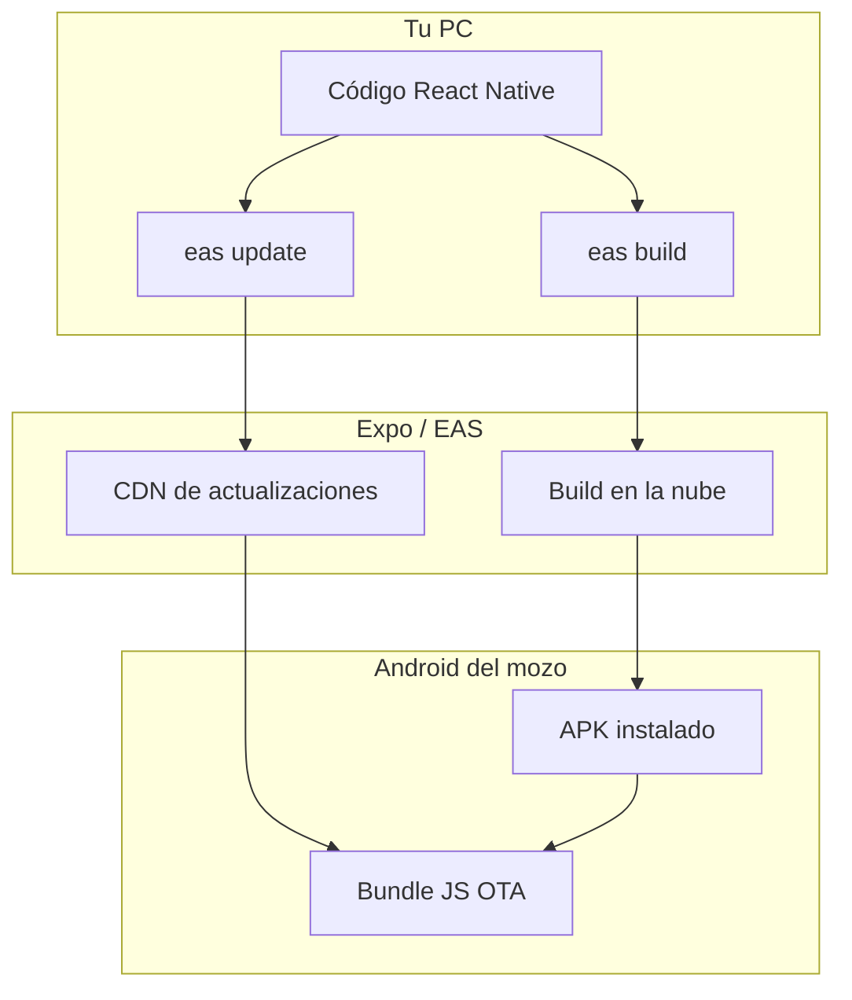
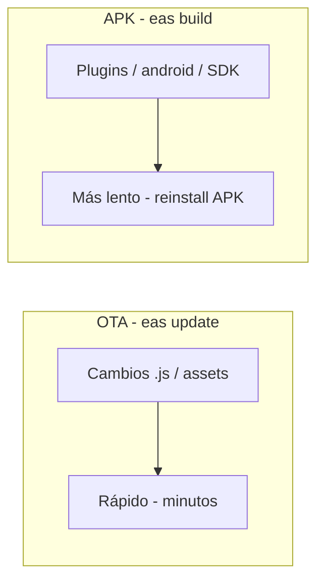

# Expo / EAS: APK sin Play Store y actualizaciones (App Mozos)

**Versión del documento:** 1.0  
**Última actualización:** Mayo 2026  
**Proyecto Expo:** [@hgartemis/appmozo](https://expo.dev/accounts/hgartemis/projects/appmozo)  
**Project ID:** `afcea184-5e43-4fc0-8fb9-553db952ce44`

Guía completa para el equipo de desarrollo: generar un **APK instalable directo en Android** (sin Google Play Store) y publicar **actualizaciones** de dos formas — **OTA** (solo JavaScript/assets) o **nuevo APK** (cambios nativos).

Para instalación en tablets del restaurante (mozos), ver también [INSTALACION_Y_ACTUALIZACION_APP_MOZOS.md](./INSTALACION_Y_ACTUALIZACION_APP_MOZOS.md).

---

## Índice

1. [Conceptos: qué es Expo, EAS Build y EAS Update](#1-conceptos-qué-es-expo-eas-build-y-eas-update)
2. [Requisitos en la PC de desarrollo](#2-requisitos-en-la-pc-de-desarrollo)
3. [Configuración del proyecto (ya aplicada)](#3-configuración-del-proyecto-ya-aplicada)
4. [Primera vez: cuenta Expo y vinculación](#4-primera-vez-cuenta-expo-y-vinculación)
5. [Generar el APK en la nube (EAS Build)](#5-generar-el-apk-en-la-nube-eas-build)
6. [Instalar el APK en el celular o tablet](#6-instalar-el-apk-en-el-celular-o-tablet)
7. [Actualizar la app sin Play Store](#7-actualizar-la-app-sin-play-store)
8. [Versionado, canales y runtimeVersion](#8-versionado-canales-y-runtimeversion)
9. [Comandos de referencia rápida](#9-comandos-de-referencia-rápida)
10. [Build local con Gradle (alternativa)](#10-build-local-con-gradle-alternativa)
11. [Solución de problemas](#11-solución-de-problemas)
12. [Enlaces útiles](#12-enlaces-útiles)

---

## 1. Conceptos: qué es Expo, EAS Build y EAS Update

| Herramienta | Función |
|-------------|---------|
| **Expo** | Framework sobre React Native; el proyecto usa SDK 54. |
| **Expo Go** | App de prueba en desarrollo; **no** sirve para producción ni push completas. |
| **EAS Build** | Compila en servidores de Expo y entrega un **APK** (o IPA en iOS). |
| **EAS Update** | Publica cambios de **JS/TS y assets** a apps ya instaladas (**OTA**), sin reinstalar APK. |
| **Canal (channel)** | Etiqueta que une un APK compilado con las OTA que recibe (p. ej. `preview`). |



**Sin Google Play Store:** el APK se distribuye por enlace de Expo, USB, carpeta compartida o URL en tu servidor. Las OTA llegan por internet al abrir la app (configurado en `app.json` → `updates.url`).

---

## 2. Requisitos en la PC de desarrollo

- **Node.js** LTS (compatible con Expo 54).
- **Cuenta Expo:** [expo.dev](https://expo.dev) (cuenta del proyecto: `hgartemis`).
- **EAS CLI:** global o vía `npx eas-cli` (recomendado si falla `npm install -g`).
- **Git** (opcional; EAS puede subir el proyecto comprimido sin commit).
- Para **build local** (opcional): Android Studio, Android SDK, JDK — ver [sección 10](#10-build-local-con-gradle-alternativa).

No necesitas publicar en Google Play Console para generar ni instalar el APK.

---

## 3. Configuración del proyecto (ya aplicada)

### 3.1 `eas.json` — perfiles de compilación

| Perfil | Uso | Canal EAS Update | Android |
|--------|-----|------------------|---------|
| `development` | Cliente de desarrollo | `development` | Development client |
| **`preview`** | **APK interno (recomendado para mozos / pruebas)** | `preview` | `apk`, `distribution: internal` |
| `production` | APK de producción | `production` | `apk` |

Archivo: [`eas.json`](../eas.json).

### 3.2 `app.json` — updates y proyecto Expo

```json
"version": "1.0.0",
"runtimeVersion": "1.0.0",
"updates": {
  "url": "https://u.expo.dev/afcea184-5e43-4fc0-8fb9-553db952ce44",
  "enabled": true,
  "checkAutomatically": "ON_LOAD"
},
"extra": {
  "eas": {
    "projectId": "afcea184-5e43-4fc0-8fb9-553db952ce44"
  }
}
```

- **`projectId`:** ya vinculado; no hace falta `eas init` salvo proyecto nuevo.
- **`runtimeVersion`:** debe ser un **string fijo** (p. ej. `"1.0.0"`) porque el repo tiene carpeta `android/` (**bare workflow**). No usar `{"policy": "appVersion"}` en este proyecto.

### 3.3 `expo-updates` y comprobación al abrir la app

- Dependencia: `expo-updates` (~29.x, SDK 54).
- Lógica: [`services/otaUpdates.js`](../services/otaUpdates.js) — en release comprueba OTA y recarga; en `__DEV__` no aplica.
- Integración: [`App.js`](../App.js) llama a `checkAndApplyOtaUpdate()` al iniciar.

### 3.4 Scripts npm

| Script | Comando equivalente |
|--------|---------------------|
| `npm run build:apk:preview` | `eas build --platform android --profile preview` |
| `npm run update:preview` | `eas update --channel preview` |
| `npm run update:production` | `eas update --channel production` |

---

## 4. Primera vez: cuenta Expo y vinculación

```powershell
cd e:\PROYECTOGAMBUSINAS\Las-Gambusinas
npm install
npx eas-cli login
npx eas-cli whoami
```

Si el proyecto no tuviera `projectId` en `app.json`:

```powershell
npx eas-cli init
```

En este repo el ID ya es `afcea184-5e43-4fc0-8fb9-553db952ce44`.

---

## 5. Generar el APK en la nube (EAS Build)

### 5.1 Perfil recomendado: `preview`

APK listo para instalar en dispositivos reales, canal `preview` para OTA.

```powershell
cd e:\PROYECTOGAMBUSINAS\Las-Gambusinas
npm install
npx eas-cli build --platform android --profile preview
```

O:

```powershell
npm run build:apk:preview
```

### 5.2 Qué ocurre durante el build

1. EAS empaqueta el proyecto y lo sube.
2. Usa credenciales Android remotas (keystore en servidores Expo) si ya están configuradas.
3. Compila el APK en la nube (~15–25 min).
4. Muestra un **enlace** y un **código QR** para instalar en el teléfono.

### 5.3 Dónde ver el resultado

- Listado de builds: https://expo.dev/accounts/hgartemis/projects/appmozo/builds  
- Ejemplo de build exitoso (preview): https://expo.dev/accounts/hgartemis/projects/appmozo/builds/c88a544a-f288-4ed3-8212-c5d88f00a5bd  

### 5.4 Descargar el APK a disco (opcional)

Desde el dashboard → build → **Download** → guardar p. ej.:

```text
E:\PROYECTOGAMBUSINAS\Las-Gambusinas-mozos-preview-v1.0.0.apk
```

### 5.5 Perfil `production`

Mismo flujo, otro canal (OTA independiente):

```powershell
npx eas-cli build --platform android --profile production
```

Usa `production` solo cuando quieras separar builds/OTA de entorno real vs pruebas.

### 5.6 Checklist antes de cada build APK

- [ ] `npm install` ejecutado
- [ ] URL del API / `.env` correctos para el entorno
- [ ] Si es **nuevo APK** (no solo OTA): subir `versionCode` en `android/app/build.gradle` y alinear `expo.version` + `runtimeVersion` si cambias versión nativa (ver [sección 8](#8-versionado-canales-y-runtimeversion))

---

## 6. Instalar el APK en el celular o tablet

1. Abre en el **mismo dispositivo Android** el enlace del build o escanea el QR de Expo.
2. Descarga e instala (permite **instalar apps desconocidas** para Chrome/Archivos).
3. Abre **App Mozos** → configura **URL del servidor** → **login** del mozo.
4. Comprueba versión en **Más** / **Acerca de** (`1.0.0` según `app.json`).

Detalle operativo para restaurante: [INSTALACION_Y_ACTUALIZACION_APP_MOZOS.md §5](./INSTALACION_Y_ACTUALIZACION_APP_MOZOS.md#5-primera-instalación-en-la-tablet).

---

## 7. Actualizar la app sin Play Store

Hay **dos mecanismos**. Elige según el tipo de cambio.

### 7.1 Actualización OTA (EAS Update) — sin nuevo APK

**Qué actualiza:** pantallas, lógica JS/TS, estilos, assets empaquetados en el bundle.  
**Qué no actualiza:** plugins nativos nuevos, permisos Android, cambios en `android/`, SDK de Expo, dependencias con código nativo.

**Requisito:** el dispositivo debe tener instalado un APK compilado con el **mismo canal** y **mismo `runtimeVersion`** que la OTA.

```powershell
cd e:\PROYECTOGAMBUSINAS\Las-Gambusinas
# Tras editar código JS/TS:
npx eas-cli update --channel preview --message "Descripción del cambio"
```

O:

```powershell
npm run update:preview
```

**En el teléfono:** cerrar y volver a abrir la app (o esperar recarga automática). La app comprueba updates al cargar (`checkAutomatically: ON_LOAD` + `otaUpdates.js`).

**Dashboard de updates:** https://expo.dev/accounts/hgartemis/projects/appmozo/updates  

| Publicas OTA en canal | El APK debe haberse generado con perfil |
|-----------------------|----------------------------------------|
| `preview` | `preview` |
| `production` | `production` |

### 7.2 Actualización con nuevo APK — cambios nativos o versión nueva

**Cuándo:** nuevo plugin Expo, permisos, `expo-notifications`, cambio de `runtimeVersion`, actualización mayor de SDK, etc.

**Pasos:**

1. Incrementar `versionCode` (y opcionalmente `versionName`) en [`android/app/build.gradle`](../android/app/build.gradle).
2. Si cambias versión de app de forma incompatible con OTA anterior: actualizar `expo.version` y **`runtimeVersion`** (mismo string) en [`app.json`](../app.json).
3. `npx eas-cli build --platform android --profile preview` (o `production`).
4. En cada tablet: abrir el **nuevo APK** → Instalar/Actualizar encima (misma firma EAS + `versionCode` mayor).
5. Opcional: publicar OTA inicial en el canal tras el build: `eas update --channel preview --message "Baseline v1.0.1"`.



### 7.3 Resumen: ¿OTA o APK?

| Cambio | Comando |
|--------|---------|
| Textos, pantallas, fixes en `.js` | `eas update --channel preview` |
| Nuevo módulo nativo, permisos, `app.json` plugins | `eas build --profile preview` + instalar APK |
| Subir versión incompatible de runtime | Cambiar `runtimeVersion` + **nuevo APK** + luego OTA solo con ese runtime |

### 7.4 Distribuir APK sin Play Store (recordatorio)

| Método | Pasos |
|--------|--------|
| Enlace Expo | QR / URL del build en expo.dev |
| Archivo local | Copiar `.apk` por USB o carpeta compartida |
| Servidor propio | Subir APK a HTTPS; el mozo descarga e instala |

No se usa Google Play Console en este flujo.

---

## 8. Versionado, canales y runtimeVersion

### Android (`android/app/build.gradle`)

| Campo | Valor actual | Siguiente release (ejemplo) |
|-------|--------------|----------------------------|
| `versionCode` | `1` | `2` (obligatorio +1 para instalar encima) |
| `versionName` | `"1.0.0"` | `"1.0.1"` |

> Con carpeta `android/`, EAS **ignora** `android.package` de `app.json` y usa el valor nativo (`com.carlos121.appmozo`).

### Expo (`app.json`)

| Campo | Rol |
|-------|-----|
| `version` | Versión visible en la app |
| `runtimeVersion` | Debe coincidir entre APK y OTA; si cambia, hace falta **nuevo APK** |

Al publicar OTA, EAS muestra algo como:

```text
Branch          preview
Runtime version 1.0.0
Platform        android, ios
```

Si cambias `runtimeVersion` de `1.0.0` a `1.0.1`, los dispositivos con APK `1.0.0` **no** recibirán OTA `1.0.1` hasta que instalen un APK compilado con `runtimeVersion` `1.0.1`.

---

## 9. Comandos de referencia rápida

```powershell
cd e:\PROYECTOGAMBUSINAS\Las-Gambusinas

# Dependencias
npm install

# Sesión Expo
npx eas-cli login
npx eas-cli whoami

# --- APK (instalación inicial o cambios nativos) ---
npx eas-cli build --platform android --profile preview
npm run build:apk:preview

# --- OTA (solo JS/TS, mismo runtimeVersion) ---
npx eas-cli update --channel preview --message "Fix pantalla pagos"
npm run update:preview

# Ver estado de un build
npx eas-cli build:list
npx eas-cli build:view BUILD_ID

# Desarrollo local (no es el APK de producción)
npx expo start
```

---

## 10. Build local con Gradle (alternativa)

Si no usas EAS y tienes Android SDK instalado:

```powershell
& "E:\PROYECTOGAMBUSINAS\build-Las-Gambusinas-APK.ps1"
```

Salida: `Las-Gambusinas/android/app/build/outputs/apk/release/app-release.apk`.

**Nota:** el build local puede usar keystore distinto al de EAS; para OTA coherentes, preferir **un solo método de firma** (idealmente EAS Build para tablets de mozos).

---

## 11. Solución de problemas

| Error / síntoma | Causa | Solución |
|-----------------|-------|----------|
| `runtime version policies are not supported` | Bare workflow + `policy: appVersion` | Usar `"runtimeVersion": "1.0.0"` string en `app.json` |
| OTA no llega al teléfono | Canal distinto al del APK | Rebuild con perfil `preview` o publicar OTA en `preview` |
| OTA no llega | `runtimeVersion` distinto | Alinear `runtimeVersion` o generar nuevo APK |
| `eas update` sin efecto | App en modo dev | OTA solo en APK release, no en `expo start` |
| No instala APK nuevo | `versionCode` no subió | Incrementar en `build.gradle` |
| Conflicto de paquete al instalar | Firma distinta | Usar mismo canal EAS / misma cuenta; no mezclar APK local y EAS sin coordinar |
| `ECOMPROMISED` en npm | Caché npm | `npm cache clean --force`; usar `npx eas-cli` |
| `SDK location not found` | Build local sin SDK | Android Studio + `ANDROID_HOME` |

---

## 12. Enlaces útiles

| Recurso | URL |
|---------|-----|
| Proyecto appmozo | https://expo.dev/accounts/hgartemis/projects/appmozo |
| Builds | https://expo.dev/accounts/hgartemis/projects/appmozo/builds |
| Updates (OTA) | https://expo.dev/accounts/hgartemis/projects/appmozo/updates |
| Docs EAS Build | https://docs.expo.dev/build/introduction/ |
| Docs EAS Update | https://docs.expo.dev/eas-update/introduction/ |
| Runtime versions | https://docs.expo.dev/eas-update/runtime-versions/ |

### Documentación relacionada en este repo

- [INSTALACION_Y_ACTUALIZACION_APP_MOZOS.md](./INSTALACION_Y_ACTUALIZACION_APP_MOZOS.md) — Operación en restaurante
- [APP_MOZOS_DOCUMENTACION_COMPLETA.md](./APP_MOZOS_DOCUMENTACION_COMPLETA.md) — Arquitectura app y push
- [App Mozos, App Cocina, Backend Las Gambusinas.md](./App%20Mozos,%20App%20Cocina,%20Backend%20Las%20Gambusinas.md) — Integración backend
