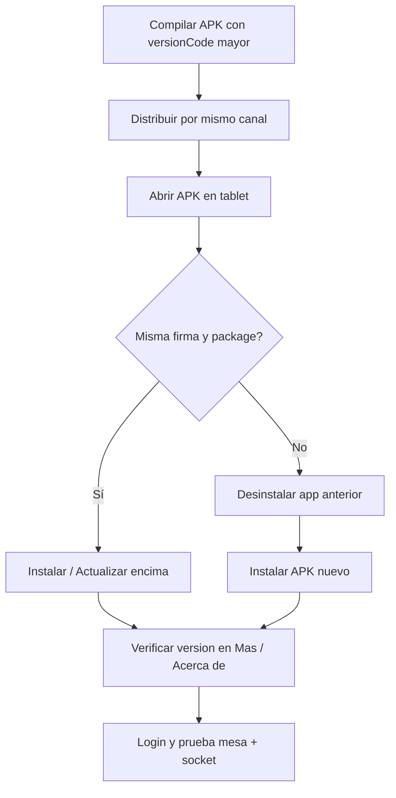

# Instalación y actualización APK — App Mozos (Las Gambusinas)

**Versión del documento:** 1.2  
**Última actualización:** Junio 2026  
**App:** `appmozo` · package `com.carlos121.appmozo` · versión actual en repo **`1.0.7`** (`versionCode` **7**, `runtimeVersion` **1.0.7**)

**Propósito:** Guía operativa para instalar la app de mozos en tablets del restaurante y actualizarla cuando publiques un nuevo APK.

| Documento | Contenido |
|-----------|-----------|
| **[COMANDA_DETALLE_TIEMPO_REAL.md](./COMANDA_DETALLE_TIEMPO_REAL.md)** | **ComandaDetalle** — tiempo real, diagnóstico S24 vs Tab A11, bugs conocidos |
| **[ENTREGA_PLEXPERITY_JUNIO_2026.md](./ENTREGA_PLEXPERITY_JUNIO_2026.md)** | **Handoff Plexperity** — resumen de cambios abril–junio 2026 |
| **[EXPO_EAS_APK_Y_ACTUALIZACIONES.md](./EXPO_EAS_APK_Y_ACTUALIZACIONES.md)** | Procedimiento completo Expo/EAS: crear APK, OTA sin Play Store, comandos |
| **[NETWORK_ERROR_APK_VS_EXPO_GO.md](./NETWORK_ERROR_APK_VS_EXPO_GO.md)** | **Network Error** al configurar servidor en APK (HTTP / cleartext) |
| [APP_MOZOS_DOCUMENTACION_COMPLETA.md](./APP_MOZOS_DOCUMENTACION_COMPLETA.md#-conversión-a-apk-nativo-y-funcionalidades-móviles-avanzadas) | Build nativo, Firebase, push |

---

## 1. Resumen y requisitos del dispositivo

| Requisito | Valor / nota |
|-----------|----------------|
| Sistema | Android 7.0+ (`minSdk` 24 del proyecto) |
| Dispositivo | Tablet o teléfono dedicado al mozo |
| Red | Wi‑Fi estable hacia el servidor backend Las Gambusinas |
| Instalación | Permitir “orígenes desconocidos” para la app que abre el APK (Archivos, Chrome, etc.) |
| Notificaciones | Android 13+: conceder permiso de notificaciones si usas alertas push |
| Cámara / galería | Solo si el mozo sube foto de perfil |

La app **no está en Play Store**; se distribuye como **APK firmado** instalado manualmente o desde un enlace interno del restaurante.

---

## 2. Modelo profesional de distribución (APK directo)

### Por qué APK directo

- Control total en cada local, sin revisión de tienda.
- Despliegue el mismo día que compilas.
- Adecuado para pocas tablets fijas por restaurante.

### Canales recomendados

| Canal | Uso | Ventaja |
|-------|-----|---------|
| USB / carpeta en PC del local | Primera instalación, locales sin servidor web | Simple, sin internet para el APK |
| URL HTTPS en servidor del restaurante | Actualizaciones recurrentes | Un enlace fijo; el mozo solo descarga e instala |
| [Expo EAS Build](https://expo.dev) | Equipo de desarrollo | Build en la nube; enlace de descarga por build |
| WhatsApp / correo | Solo emergencias | Riesgo de versiones mezcladas; no recomendado como canal principal |

### Nombre del archivo

Usa nombres versionados para no confundir builds:

```text
Las-Gambusinas-mozos-v1.0.1-build2.apk
```

Convención: `v{versionName}-build{versionCode}.apk`

---

## 3. Generar el APK

Valores actuales del repositorio:

| Campo | Valor actual |
|-------|----------------|
| `expo.version` (`app.json`) | `1.0.0` |
| `versionName` (`android/app/build.gradle`) | `1.0.0` |
| `versionCode` | `1` |
| `applicationId` / package | `com.carlos121.appmozo` |
| Perfil EAS **preview** (recomendado) | `apk` + canal `preview` + OTA |
| Perfil EAS production | `apk` + canal `production` |
| OTA (EAS Update) | `expo-updates` + canal alineado al APK instalado |

### Checklist antes de compilar

- [ ] `npm install` en `Las-Gambusinas/`
- [ ] Variables de entorno / URL del API correctas para el entorno (producción vs pruebas)
- [ ] **Incrementar** `versionCode` y `versionName` (ver sección 4)
- [ ] Misma keystore de producción que en releases anteriores (ver sección 4)

### Opción A — EAS Build (recomendada)

Procedimiento detallado: **[EXPO_EAS_APK_Y_ACTUALIZACIONES.md §5](./EXPO_EAS_APK_Y_ACTUALIZACIONES.md#5-generar-el-apk-en-la-nube-eas-build)**.

```powershell
cd Las-Gambusinas
npm install
npx eas-cli login
npx eas-cli build --platform android --profile preview
```

- Descarga o QR: [expo.dev → appmozo → Builds](https://expo.dev/accounts/hgartemis/projects/appmozo/builds).
- Perfil **`preview`**: APK interno + canal OTA `preview`.
- Perfil **`production`**: mismo formato APK, canal `production` (entorno real separado).

### Opción B — Build local (Gradle)

Requisitos: Android SDK (Android Studio), JDK en PATH.

```powershell
# Desde la raíz del monorepo (si existe el script):
& "E:\PROYECTOGAMBUSINAS\build-Las-Gambusinas-APK.ps1"
```

O manualmente:

```bash
cd Las-Gambusinas/android
./gradlew assembleRelease
```

**Salida del APK:**

```text
Las-Gambusinas/android/app/build/outputs/apk/release/app-release.apk
```

El script `build-Las-Gambusinas-APK.ps1` copia además el artefacto a:

```text
E:\PROYECTOGAMBUSINAS\Las-Gambusinas-app-release.apk
```

### Build de desarrollo (solo pruebas)

```bash
npx expo run:android
# o
eas build --platform android --profile development
```

No usar builds de desarrollo en tablets de producción del restaurante.

---

## 4. Versionado obligatorio para poder actualizar

Android solo permite **instalar encima** (sin desinstalar) si se cumple:

1. Mismo **package**: `com.carlos121.appmozo`
2. Misma **firma** (mismo keystore)
3. **`versionCode` estrictamente mayor** que el instalado

### Qué editar en cada release

| Archivo | Campo | Ejemplo siguiente release |
|---------|--------|---------------------------|
| `app.json` | `expo.version` | `1.0.1` |
| `android/app/build.gradle` | `versionName` | `"1.0.1"` |
| `android/app/build.gradle` | `versionCode` | `2` (siempre +1 entero) |

La versión visible en la app (**Más** / **Acerca de**) sale de `expo.version` vía `Constants.expoConfig?.version`.

### Keystore de producción (crítico)

En el repo actual, el build `release` usa temporalmente el **keystore debug**. Para un despliegue profesional:

1. Generar un keystore de producción (una sola vez).
2. Configurar `signingConfigs.release` en `android/app/build.gradle`.
3. **Guardar copia segura** del `.jks` y contraseñas.

Si cambias o pierdes el keystore, las tablets **no** podrán actualizar encima: habrá que **desinstalar** la app anterior e instalar el APK nuevo (se pierden datos locales en AsyncStorage: sesión, URL guardada, etc.).

### Registro de releases (recomendado)

| Fecha | versionName | versionCode | Notas | Tablets / local |
|-------|-------------|-------------|-------|-----------------|
| | 1.0.0 | 1 | Instalación inicial | |
| | | | | |

---

## 5. Primera instalación en la tablet

1. **Obtener el APK** por USB, carpeta compartida o descarga desde el enlace del servidor.
2. En la tablet: **Ajustes → Seguridad** (o **Aplicaciones**) → activar instalación desde la fuente que usarás (p. ej. “Archivos” o el navegador).
3. Abrir el archivo `.apk` → **Instalar** → **Abrir**.
4. En la app: configurar la **URL del servidor** (ajustes / configuración de API) y hacer **login** del mozo.
5. **Verificar:**
   - Indicador de conexión Socket (online en pantalla de inicio).
   - Abrir una mesa y comprobar que cargan comandas.
   - Si Firebase/FCM está configurado: probar una notificación (ver [APP_MOZOS — APK y push](./APP_MOZOS_DOCUMENTACION_COMPLETA.md#-conversión-a-apk-nativo-y-funcionalidades-móviles-avanzadas)).

---

## 6. Actualizar cuando publiques una nueva versión

### Dos formas (sin Play Store)

| Tipo | Cuándo | Acción |
|------|--------|--------|
| **OTA** | Solo cambios en pantallas / lógica JS | `npm run update:preview` (ver [EXPO_EAS §7.1](./EXPO_EAS_APK_Y_ACTUALIZACIONES.md#71-actualización-ota-eas-update--sin-nuevo-apk)) |
| **APK nuevo** | Plugins nativos, permisos, `runtimeVersion` nuevo | `eas build` + instalar APK en tablet |

Flujo **APK completo** (cuando OTA no basta):



### Pasos

1. Compilar con `versionCode` incrementado (sección 4).
2. Publicar el APK (reemplazar `app-mozos-latest.apk` en el servidor o enviar a cada tablet).
3. En la tablet: abrir el nuevo APK → **Actualizar** o **Instalar**.
4. Abrir la app → **Más** o **Acerca de** → confirmar `versionName` esperada.
5. Si aparece *“No se instaló la app”* o *“Conflicto con paquete”*:
   - Causa habitual: firma distinta o `versionCode` no mayor.
   - Solución: desinstalar la app anterior → instalar el nuevo APK → reconfigurar URL y login.

### Checklist post-actualización

- [ ] Login de mozo correcto
- [ ] Lista de mesas carga
- [ ] Socket en línea; probar recepción de `plato-actualizado` desde cocina
- [ ] Flujo de pago / PDF si el local lo usa

### Publicar APK en servidor del restaurante (ejemplo)

1. Subir el APK a una ruta estática, p. ej. `https://tu-servidor.com/apps/mozos/Las-Gambusinas-mozos-v1.0.1-build2.apk`.
2. Opcional: mantener un alias `app-mozos-latest.apk` que siempre apunte al último build (documentar en el local qué versión es).
3. En la tablet: Chrome → URL → descargar → abrir → instalar.

---

## 7. Política recomendada para despliegue profesional

- **Un APK activo por entorno:** producción y pruebas no deben mezclarse en la misma tablet.
- **Ventana de mantenimiento:** actualizar fuera del servicio pico (antes de abrir o después de cerrar).
- **Conservar el APK anterior** firmado con la misma clave por si necesitas rollback.
- **Rollback:** instalar el APK anterior solo si su `versionCode` es **mayor** que el instalado; si no, desinstalar e instalar el build antiguo (implica reconfigurar la app).
- **No mezclar** builds de distintos desarrolladores sin coordinar el keystore.

---

## 8. OTA (EAS Update) — ya configurado

La app incluye **`expo-updates`**. Al abrir el APK compilado con canal `preview`, puede recibir bundles JS sin reinstalar.

| Enfoque | Estado | Documentación |
|--------|--------|----------------|
| **OTA** (`eas update --channel preview`) | Activo | [EXPO_EAS §7](./EXPO_EAS_APK_Y_ACTUALIZACIONES.md#7-actualizar-la-app-sin-play-store) |
| **APK completo** (`eas build`) | Activo | Misma guía §5–§6 |
| **Aviso in-app + URL APK** (opcional futuro) | No implementado | Endpoint + UI en `MasScreen` |

**Criterio:** cambios solo en `.js` / assets → OTA; cambios en plugins, `android/` o `runtimeVersion` → nuevo APK.

---

## 9. Solución de problemas

| Problema | Causa probable | Qué hacer |
|----------|----------------|-----------|
| Gradle: *SDK location not found* | Android SDK no instalado o sin `local.properties` | Instalar Android Studio; definir `ANDROID_HOME`; usar `build-Las-Gambusinas-APK.ps1` |
| *App no instalada* al abrir APK | Firma distinta al build anterior | Desinstalar app anterior; instalar con el keystore de producción correcto |
| Instala pero no actualiza | `versionCode` igual o menor | Subir `versionCode` en `build.gradle` y recompilar |
| App abre pero no conecta | URL del servidor incorrecta o red/firewall | Revisar URL en ajustes; ping al backend; HTTPS válido |
| **Network Error** solo en APK (Expo Go OK) | HTTP bloqueado en release o `localhost` en la URL | Ver **[NETWORK_ERROR_APK_VS_EXPO_GO.md](./NETWORK_ERROR_APK_VS_EXPO_GO.md)**; recompilar APK con `usesCleartextTraffic` |
| EAS CLI: `ECOMPROMISED` (npm) | Caché o lock de npm dañado | `npm cache clean --force`; reinstalar `eas-cli`; ver logs en `%LOCALAPPDATA%\npm-cache\_logs` |
| Versión en app no coincide | No sincronizaste `app.json` con el build | Alinear `expo.version` y volver a compilar |

---

## 10. Enlaces relacionados

- **[EXPO_EAS_APK_Y_ACTUALIZACIONES.md](./EXPO_EAS_APK_Y_ACTUALIZACIONES.md)** — Guía completa Expo Dev / EAS (APK + OTA sin Play Store)
- [APP_MOZOS_DOCUMENTACION_COMPLETA.md](./APP_MOZOS_DOCUMENTACION_COMPLETA.md) — Build nativo, Firebase, push, segundo plano
- [App Mozos, App Cocina, Backend Las Gambusinas.md](./App%20Mozos,%20App%20Cocina,%20Backend%20Las%20Gambusinas.md) — Arquitectura y eventos Socket
- [eas.json](../eas.json) — Perfiles de build
- [app.json](../app.json) — Versión y package Android
- [build-Las-Gambusinas-APK.ps1](../../build-Las-Gambusinas-APK.ps1) — Script de build local (raíz del monorepo)
