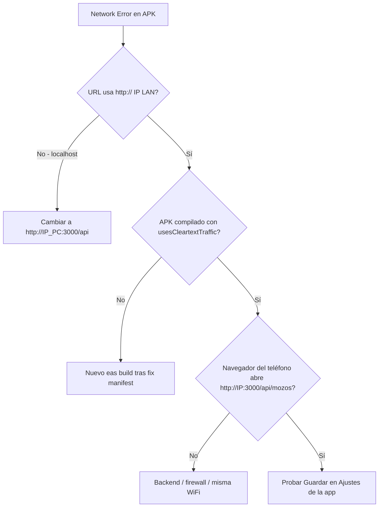

# Network Error en APK vs Expo Go — App Mozos

**Versión:** 1.0 · **Mayo 2026**

## Síntoma

- En **Expo Go** (QR de `expo start`): configurar servidor (`http://IP:3000/api`) y login **funcionan**.
- En **APK** (EAS Build o Gradle release): al guardar la misma URL en **Configuración del servidor**, aparece **Network Error** (o “No se pudo conectar con el servidor”) y el login falla igual.

No es un fallo del backend por sí solo: suele ser **cómo Android trata HTTP en builds release** y **qué host pones en la URL**.

---

## Por qué Expo Go y el APK no se comportan igual

| Aspecto | Expo Go | APK release |
|---------|---------|-------------|
| Tráfico **HTTP** (`http://192.168.x.x`) | Permitido en la práctica (entorno de desarrollo) | **Bloqueado por defecto** desde Android 9+ si no declaras cleartext |
| `localhost` / `127.0.0.1` | A veces “parece” funcionar vía túnel Metro | Apunta al **propio teléfono**, no al PC del backend |
| Manifest Android | Cliente Expo | [`android/app/src/main/AndroidManifest.xml`](../android/app/src/main/AndroidManifest.xml) |

En este repo, el manifest **debug** ya tenía `usesCleartextTraffic="true"`, pero el **main (release)** no — de ahí el fallo solo en APK.

```xml
<!-- debug/AndroidManifest.xml — sí permitía HTTP -->
<application android:usesCleartextTraffic="true" ... />

<!-- main/AndroidManifest.xml (release) — antes NO; corregido en el repo -->
```

**Corrección aplicada en el proyecto:** `android:usesCleartextTraffic="true"` en el `<application>` del manifest principal y `"usesCleartextTraffic": true` en [`app.json`](../app.json). Tras cambiar esto hay que **generar un APK nuevo** (`eas build`); el APK viejo sigue bloqueando HTTP.

---

## Causas frecuentes (orden de probabilidad)

### 1. HTTP bloqueado en APK (cleartext) — la más común

**URL típica del restaurante / LAN:**

```text
http://192.168.18.127:3000/api
```

Axios devuelve `error.message === "Network Error"` **sin** `error.response` cuando Android corta la conexión antes de llegar al servidor.

**Qué hacer:**

1. Usar un APK compilado **después** de activar `usesCleartextTraffic` (ver arriba), o
2. Servir el backend por **HTTPS** con certificado válido (recomendado a largo plazo en producción).

---

### 2. URL con `localhost` o `127.0.0.1`

En el celular, `http://localhost:3000/api` es el **teléfono**, no tu PC.

| Incorrecto en APK | Correcto |
|-------------------|----------|
| `http://localhost:3000/api` | `http://192.168.XX.XX:3000/api` (IP LAN del PC/servidor) |
| `http://127.0.0.1:3000/api` | Misma IP LAN |

En Expo Go a veces se usa la IP que muestra Metro o un túnel; por eso “la misma URL” en la UI no es equivalente.

---

### 3. IP incorrecta o red distinta

Valores de referencia en el repo (pueden no coincidir con tu red actual):

| Archivo | IP / URL por defecto |
|---------|----------------------|
| [`config/envDefaults.js`](../config/envDefaults.js) | `http://192.168.50.153:3000/api` |
| [`Backend-LasGambusinas/.env`](../../Backend-LasGambusinas/.env) | `IP=192.168.18.127` |
| [`.env.example`](../.env.example) | `EXPO_PUBLIC_API_BASE=http://192.168.50.153:3000/api` |

El mozo debe usar la **IP del equipo donde corre** `Backend-LasGambusinas`, en la **misma Wi‑Fi** que el teléfono.

**Comprobar en Windows (PC del backend):**

```powershell
ipconfig
# Buscar IPv4 de Wi-Fi, ej. 192.168.18.127
```

**Comprobar en el teléfono:** navegador → `http://TU_IP:3000/api/mozos` (puede devolver JSON o 401; lo importante es que **cargue**, no “sitio no disponible”).

---

### 4. Backend no escuchando en la red

El backend ya usa `0.0.0.0` en [`Backend-LasGambusinas/index.js`](../../Backend-LasGambusinas/index.js) — correcto para tablets en LAN.

Verificar:

- Servidor arrancado (`PORT=3000` en `.env`).
- Firewall de Windows permite entrantes en el puerto **3000** (red privada).

---

### 5. Formato de URL en la app

[`config/apiConfig.js`](../config/apiConfig.js) exige:

- Esquema `http://` o `https://`
- Path que **contenga** `/api`
- Ejemplo válido: `http://192.168.18.127:3000/api`

WebSocket se deriva solo: `http` → `ws://IP:3000`, `https` → `wss://...`.

---

### 6. HTTPS autofirmado

Si usas `https://` con certificado no confiable en el dispositivo, también verás **Network Error**. Solución: certificado válido o, en desarrollo, seguir con HTTP + cleartext en LAN.

---

### 7. Variables `EXPO_PUBLIC_*` en build EAS

Los fallbacks se leen de [`config/envDefaults.js`](../config/envDefaults.js) al **compilar** el bundle. En EAS puedes definir:

- `EXPO_PUBLIC_API_BASE`
- `EXPO_PUBLIC_WS_URL`

Si no las defines, el APK usa la IP hardcodeada del fallback hasta que el mozo guarde otra en Ajustes (AsyncStorage). Eso **no** sustituye a `usesCleartextTraffic` para HTTP.

---

## Flujo de diagnóstico recomendado



1. Abrir **Configuración del servidor** (Login o **Más**).
2. Pulsar **Probar conexión** → usa `GET {baseURL}/mozos` ([`apiConfig.testConnection`](../config/apiConfig.js)).
3. Si falla, probar la misma URL en Chrome del teléfono.
4. Si el navegador falla → red/backend; si el navegador OK y la app no → revisar cleartext o APK antiguo.

---

## Mensajes de error en el código

| Origen | Mensaje |
|--------|---------|
| Axios sin respuesta | `Network Error` |
| Login | “No se pudo conectar con el servidor…” ([`Login.js`](../Pages/Login/Login.js)) |
| `testConnection` | “Servidor no accesible” / `ECONNREFUSED` / `ENOTFOUND` |
| Modal ajustes | Botón **Probar conexión** ([`SettingsModal.js`](../Components/SettingsModal.js)) |

---

## Checklist de solución

- [ ] URL = `http://<IP_LAN_DEL_PC>:3000/api` (no localhost).
- [ ] Teléfono y PC en la **misma Wi‑Fi**.
- [ ] Backend corriendo; `http://IP:3000` responde desde el navegador del teléfono.
- [ ] APK generado **después** de `usesCleartextTraffic` en manifest / `app.json`.
- [ ] Opcional: copiar [`.env.example`](../.env.example) → `.env` con tu IP antes de `eas build`.
- [ ] Si cambias solo JS y ya tienes APK bueno: OTA no arregla cleartext en manifest → hace falta **nuevo build APK**.

---

## Producción recomendada

Para mozos en restaurante a medio plazo:

1. Backend detrás de **HTTPS** (reverse proxy o certificado en LAN).
2. En la app, URL `https://tu-servidor/api`.
3. Valorar quitar cleartext o restringirlo con `network_security_config.xml` solo a dominios internos.

Mientras el backend sea solo **HTTP en LAN**, el APK necesita `usesCleartextTraffic="true"` o seguirá el Network Error.

---

## Enlaces

- [EXPO_EAS_APK_Y_ACTUALIZACIONES.md](./EXPO_EAS_APK_Y_ACTUALIZACIONES.md) — Recompilar APK
- [INSTALACION_Y_ACTUALIZACION_APP_MOZOS.md](./INSTALACION_Y_ACTUALIZACION_APP_MOZOS.md) — Instalación en tablet
- [Android: Cleartext traffic](https://developer.android.com/privacy-and-security/risks/cleartext)
