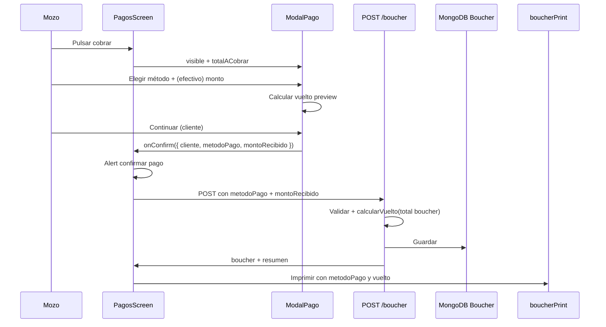

# Plan de implementación: Método de pago y vuelto en modal de cobro

**Versión:** 1.0  
**Fecha:** Junio 2026  
**Audiencia:** GLM-5.2 / equipo de desarrollo  
**Alcance:** App Mozos (`PagosScreen` + modal de cobro), Backend (`POST /boucher`, modelo `Boucher`), generación de boucher (PDF / HTML / ePOS), reportes y cierre de caja

---

## 1. Resumen ejecutivo

Hoy, al cobrar una mesa en `PagosScreen`, el mozo abre el modal **"Información del Cliente"** (`ModalClientes.js`), registra o confirma al cliente invitado, y el sistema procesa el pago sin capturar **método de pago** ni **vuelto**. El boucher imprime `Pago: Efectivo` por defecto aunque no se haya elegido nada.

Este plan define:

1. Renombrar el modal a **"Información del pago"**.
2. Agregar **arriba** de la sección "Registrar datos del cliente" un bloque obligatorio de **método de pago** con tres opciones: **Efectivo**, **YAPE/PLIN**, **CRÉDITO/DÉBITO**.
3. Si el mozo elige **Efectivo**, expandir campos: **"Con cuánto pagará"** y cálculo automático de **vuelto** en el modal.
4. Persistir método, monto recibido y vuelto en el boucher del backend.
5. Mostrar método y vuelto en el boucher impreso/compartido.

**Nota sobre el flujo actual:** En el código, este modal se abre **antes** de procesar el pago (al pulsar el botón de cobrar en `PagosScreen`), no después del pago exitoso. El modal post-pago es `ModalPagoExitoso`. La feature aplica al modal pre-cobro; el vuelto calculado en el modal debe viajar al `POST /boucher` y quedar reflejado en el boucher generado tras el cobro.

---

## 2. Objetivo de negocio

| Necesidad | Descripción |
|-----------|-------------|
| Mozos | Registrar con qué medio cobró cada mesa de forma obligatoria y sin fricción extra. |
| Caja | Saber cuánto efectivo entró y cuánto vuelto se entregó por boucher. |
| Operación | Reportes y cierre de caja con desglose real (hoy asumen todo efectivo). |
| Cliente | Boucher con método de pago y vuelto cuando pagó en efectivo. |

---

## 3. Estado actual del código (análisis)

### 3.1 App Mozos — `PagosScreen.js`

**Archivo:** `gambusinas/Pages/navbar/screens/PagosScreen.js`

Flujo actual de cobro:

1. Mozo pulsa cobrar → `handlePagar()` (~línea 1066).
2. Si la mesa no está pagada → `setModalClienteVisible(true)`.
3. `ModalClientes` devuelve cliente vía `handleClienteSeleccionado(cliente)` (~1830).
4. `Alert.alert("Confirmar Pago", ...)` con total formateado.
5. Si confirma → `procesarPagoConCliente(cliente)` (~1221).
6. `POST /boucher` con payload (~1331):

```javascript
const boucherData = {
  mesaId: mesaIdFinal,
  mozoId: mozoId,
  clienteId: cliente._id,
  platosSeleccionados: platosPayload,
  observaciones: "...",
};
```

**No se envían:** `metodoPago`, `montoRecibido`, `vuelto`.

Total a cobrar en pantalla: `totalesPagoActual` (`useMemo` ~954) usando `calcularSubtotalSeleccion` + `calcularTotalesPreview` según platos seleccionados (pago parcial incluido).

### 3.2 App Mozos — `ModalClientes.js`

**Archivo:** `gambusinas/Components/ModalClientes.js`

- Título actual: `"Información del Cliente"` (línea 167).
- Secciones: checkbox invitado + formulario "Registrar datos del cliente" (DNI, nombre, teléfono).
- Callback: `onClienteSeleccionado(clienteData)` — solo datos de cliente.
- **No recibe** el total a cobrar ni expone datos de pago.

### 3.3 App Mozos — Generación de boucher

| Archivo | Comportamiento actual |
|---------|----------------------|
| `utils/boucherPdfNative.js` | `addLabel('Pago', boucher?.metodoPago \|\| 'Efectivo')` — sin vuelto |
| `utils/boucherHtml.js` | Igual, fallback `'Efectivo'` |
| `utils/boucherEposXml.js` | Igual para impresión térmica |
| `services/boucherPrint/index.js` | Orquestador post-pago (Imprimir / Compartir) |

Los tres formatos ya tienen hook para `metodoPago` pero el campo **no existe** en el documento MongoDB del boucher.

### 3.4 Backend — modelo y API

**Archivo:** `backend-gambusinas/src/database/models/boucher.model.js`

- Campos de totales, descuentos, platos, cliente, `esPagoParcial`, etc.
- **No hay** `metodoPago`, `montoRecibido`, `vuelto`.

**Archivo:** `backend-gambusinas/src/controllers/boucherController.js`

- `POST /boucher` extrae: `mesaId`, `mozoId`, `clienteId`, `comandasIds`, `platosSeleccionados`, `observaciones`.
- Delega en `procesarPagoBoucher()` (`boucherPagoService.js`).
- **No procesa** datos de pago.

**Archivo:** `backend-gambusinas/src/utils/calculosPrecios.js`

- Ya existe `calcularVuelto(total, montoRecibido)` (~301) — **reutilizar en backend**, no duplicar lógica.

### 3.5 Backend — reportes y cierre (impacto futuro)

| Archivo | Estado |
|---------|--------|
| `public/reportes.html` | Agrupa por `efectivo`, `tarjeta`, `digital` según `boucher.metodoPago` |
| `src/repository/cierreCaja.repository.js` | TODO explícito: asume todo efectivo (~66) |
| `public/bouchers.html` | Ejemplo mock con `metodoPago` y `vuelto: 8.00` |
| `configuracionSistema.model.js` | `metodosPago.efectivo`, `yape`, `plin`, etc. (admin) |

La feature de mozos usa **3 opciones agrupadas** en UI; el backend debe normalizar a valores que reportes puedan mapear.

### 3.6 Documentación previa

`backend-gambusinas/docs/automated/DIAGRAMA_FLUJO_DATOS_Y_FUNCIONES.md` ya identifica la deuda técnica: faltan `metodoPago`, `montoRecibido` y `vuelto` en bouchers.

---

## 4. Diseño funcional (UX)

### 4.1 Estructura del modal renombrado

```
┌─────────────────────────────────────────┐
│  Información del pago              [X]  │
├─────────────────────────────────────────┤
│  Total a cobrar: S/. 45.50              │  ← nuevo (solo lectura)
│                                         │
│  Método de pago *                       │  ← obligatorio
│  ( ) Efectivo                           │
│  ( ) YAPE / PLIN                        │
│  ( ) CRÉDITO / DÉBITO                   │
│                                         │
│  ┌─ Solo si Efectivo ─────────────────┐ │
│  │ Con cuánto pagará: [________]      │ │
│  │ Vuelto: S/. 4.50                   │ │  ← cálculo en vivo
│  └────────────────────────────────────┘ │
│                                         │
│  [ ] Continuar como Invitado            │
│  Registrar datos del cliente:           │
│    Nombre / DNI / Teléfono              │
├─────────────────────────────────────────┤
│  [ Cancelar ]        [ Continuar ]      │
└─────────────────────────────────────────┘
```

### 4.2 Reglas de interacción

| Regla | Detalle |
|-------|---------|
| Método obligatorio | No habilitar "Continuar" hasta elegir una de las 3 opciones |
| Efectivo | Mostrar campo "Con cuánto pagará" (numérico, 2 decimales) |
| Vuelto en modal | `vuelto = max(0, montoRecibido - totalACobrar)`; actualizar en cada keystroke |
| Validación efectivo | `montoRecibido >= totalACobrar`; si es menor, mensaje inline y bloquear Continuar |
| YAPE/PLIN o CRÉDITO/DÉBITO | Ocultar monto recibido y vuelto; no enviar esos campos (o enviar `null`) |
| Total en modal | Usar el mismo total que verá el mozo en `Alert` de confirmación (IGV según `configMoneda`) |
| Pago parcial | Total = `totalesPagoActual.total` (platos seleccionados), no el total de mesa completa |

### 4.3 Etiquetas visibles vs valores internos

| UI (mozo) | Valor API / DB | Mapeo reportes |
|-----------|----------------|----------------|
| Efectivo | `efectivo` | `efectivo` |
| YAPE / PLIN | `yape_plin` | `digital` |
| CRÉDITO / DÉBITO | `credito_debito` | `tarjeta` |

Etiqueta en boucher (texto impreso): usar labels amigables — `"Efectivo"`, `"YAPE/PLIN"`, `"Crédito/Débito"`.

---

## 5. Diseño de datos

### 5.1 Campos nuevos en `boucher.model.js`

```javascript
metodoPago: {
  type: String,
  enum: ['efectivo', 'yape_plin', 'credito_debito'],
  required: true,
  default: 'efectivo', // solo para bouchers legacy sin migración; POST nuevo debe exigirlo
},
metodoPagoLabel: {
  type: String,
  default: null, // snapshot legible: "YAPE/PLIN"
},
montoRecibido: {
  type: Number,
  default: null, // obligatorio si metodoPago === 'efectivo'
},
vuelto: {
  type: Number,
  default: null, // calculado en servidor para efectivo
},
```

**Política legacy:** bouchers existentes sin `metodoPago` siguen mostrando fallback `"Efectivo"` en impresión. No migración masiva obligatoria.

### 5.2 Payload `POST /boucher` (extensión)

```json
{
  "mesaId": "...",
  "mozoId": "...",
  "clienteId": "...",
  "platosSeleccionados": [...],
  "observaciones": "",
  "metodoPago": "efectivo",
  "montoRecibido": 50.00
}
```

- `vuelto` **no** debe enviarse desde el cliente; el backend lo calcula con `calcularVuelto`.
- Si `metodoPago !== 'efectivo'`, omitir `montoRecibido`.

### 5.3 Respuesta

El boucher retornado debe incluir `metodoPago`, `metodoPagoLabel`, `montoRecibido`, `vuelto` para que `ModalPagoExitoso` e impresión los usen sin recalcular.

---

## 6. Flujo de datos (diagrama)



---

## 7. Detalle de implementación — App Mozos

### 7.1 Renombrar y extender el modal

**Opción recomendada (menor riesgo):** mantener archivo `ModalClientes.js` pero:

- Cambiar título a `"Información del pago"`.
- Renombrar export a `ModalInformacionPago` **solo si** se actualizan todos los imports; si no, dejar nombre de componente y cambiar solo UI.

**Props nuevas:**

```javascript
ModalClientes({
  visible,
  onClose,
  onClienteSeleccionado, // mantener firma o deprecar
  onPagoConfirmado,      // preferido: ({ cliente, metodoPago, montoRecibido, vueltoPreview })
  totalACobrar,          // number — total con IGV según config
  simboloMoneda,         // 'S/.'
  decimales,             // 2
})
```

**Estado interno del modal:**

```javascript
const [metodoPago, setMetodoPago] = useState(null);
const [montoRecibidoStr, setMontoRecibidoStr] = useState('');
const vueltoPreview = useMemo(() => {
  if (metodoPago !== 'efectivo') return null;
  const monto = parseFloat(montoRecibidoStr.replace(',', '.')) || 0;
  return Math.max(0, Math.round((monto - totalACobrar) * 100) / 100);
}, [metodoPago, montoRecibidoStr, totalACobrar]);
```

**Validación en `handleContinuar`:**

1. `metodoPago` definido.
2. Si `efectivo`: `montoRecibido >= totalACobrar`.
3. Crear cliente (lógica actual sin cambios).
4. Invocar callback con datos de pago + cliente.

**UI método de pago:** tres `TouchableOpacity` o `Pressable` estilo chip/radio (consistente con botones `buttonNew` del modal). Ubicar **antes** del checkbox de invitado o entre total y "Registrar datos del cliente" según diseño §4.1.

### 7.2 `PagosScreen.js`

1. Pasar a `ModalClientes`:

```javascript
totalACobrar={totalesPagoActual.total}
simboloMoneda={configMoneda?.simboloMoneda || 'S/.'}
decimales={configMoneda?.decimales ?? 2}
onPagoConfirmado={handlePagoConfirmado}
```

2. Implementar `handlePagoConfirmado({ cliente, metodoPago, montoRecibido })`:
   - Reemplaza o envuelve `handleClienteSeleccionado`.
   - Guardar en estado: `datosPagoRef` o `useState` (`metodoPagoSeleccionado`, `montoRecibidoSeleccionado`).
   - Mantener `Alert` de confirmación; opcionalmente mostrar método y vuelto en el mensaje.

3. En `procesarPagoConCliente`, extender `boucherData`:

```javascript
metodoPago: datosPago.metodoPago,
...(datosPago.metodoPago === 'efectivo' && {
  montoRecibido: datosPago.montoRecibido,
}),
```

4. Tras respuesta exitosa, el `boucherCreado` ya trae `vuelto` del backend → `setBoucherData(boucherCreado)`.

### 7.3 Helper compartido (opcional, recomendado)

**Archivo nuevo:** `gambusinas/utils/pagoMetodoHelpers.js`

```javascript
export const METODOS_PAGO = [
  { value: 'efectivo', label: 'Efectivo' },
  { value: 'yape_plin', label: 'YAPE/PLIN' },
  { value: 'credito_debito', label: 'CRÉDITO/DÉBITO' },
];

export function labelMetodoPago(value) { ... }
export function calcularVueltoPreview(total, montoRecibido) { ... }
export function validarPagoEfectivo(total, montoRecibido) { ... }
```

Evita duplicar lógica entre modal y tests.

### 7.4 Boucher — capa de presentación

Actualizar los tres generadores para mostrar vuelto **solo si** `metodoPago === 'efectivo'` (o `montoRecibido != null`):

**`boucherPdfNative.js`** (después de línea ~328):

```javascript
const labelPago = boucher?.metodoPagoLabel || labelMetodoPago(boucher?.metodoPago) || 'Efectivo';
addLabel('Pago', labelPago);
if (boucher?.metodoPago === 'efectivo' && boucher?.montoRecibido != null) {
  addPad('Recibido:', `${simboloMoneda} ${boucher.montoRecibido.toFixed(2)}`);
  addPad('Vuelto:', `${simboloMoneda} ${(boucher.vuelto ?? 0).toFixed(2)}`, { bold: true });
}
```

Replicar patrón en `boucherHtml.js` y `boucherEposXml.js`.

**`ModalPagoExitoso.js` (P2):** opcional mostrar método y vuelto en la tarjeta de resumen; no bloqueante para v1.

---

## 8. Detalle de implementación — Backend

### 8.1 Modelo `boucher.model.js`

Agregar campos de §5.1. En `pre('save')`, si `metodoPago === 'efectivo'` y hay `montoRecibido`, recalcular `vuelto` con `calculosPrecios.calcularVuelto(this.total, this.montoRecibido).vuelto` como red de seguridad.

### 8.2 `boucherController.js` — `POST /boucher`

Extraer del body:

```javascript
const { ..., metodoPago, montoRecibido } = req.body;
```

Pasar a `procesarPagoBoucher({ ..., metodoPago, montoRecibido })`.

### 8.3 `boucherPagoService.js`

Después de calcular `total` del boucher y **antes** de `save`:

```javascript
const METODOS_VALIDOS = ['efectivo', 'yape_plin', 'credito_debito'];

if (!metodoPago || !METODOS_VALIDOS.includes(metodoPago)) {
  const err = new Error('Debe indicar un método de pago válido');
  err.statusCode = 400;
  throw err;
}

boucherDoc.metodoPago = metodoPago;
boucherDoc.metodoPagoLabel = labelMetodoPago(metodoPago);

if (metodoPago === 'efectivo') {
  if (montoRecibido == null || montoRecibido < totalFinal) {
    const err = new Error('El monto recibido debe ser mayor o igual al total');
    err.statusCode = 400;
    throw err;
  }
  const { vuelto } = calculosPrecios.calcularVuelto(totalFinal, montoRecibido);
  boucherDoc.montoRecibido = montoRecibido;
  boucherDoc.vuelto = vuelto;
}
```

Usar `totalFinal` del boucher ya calculado (con descuentos e IGV), no el subtotal enviado por el cliente.

### 8.4 Validación cruzada total mozo vs servidor

El mozo calcula vuelto con `totalesPagoActual.total` en cliente. El servidor recalcula totales al armar el boucher. Si hay diferencia (redondeo, descuento, platos), **prevalece el total del servidor** para `vuelto`. El modal puede mostrar una advertencia si la respuesta trae `vuelto` distinto al preview (edge case; log en `__DEV__`).

### 8.5 Reportes y cierre de caja (fase posterior recomendada)

| Tarea | Archivo |
|-------|---------|
| Mapear `yape_plin` → contador `digital` | `public/reportes.html` |
| Mapear `credito_debito` → `tarjeta` | mismo |
| Sumar vuelto y monto recibido en cierre | `cierreCaja.repository.js` |

No bloquear v1 de mozos; sí documentar como **F3**.

---

## 9. Plan de fases sugerido

| Fase | Entregable | Estimación |
|------|------------|------------|
| **F1** | Modelo boucher + validación en `boucherPagoService` + tests API | 0.5–1 día |
| **F2** | Modal: renombre, método obligatorio, efectivo + vuelto preview | 1 día |
| **F3** | `PagosScreen`: pasar total, enviar payload, confirmación | 0.5 día |
| **F4** | PDF / HTML / ePOS con método y vuelto | 0.5 día |
| **F5** | Reportes admin + cierre caja (mapeo métodos) | 0.5–1 día |
| **F6** | QA: efectivo exacto, con vuelto, YAPE, tarjeta, pago parcial | 0.5 día |

**Orden de dependencias:** F1 → F2 + F3 en paralelo → F4 → F6 → F5 (admin puede ir después del release mozos).

---

## 10. Casos de prueba

| # | Escenario | Resultado esperado |
|---|-----------|-------------------|
| 1 | Abrir modal de cobro | Título "Información del pago"; total visible |
| 2 | Continuar sin método | Botón deshabilitado o alerta |
| 3 | Efectivo, monto = total | Vuelto S/. 0.00; boucher sin error |
| 4 | Efectivo, monto > total | Vuelto correcto en modal y boucher |
| 5 | Efectivo, monto < total | No permite continuar |
| 6 | YAPE/PLIN | Sin campos de efectivo; boucher muestra "YAPE/PLIN" |
| 7 | CRÉDITO/DÉBITO | Igual; sin montoRecibido en DB |
| 8 | Pago parcial (2 de 5 platos) | Total y vuelto sobre subconjunto seleccionado |
| 9 | Descuento 100% (total 0) | Efectivo: montoRecibido >= 0; vuelto coherente |
| 10 | POST sin metodoPago | 400 del backend |
| 11 | POST efectivo sin montoRecibido | 400 del backend |
| 12 | Reimprimir boucher guardado | PDF/HTML/ePOS muestran método y vuelto históricos |
| 13 | Boucher antiguo sin campos | Impresión fallback "Efectivo", sin bloque vuelto |

---

## 11. Riesgos y mitigaciones

| Riesgo | Mitigación |
|--------|------------|
| Total modal ≠ total servidor | Backend autoritativo; validar `montoRecibido >= total` en servidor |
| Mozo confunde modal cliente vs post-pago | Renombre claro + total visible arriba |
| Reportes no reconocen `yape_plin` | Tabla de mapeo en reportes (F5) |
| Teclado numérico y decimales en Android | `keyboardType="decimal-pad"`; normalizar coma/punto |
| Pago parcial + múltiples bouchers | Cada boucher lleva su propio método/vuelto |

---

## 12. Criterios de aceptación

- [ ] Modal titulado **"Información del pago"**.
- [ ] Tres métodos de pago; selección **obligatoria** antes de continuar.
- [ ] Con **Efectivo**: campo "Con cuánto pagará" y **vuelto calculado automáticamente** en el modal.
- [ ] No permite efectivo con monto menor al total.
- [ ] `POST /boucher` persiste `metodoPago`; en efectivo también `montoRecibido` y `vuelto`.
- [ ] Boucher impreso/compartido muestra método y, si aplica, recibido + vuelto.
- [ ] Pagos YAPE/PLIN y CRÉDITO/DÉBITO no muestran vuelto.
- [ ] Compatible con flujo de **pagos parciales** existente.

---

## 13. Archivos a modificar (checklist)

### App Mozos (`gambusinas/`)

| Archivo | Cambio |
|---------|--------|
| `Components/ModalClientes.js` | Título, UI método pago, efectivo, vuelto, validación, callback |
| `Pages/navbar/screens/PagosScreen.js` | Props modal, estado pago, payload POST |
| `utils/pagoMetodoHelpers.js` | **Nuevo** — enums, labels, cálculo vuelto |
| `utils/boucherPdfNative.js` | Bloque pago + vuelto |
| `utils/boucherHtml.js` | Idem |
| `utils/boucherEposXml.js` | Idem |
| `Pages/navbar/screens/ModalPagoExitoso.js` | Opcional: resumen método/vuelto |

### Backend (`backend-gambusinas/`)

| Archivo | Cambio |
|---------|--------|
| `src/database/models/boucher.model.js` | Campos nuevos |
| `src/controllers/boucherController.js` | Leer body |
| `src/services/boucherPagoService.js` | Validar y persistir |
| `src/utils/calculosPrecios.js` | Exportar helper `labelMetodoPago` si conviene |
| `public/reportes.html` | Mapeo métodos (F5) |
| `src/repository/cierreCaja.repository.js` | Usar `metodoPago` real (F5) |

---

## 14. Documentos relacionados

| Documento | Relación |
|-----------|----------|
| [PLAN_PAGOS_PARCIALES_Y_VOUCHERS_AGRUPADOS.md](./PLAN_PAGOS_PARCIALES_Y_VOUCHERS_AGRUPADOS.md) | Total por platos seleccionados |
| [APP_MOZOS_DOCUMENTACION_COMPLETA.md](./APP_MOZOS_DOCUMENTACION_COMPLETA.md) | Arquitectura PagosScreen y boucherPrint |
| [ENTREGA_PLEXPERITY_JUNIO_2026.md](./ENTREGA_PLEXPERITY_JUNIO_2026.md) | Pipeline de impresión |
| `backend-gambusinas/docs/automated/DIAGRAMA_FLUJO_DATOS_Y_FUNCIONES.md` | Deuda técnica método de pago |

---

## 15. Resumen para GLM-5.2 (orden de ejecución)

1. **Backend primero:** agregar `metodoPago`, `metodoPagoLabel`, `montoRecibido`, `vuelto` al schema; validar en `procesarPagoBoucher` con `calcularVuelto` existente.
2. **Modal:** renombrar a "Información del pago"; bloque de método obligatorio arriba de "Registrar datos del cliente"; expansión efectivo con vuelto en vivo.
3. **PagosScreen:** pasar `totalACobrar={totalesPagoActual.total}`; en `POST /boucher` enviar `metodoPago` y `montoRecibido` (solo efectivo).
4. **Impresión:** actualizar `boucherPdfNative`, `boucherHtml`, `boucherEposXml` para mostrar método y vuelto.
5. **QA:** cubrir los 13 casos de §10; verificar pago parcial.
6. **Opcional F5:** reportes y cierre de caja con mapeo `yape_plin` / `credito_debito`.

Este documento es la especificación única para la feature. No implementar métodos de pago adicionales en v1 ni confiar solo en el cálculo de vuelto del cliente sin validación en servidor.
