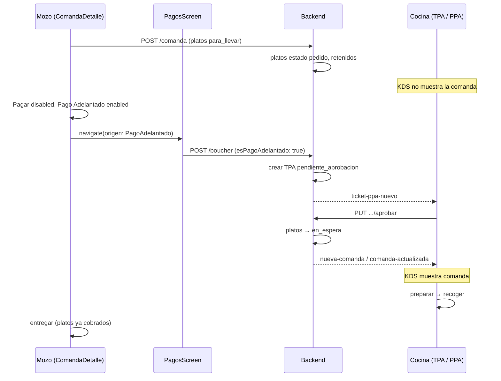
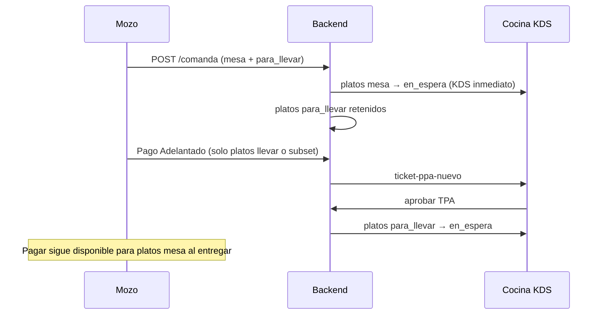

# Plan de implementación — Pagos Adelantados (PPA)

**Versión:** 1.0  
**Fecha:** Junio 2026  
**Alcance:** App Mozos (`gambusinas`), App Cocina (`appcocina`), Backend Las Gambusinas (`backend-gambusinas`)  
**Documentación relacionada:**
- [PLAN_PARA_LLEVAR_PLATOS_GLM-5.2.md](./PLAN_PARA_LLEVAR_PLATOS_GLM-5.2.md) — campo `tipoServicio` por línea de plato
- [PLAN_PAGOS_PARCIALES_Y_VOUCHERS_AGRUPADOS.md](./PLAN_PAGOS_PARCIALES_Y_VOUCHERS_AGRUPADOS.md) — flujo de `PagosScreen` y bouchers
- [APP_MOZOS_DOCUMENTACION_COMPLETA.md](./APP_MOZOS_DOCUMENTACION_COMPLETA.md)
- [App Mozos, App Cocina, Backend Las Gambusinas.md](./App%20Mozos,%20App%20Cocina,%20Backend%20Las%20Gambusinas.md) — eventos Socket.io

---

## 1. Resumen ejecutivo

### Objetivo

Implementar **Pagos Adelantados (PPA)**: cobrar ciertos platos — principalmente **para llevar** — **antes** de que entren al tablero KDS de cocina. Cocina debe **aprobar** cada ticket de pago adelantado para liberar esos platos al flujo normal de preparación.

### Valor de negocio

| Necesidad | Descripción |
|-----------|-------------|
| Mozos | Asegurar el cobro de comandas para llevar antes de que cocina prepare |
| Cocina | Ver solo platos para llevar ya pagados y validados; evitar preparar pedidos sin garantía de pago |
| Operación | Trazabilidad completa: comanda, mozo, platos, total, voucher y aprobación en un solo ticket |

### Resultado esperado

| Actor | Experiencia |
|-------|-------------|
| **Mozo** | En `ComandaDetalleScreen`, botón **Pago Adelantado** debajo de **Pagar** → confirma pago en `PagosScreen` → ticket queda pendiente de aprobación en cocina |
| **Cocina** | Tablero dedicado **TICKETS DE PAGOS ADELANTADOS** + acceso rápido **PPA** (sidebar) en los 3 tableros KDS de Ver Comandas |
| **Backend** | Persiste tickets, bloquea platos para llevar en cocina hasta aprobación, emite eventos en tiempo real |

---

## 2. Conceptos del dominio

```
Comanda
    └── Plato(s)
            ├── tipoServicio: 'mesa' | 'para_llevar'
            ├── estado: pedido → en_espera → recoger → entregado → pagado
            └── pagoAdelantado: { requerido, ticketId, estadoTicket }   ← NUEVO

Ticket Pago Adelantado (TPA)                                          ← NUEVA ENTIDAD
    ├── comanda(s), mozo, mesa
    ├── platos[] con detalle y totales
    ├── boucher (voucher generado al cobrar)
    ├── estado: pendiente_aprobacion | aprobado | rechazado
    └── aprobadoPor, fechaAprobacion, motivoRechazo
```

| Término | Significado |
|---------|-------------|
| **PPA** | Pago Adelantado — abreviatura usada en UI de cocina (botón sidebar) |
| **TPA** | Ticket de Pago Adelantado — documento operativo que cocina aprueba o rechaza |
| **Plato retenido** | Plato `para_llevar` en estado `pedido` con `pagoAdelantado.requerido: true` y sin aprobación; **no visible** en KDS |
| **Plato liberado** | Tras aprobación del TPA, pasa a `en_espera` y entra al flujo KDS habitual |

### Composición de comanda (clasificación)

Helper compartido (mozos + backend):

```javascript
function clasificarComandaPorTipoServicio(platosActivos) {
  const tieneMesa = platosActivos.some(p => (p.tipoServicio || 'mesa') === 'mesa');
  const tieneLlevar = platosActivos.some(p => p.tipoServicio === 'para_llevar');
  if (tieneMesa && tieneLlevar) return 'mixta';
  if (tieneLlevar) return 'solo_para_llevar';
  return 'solo_mesa';
}
```

---

## 3. Reglas de negocio

### Regla 1 — Habilitación de botones en `ComandaDetalleScreen` (requisito inicial)

Ubicación: barra de acciones inferior, **debajo** del botón **Pagar**.

| Composición de la comanda | Botón **Pagar** | Botón **Pago Adelantado** |
|---------------------------|-----------------|---------------------------|
| **Solo platos para llevar** | ❌ Deshabilitado | ✅ Habilitado (si hay platos cobrables vía PPA) |
| **Solo platos para mesa** | ✅ Habilitado (flujo actual: todos entregados/pagados) | ✅ Habilitado |
| **Mixta** (mesa + para llevar) | ✅ Habilitado | ✅ Habilitado |

**Implementación en mozos** (`ComandaDetalleScreen.js`):

```javascript
const composicion = clasificarComandaPorTipoServicio(todosLosPlatos.filter(p => !p.eliminado));
const puedePagarNormal = composicion !== 'solo_para_llevar'
  && todosLosPlatos.length > 0
  && todosLosPlatos.every(p => p.estado === 'entregado' || p.estado === 'pagado');

const puedePagoAdelantado = todosLosPlatos.length > 0
  && hayPlatosElegiblesParaPPA(todosLosPlatos); // ver Regla 2
```

> **Nota UX:** En comandas `solo_para_llevar`, el mozo **no** puede usar el flujo clásico de pago post-entrega; debe usar Pago Adelantado.

### Regla 2 — Qué platos entran en un Pago Adelantado

| Plato | Elegible para PPA |
|-------|-------------------|
| `tipoServicio === 'para_llevar'` en estado `pedido` sin TPA aprobado | ✅ Sí |
| `tipoServicio === 'mesa'` en estado `pedido` o `en_espera` | ✅ Sí (cobro anticipado opcional en comandas mesa/mixtas) |
| Ya incluido en TPA `pendiente_aprobacion` | ❌ No (evitar doble ticket) |
| Ya incluido en TPA `aprobado` | ❌ No |
| `recoger`, `entregado`, `pagado` | ❌ No — usar **Pagar** normal o pago parcial |
| `eliminado === true` | ❌ No |

### Regla 3 — Retención en cocina (KDS)

| Composición | Platos mesa | Platos para llevar |
|-------------|-------------|-------------------|
| `solo_mesa` | Flujo actual inmediato (`en_espera`) | N/A |
| `solo_para_llevar` | N/A | Retenidos en `pedido` hasta TPA **aprobado** |
| `mixta` | Flujo actual inmediato | Retenidos hasta TPA **aprobado** |

Al **aprobar** TPA: platos retenidos pasan a `en_espera`, se setea `tiempos.en_espera`, se emite `nueva-comanda` / `comanda-actualizada` hacia `/cocina`.

### Regla 4 — Flujo de pago en `PagosScreen`

| Origen | Validación de platos | Al confirmar pago |
|--------|----------------------|-------------------|
| `origen: 'ComandaDetalle'` (Pagar) | Solo `entregado` (actual) | Boucher normal; platos → `pagado` |
| `origen: 'PagoAdelantado'` | Platos elegibles Regla 2 | Boucher con `esPagoAdelantado: true`; platos **no** pasan a `pagado` aún; se crea TPA `pendiente_aprobacion` |

Tras pago adelantado exitoso:
- Plato queda en estado intermedio: `pedido` + flag `pagoAdelantado.cobrado: true` (o sub-estado documentado en modelo).
- El voucher se genera igual que pago parcial (reutilizar `boucherPagoService`).
- Mozo ve confirmación: *"Pago registrado. Esperando aprobación de cocina."*

Al **aprobar** en cocina: platos retenidos → `en_espera` (cocina los prepara). El cobro ya está hecho; al entregar para llevar el plato pasa `recoger` → `entregado` → ya está `pagado` vía TPA (no re-cobrar en **Pagar**).

### Regla 5 — Aprobación y rechazo (cocina)

| Acción | Quién | Efecto |
|--------|-------|--------|
| **Aprobar** | Cocinero, supervisor o admin | TPA → `aprobado`; platos liberados a KDS |
| **Rechazar** | Cocinero, supervisor o admin | TPA → `rechazado`; notificar mozo; definir política de reembolso/anulación (ver §8.4) |

### Regla 6 — Visibilidad del botón PPA en tableros KDS

En los **3 tableros** de Ver Comandas:
- Vista General (`comandastyle.jsx`)
- Vista Personalizada (`ComandastylePerso.jsx`)
- Vista Supervisor (`ComandaStyleSupervi.jsx`)

En la **barra superior** (header, junto a sync/config): botón **`PPA`**.

- Al pulsar: sidebar derecho (~320–400px) con lista de TPA `pendiente_aprobacion`.
- Badge numérico en el botón si hay tickets pendientes.
- Misma fuente de datos que el tablero dedicado (§6.2).

---

## 4. Estado actual del código

### 4.1 App Mozos

| Archivo | Estado | Gap |
|---------|--------|-----|
| `Pages/ComandaDetalleScreen.js` | Botón **Pagar** (~L1802–1813); `puedePagar` exige todos entregados/pagados (~L640) | Falta botón **Pago Adelantado**, lógica Regla 1, helper composición |
| `Pages/navbar/screens/PagosScreen.js` | Pagos parciales, badge para llevar | Falta modo `origen: 'PagoAdelantado'`, validación distinta, post-pago TPA |
| `tipoServicio` en OrdenesScreen / ComandaDetalle | ✅ Implementado | Base para clasificar comandas |

### 4.2 App Cocina

| Archivo | Estado | Gap |
|---------|--------|-----|
| `components/pages/MenuPage.jsx` | Solo "Ver Comandas" y Config | Falta entrada **TICKETS DE PAGOS ADELANTADOS** |
| `components/App.jsx` | Rutas: COCINA, COCINA_PERSONALIZADA, COCINA_SUPERVISOR | Falta ruta `TICKETS_PPA` |
| `comandastyle.jsx`, `ComandastylePerso.jsx`, `ComandaStyleSupervi.jsx` | Tableros KDS | Falta botón **PPA** + sidebar |
| Filtro KDS (~L1279 `comandastyle.jsx`) | Solo `status === 'en_espera'` | Debe excluir platos retenidos por PPA |

### 4.3 Backend

| Componente | Estado | Gap |
|------------|--------|-----|
| `comanda.model.js` | `tipoServicio` en platos | Falta subdocumento `pagoAdelantado` en plato |
| `boucher.model.js` | `tipoServicio`, `esPagoParcial` | Falta `esPagoAdelantado`, referencia `ticketPagoAdelantado` |
| `agregarComanda` | Platos → `en_espera` por defecto | Debe retenir `para_llevar` si comanda requiere PPA |
| — | No existe | Modelo, repo, controller y rutas de TPA |

---

## 5. Diseño de datos

### 5.1 Nuevo modelo: `TicketPagoAdelantado`

**Archivo propuesto:** `backend-gambusinas/src/database/models/ticketPagoAdelantado.model.js`

```javascript
{
  ticketNumber: Number,           // Auto-increment
  estado: {
    type: String,
    enum: ['pendiente_aprobacion', 'aprobado', 'rechazado'],
    default: 'pendiente_aprobacion',
    index: true
  },
  comandas: [{ type: ObjectId, ref: 'Comanda' }],
  comandasNumbers: [Number],
  mesa: { type: ObjectId, ref: 'mesas', required: true },
  numMesa: Number,
  mozo: { type: ObjectId, ref: 'mozos', required: true },
  nombreMozo: String,
  mozoNombre: String,             // desnormalizado
  pedido: { type: ObjectId, ref: 'Pedido' },
  platos: [{
    comandaId: ObjectId,
    comandaNumber: Number,
    platoLineaId: ObjectId,       // _id del subdocumento en comanda.platos
    plato: ObjectId,
    platoId: Number,
    nombre: String,
    precio: Number,
    cantidad: Number,
    subtotal: Number,
    tipoServicio: { type: String, enum: ['mesa', 'para_llevar'] },
    complementosSeleccionados: [],
    notaEspecial: String
  }],
  subtotal: Number,
  igv: Number,
  total: Number,
  boucher: { type: ObjectId, ref: 'Boucher' },
  voucherId: String,
  metodoPago: String,
  cliente: { type: ObjectId, ref: 'Cliente' },
  aprobadoPor: { type: ObjectId, ref: 'mozos' },
  aprobadoPorNombre: String,
  fechaAprobacion: Date,
  rechazadoPor: ObjectId,
  motivoRechazo: String,
  fechaRechazo: Date,
  observaciones: String,
  createdAt: Date,
  updatedAt: Date
}
```

### 5.2 Extensión en `comanda.platos[]`

```javascript
pagoAdelantado: {
  requerido: { type: Boolean, default: false },      // true si es para_llevar retenido
  ticketId: { type: ObjectId, ref: 'TicketPagoAdelantado', default: null },
  estadoTicket: {
    type: String,
    enum: [null, 'pendiente_aprobacion', 'aprobado', 'rechazado'],
    default: null
  },
  cobrado: { type: Boolean, default: false },          // true tras voucher PPA
  boucherId: { type: ObjectId, ref: 'Boucher', default: null }
}
```

### 5.3 Extensión en `Boucher`

```javascript
esPagoAdelantado: { type: Boolean, default: false, index: true },
ticketPagoAdelantado: { type: ObjectId, ref: 'TicketPagoAdelantado', default: null }
```

### 5.4 Lógica al crear comanda (`agregarComanda`)

```javascript
for (const plato of platos) {
  const esLlevar = plato.tipoServicio === 'para_llevar';
  if (esLlevar) {
    plato.estado = 'pedido';                    // NO en_espera
    plato.pagoAdelantado = { requerido: true, estadoTicket: null };
  } else {
    plato.estado = plato.estado || 'en_espera';
    if (plato.estado === 'en_espera') plato.tiempos.en_espera = ahora;
  }
}
// status comanda: en_espera si hay al menos un plato mesa en_espera;
// si solo para_llevar → status 'pedido' o nuevo 'pago_adelantado_pendiente'
```

---

## 6. Diseño UI/UX

### 6.1 App Mozos — `ComandaDetalleScreen`

```
┌─────────────────────────────────────────┐
│  [Eliminar] [Nueva] [Pagar]             │  ← Pagar disabled si solo_para_llevar
│  [Pago Adelantado]  [Descuento] ...     │  ← NUEVO, debajo de Pagar
└─────────────────────────────────────────┘
```

- **Icono sugerido:** `MaterialCommunityIcons` `cash-fast` o `wallet-outline`
- **Color:** `#7C3AED` (violeta, distinto del verde de Pagar)
- **Disabled cuando:** no hay platos elegibles Regla 2, o TPA pendiente duplicado

**Navegación:**

```javascript
navigation.navigate('Pagos', {
  mesa,
  comandasParaPagar: comandasFiltradasPPA,
  totalPendiente,
  origen: 'PagoAdelantado',
  platosElegiblesPPA: buildPlatosElegiblesPPA(comandas)
});
```

### 6.2 App Mozos — `PagosScreen` (modo PPA)

Reutilizar layout actual con adaptaciones:

| Elemento | Pagar normal | Pago Adelantado |
|----------|--------------|-----------------|
| Título header | "Pago" | "Pago Adelantado" |
| Selección platos | Solo entregados | Elegibles Regla 2 (pre-cocina) |
| Texto ayuda | — | "El pago será enviado a cocina para aprobación antes de preparar platos para llevar" |
| Post-confirmación | Voucher + mesa liberada si aplica | Voucher + mensaje "Esperando aprobación cocina" |
| Badge para llevar | ✅ | ✅ (destacado) |

### 6.3 App Cocina — Tablero dedicado

**Nueva opción en `MenuPage.jsx`:**

```
┌──────────────────────────────────────────────────┐
│  TICKETS DE PAGOS ADELANTADOS                    │
│  Aprobar pagos antes de enviar platos a cocina   │
└──────────────────────────────────────────────────┘
```

**Vista:** tabla/lista de cards (no KDS de comandas). Cada fila/card muestra:

- Nº ticket, fecha/hora, estado
- Mesa, mozo (nombre + alias si existe)
- Nº comanda(s)
- Lista de platos: nombre, cantidad, complementos, nota, badge Para llevar / Mesa
- Subtotal, IGV, **total**
- Método de pago, voucherId (si ya cobrado)
- Botones: **Aprobar** | **Rechazar** (con modal motivo)

**Filtros:** pendientes (default), aprobados hoy, rechazados hoy.

### 6.4 App Cocina — Sidebar PPA en tableros KDS

```
┌────────────────────────────────────────────────────────────────┐
│ [← Menú]  Comandas  [Sync] [PPA (3)] [Config]                  │
├───────────────────────────────────────────────┬────────────────┤
│                                               │ TICKETS PPA    │
│         Tablero KDS principal                 │ ┌────────────┐ │
│         (comandas en_espera)                  │ │ Mesa 12    │ │
│                                               │ │ Mozo: Juan │ │
│                                               │ │ S/. 45.00  │ │
│                                               │ │ [Aprobar]  │ │
│                                               │ └────────────┘ │
│                                               │ ...            │
└───────────────────────────────────────────────┴────────────────┘
```

- Componente compartido: `PpaSidebar.jsx` + hook `useTicketsPPA.js`
- Importar en los 3 componentes KDS
- Estado: `ppaSidebarOpen` toggle con botón **PPA**
- Ancho fijo derecho; en móvil/tablet pequeño → drawer overlay

---

## 7. API Backend (propuesta)

### 7.1 Rutas REST

| Método | Ruta | Descripción | Rol |
|--------|------|-------------|-----|
| `POST` | `/api/pago-adelantado` | Crear TPA tras cobro (llamado desde `boucherPagoService` o endpoint dedicado) | mozos |
| `GET` | `/api/pago-adelantado/pendientes` | Lista TPA `pendiente_aprobacion` del día | cocina, supervisor, admin |
| `GET` | `/api/pago-adelantado/:id` | Detalle completo de un ticket | cocina, mozos (propio), admin |
| `GET` | `/api/pago-adelantado/fecha/:YYYY-MM-DD` | Histórico por fecha | cocina, admin |
| `PUT` | `/api/pago-adelantado/:id/aprobar` | Aprueba y libera platos a KDS | cocina, supervisor, admin |
| `PUT` | `/api/pago-adelantado/:id/rechazar` | Rechaza con motivo | cocina, supervisor, admin |
| `GET` | `/api/comanda/comandas-para-pago-adelantado/:mesaId` | Comandas + platos elegibles (análogo a `comandas-para-pagar`) | mozos |

### 7.2 Servicio propuesto

**Archivo:** `backend-gambusinas/src/services/pagoAdelantadoService.js`

| Función | Responsabilidad |
|---------|-----------------|
| `obtenerPlatosElegiblesPPA(comandas)` | Regla 2 |
| `crearTicketTrasPago(boucher, platosSeleccionados)` | Crea TPA, enlaza platos |
| `aprobarTicket(ticketId, usuarioCocina)` | Transición estados + liberar KDS |
| `rechazarTicket(ticketId, motivo, usuario)` | Rechazo + socket a mozos |
| `liberarPlatosACocina(ticket)` | `pedido` → `en_espera` en platos aprobados |

### 7.3 Integración con pago existente

Extender `POST /api/boucher`:

```json
{
  "mesaId": "...",
  "mozoId": "...",
  "esPagoAdelantado": true,
  "platosSeleccionados": [ ... ]
}
```

Flujo en `boucherPagoService.js`:

1. Si `esPagoAdelantado`: **no** exigir estado `entregado`; validar Regla 2.
2. Crear boucher con `esPagoAdelantado: true`.
3. **No** marcar platos como `pagado` (solo `pagoAdelantado.cobrado: true`).
4. Llamar `pagoAdelantadoService.crearTicketTrasPago`.
5. Emitir `ticket-ppa-nuevo` a `/cocina` y `/mozos`.

---

## 8. Eventos Socket.io

### 8.1 Nuevos eventos

| Evento | Namespace | Dirección | Payload resumido |
|--------|-----------|-----------|------------------|
| `ticket-ppa-nuevo` | `/cocina`, `/mozos` | Backend → Apps | `{ ticket }` |
| `ticket-ppa-actualizado` | `/cocina`, `/mozos` | Backend → Apps | `{ ticketId, estado, ticket }` |
| `ticket-ppa-aprobado` | `/mozos`, `/cocina` | Backend → Apps | `{ ticketId, comandaIds, platosLiberados[] }` |
| `ticket-ppa-rechazado` | `/mozos` | Backend → Apps | `{ ticketId, motivo, mesaId }` |

**Room cocina:** emitir a `fecha-YYYY-MM-DD` (mismo patrón que `nueva-comanda`).

**Room mozos:** emitir a `mesa-{mesaId}` para actualizar `ComandaDetalleScreen` en tiempo real.

### 8.2 Eventos existentes afectados

| Evento | Cambio |
|--------|--------|
| `nueva-comanda` | Solo incluir platos ya liberados (mesa o para_llevar aprobados) |
| `comanda-actualizada` | Incluir `pagoAdelantado` en platos; cocina refresca sidebar PPA |

### 8.3 Política de rechazo (decisión pendiente — documentar en implementación)

Opciones a definir con negocio antes de codificar rechazo:

| Opción | Comportamiento |
|--------|----------------|
| A — Reembolso manual | TPA rechazado; boucher anulado en admin; mozo reintenta |
| B — Mantener cobro | Rechazo solo operativo (ej. error de plato); ajuste manual |
| C — Reverso automático | Endpoint revierte boucher y desmarca `pagoAdelantado.cobrado` |

**Recomendación v1:** Opción A con flag `requiereReembolso: true` en TPA rechazado.

---

## 9. Flujos end-to-end

### 9.1 Comanda solo para llevar



### 9.2 Comanda mixta



### 9.3 Comanda solo mesa (Pago Adelantado opcional)

- Platos mesa entran a KDS de inmediato.
- Mozo puede usar **Pago Adelantado** para cobrar platos aún en `pedido`/`en_espera` (anticipo).
- **Pagar** sigue el flujo clásico cuando todo está `entregado`/`pagado`.

---

## 10. Plan de implementación por fases

### Fase 1 — Backend fundacional (P0)

| # | Tarea | Archivos |
|---|-------|----------|
| 1.1 | Modelo `TicketPagoAdelantado` + índices | `ticketPagoAdelantado.model.js` |
| 1.2 | Extender `comanda.platos[].pagoAdelantado` | `comanda.model.js` |
| 1.3 | Extender `Boucher.esPagoAdelantado` | `boucher.model.js` |
| 1.4 | `pagoAdelantadoService.js` + repository | `services/`, `repository/` |
| 1.5 | Rutas y controller | `routes/pagoAdelantado.routes.js`, `controllers/` |
| 1.6 | Modificar `agregarComanda` — retener para_llevar | `comanda.repository.js` |
| 1.7 | `GET comandas-para-pago-adelantado/:mesaId` | `comandaController.js` |
| 1.8 | Extender `boucherPagoService` para PPA | `boucherPagoService.js` |
| 1.9 | Eventos socket en `events.js` | `src/socket/events.js` |

### Fase 2 — App Mozos (P0)

| # | Tarea | Archivos |
|---|-------|----------|
| 2.1 | Helper `comandaTipoServicioHelpers.js` | `gambusinas/utils/` o `helpers/` |
| 2.2 | Botón **Pago Adelantado** + Regla 1 | `ComandaDetalleScreen.js` |
| 2.3 | `handlePagoAdelantado` + endpoint | `ComandaDetalleScreen.js` |
| 2.4 | Modo PPA en `PagosScreen` | `PagosScreen.js` |
| 2.5 | Suscripción socket `ticket-ppa-*` | `ComandaDetalleScreen.js`, contexto socket |
| 2.6 | Estados visuales: "Pago adelantado pendiente/aprobado" en lista platos | `ComandaDetalleScreen.js` |

### Fase 3 — App Cocina (P0)

| # | Tarea | Archivos |
|---|-------|----------|
| 3.1 | Ruta `TICKETS_PPA` en `App.jsx` | `App.jsx` |
| 3.2 | Pantalla `TicketsPpaPage.jsx` (tablero dedicado) | `components/pages/` |
| 3.3 | Entrada en `MenuPage.jsx` | `MenuPage.jsx` |
| 3.4 | `PpaSidebar.jsx` + `useTicketsPPA.js` | `components/Principal/` |
| 3.5 | Botón **PPA** en header de 3 tableros | `comandastyle.jsx`, `ComandastylePerso.jsx`, `ComandaStyleSupervi.jsx` |
| 3.6 | Aprobar / Rechazar UI + API | `TicketsPpaPage.jsx`, `PpaSidebar.jsx` |
| 3.7 | Sonido/toast al `ticket-ppa-nuevo` | hooks socket cocina |

### Fase 4 — Ajustes KDS y cierre (P1)

| # | Tarea | Archivos |
|---|-------|----------|
| 4.1 | Filtrar platos retenidos en endpoint `/cocina/:fecha` | `cocinaController` o repository |
| 4.2 | Badge PPA en platos para llevar ya aprobados en KDS | `PlatoPreparacion.jsx` |
| 4.3 | Cierre de caja: separar ingresos PPA | `cierreCajaRestauranteController.js` |
| 4.4 | Dashboard admin: listado TPA | `public/` (opcional) |
| 4.5 | Tests integración + casos manuales | `backend-gambusinas/tests/` |

---

## 11. Helpers compartidos (mozos)

**Archivo propuesto:** `gambusinas/helpers/pagoAdelantadoHelpers.js`

```javascript
export function clasificarComandaPorTipoServicio(platosActivos) { ... }

export function hayPlatosElegiblesParaPPA(platos) {
  return platos.some(p => {
    if (p.eliminado) return false;
    const e = (p.estado || '').toLowerCase();
    if (!['pedido', 'en_espera'].includes(e)) return false;
    if (p.pagoAdelantado?.estadoTicket === 'pendiente_aprobacion') return false;
    if (p.pagoAdelantado?.cobrado && p.pagoAdelantado?.estadoTicket === 'aprobado') return false;
    return true;
  });
}

export function getReglasBotonesComandaDetalle(platos) {
  const composicion = clasificarComandaPorTipoServicio(platos.filter(p => !p.eliminado));
  const todosEntregadosOPagados = platos.length > 0
    && platos.every(p => p.estado === 'entregado' || p.estado === 'pagado');
  return {
    composicion,
    mostrarPagar: composicion !== 'solo_para_llevar' && todosEntregadosOPagados,
    mostrarPagoAdelantado: hayPlatosElegiblesParaPPA(platos),
    pagarDisabled: composicion === 'solo_para_llevar' || !todosEntregadosOPagados,
  };
}
```

---

## 12. Casos de prueba

| # | Escenario | Resultado esperado |
|---|-----------|-------------------|
| 1 | Comanda solo para llevar creada | No aparece en KDS; **Pagar** disabled; **Pago Adelantado** enabled |
| 2 | Pago adelantado confirmado | TPA pendiente; voucher generado; cocina recibe ticket |
| 3 | Cocina aprueba TPA | Platos para llevar en KDS `en_espera` |
| 4 | Comanda mixta sin PPA | Platos mesa en KDS; para llevar retenidos |
| 5 | PPA solo platos para llevar en mixta | Tras aprobar, solo esos platos entran a KDS |
| 6 | Comanda solo mesa | Ambos botones según reglas; KDS inmediato |
| 7 | Pago adelantado en solo mesa | TPA creado; platos mesa ya en KDS; cobro anticipado |
| 8 | Rechazo TPA | Mozo notificado; platos no liberados |
| 9 | Sidebar PPA en Vista General | Lista sincronizada con tablero dedicado |
| 10 | Socket desconectado | Polling fallback en `useTicketsPPA` (patrón existente KDS) |
| 11 | Doble tap Pago Adelantado | No duplicar TPA para mismos platos |
| 12 | Plato para llevar entregado tras PPA aprobado | No aparece en **Pagar** como pendiente (ya cobrado) |

---

## 13. Riesgos y mitigaciones

| Riesgo | Mitigación |
|--------|------------|
| Comandas antiguas sin `pagoAdelantado` | Defaults seguros; solo para_llevar nuevos se retienen |
| Doble cobro (PPA + Pagar) | Backend excluye platos con `pagoAdelantado.cobrado` en `comandas-para-pagar` |
| KDS oculta comandas válidas | Endpoint cocina filtra por plato, no solo por `comanda.status` |
| Rechazo sin política de reembolso | Definir Opción A/B/C antes de Fase 3.6 |
| Performance sidebar + tablero | Una query `GET /pendientes`; cache con socket incremental |

---

## 14. Criterios de aceptación

- [ ] Regla 1 implementada en `ComandaDetalleScreen` (3 composiciones de comanda).
- [ ] Mozo completa pago adelantado en `PagosScreen` y recibe voucher.
- [ ] Cocina ve ticket completo (comanda, mozo, platos, total) en tablero **TICKETS DE PAGOS ADELANTADOS**.
- [ ] Aprobación libera platos para llevar al KDS.
- [ ] Botón **PPA** funcional en Vista General, Personalizada y Supervisor con sidebar.
- [ ] Eventos tiempo real actualizan mozos y cocina sin recargar app.
- [ ] Comandas solo mesa no cambian su flujo salvo uso explícito de PPA.
- [ ] Documentación backend `backend-gambusinas/docs/PAGOS_ADELANTADOS.md` (crear en Fase 1).

---

## 15. Referencias de código implementado (MVP)

### Backend

| Archivo | Descripción |
|---------|-------------|
| `backend-gambusinas/src/database/models/ticketPagoAdelantado.model.js` | **NUEVO** — Modelo TPA con estados, platos, aprobación/rechazo |
| `backend-gambusinas/src/database/models/comanda.model.js` | **MODIFICADO** — Subdocumento `pagoAdelantado` en `platos[]` |
| `backend-gambusinas/src/database/models/boucher.model.js` | **MODIFICADO** — Campos `esPagoAdelantado` y `ticketPagoAdelantado` |
| `backend-gambusinas/src/repository/ticketPagoAdelantado.repository.js` | **NUEVO** — CRUD de TPA (crear, aprobar, rechazar, listar) + `clasificarComandaPorTipoServicio` |
| `backend-gambusinas/src/controllers/pagoAdelantadoController.js` | **NUEVO** — Endpoints REST + emisión de eventos Socket.io |
| `backend-gambusinas/src/services/boucherPagoService.js` | **MODIFICADO** — Soporta `esPagoAdelantado`; omite `marcarPlatosComoPagados` en PPA |
| `backend-gambusinas/index.js` | **MODIFICADO** — Registra ruta `/api` de `pagoAdelantadoController` |

### App Mozos

| Archivo | Descripción |
|---------|-------------|
| `gambusinas/helpers/pagoAdelantadoHelpers.js` | **NUEVO** — `clasificarComandaPorTipoServicio`, `getReglasBotonesComandaDetalle`, `buildPlatosPayloadPPA` |
| `gambusinas/Pages/ComandaDetalleScreen.js` | **MODIFICADO** — Botón "Pago Adelantado" violeta, Regla 1 (composición), `handlePagoAdelantado` |

### App Cocina

| Archivo | Descripción |
|---------|-------------|
| `appcocina/src/hooks/useTicketsPPA.js` | **NUEVO** — Hook para fetching + Socket.io de TPA |
| `appcocina/src/components/Principal/PpaSidebar.jsx` | **NUEVO** — Sidebar con lista de TPA pendientes para los 3 tableros KDS |
| `appcocina/src/components/pages/TicketsPpaPage.jsx` | **NUEVO** — Tablero dedicado de TPA con filtros, aprobación y rechazo |
| `appcocina/src/components/App.jsx` | **MODIFICADO** — Ruta `TICKETS_PPA` |
| `appcocina/src/components/pages/MenuPage.jsx` | **MODIFICADO** — Entrada "Tickets de Pagos Adelantados" con icono 🛍️ |
| `appcocina/src/components/Principal/comandastyle.jsx` | **MODIFICADO** — Botón PPA en header + filtrado de platos retenidos + PpaSidebar |

---

*Documento de planificación. La implementación del MVP está completa según las fases 1–3 del plan.*
