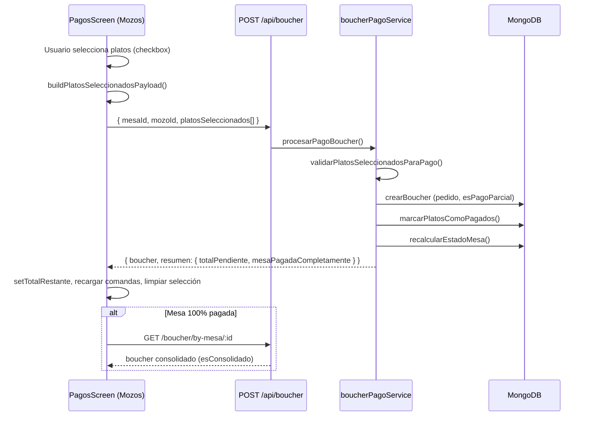

# Plan de implementación — Pagos parciales (App Mozos) y agrupación de vouchers (Dashboard)

**Fecha:** 17 de junio de 2026  
**Alcance:** App Mozos (`gambusinas`), Backend Las Gambusinas (`backend-gambusinas`), Dashboard web (`public/bouchers.html`)  
**Versión App Mozos de referencia:** 1.0.7  
**Documentación relacionada:**
- [PAGOS_PARCIALES.md](../../backend-gambusinas/docs/PAGOS_PARCIALES.md) — contrato API y reglas de negocio
- [APP_MOZOS_DOCUMENTACION_COMPLETA.md](./APP_MOZOS_DOCUMENTACION_COMPLETA.md)
- [ENTREGA_PLEXPERITY_JUNIO_2026.md](./ENTREGA_PLEXPERITY_JUNIO_2026.md)

---

## 1. Resumen ejecutivo

### Objetivo

Permitir que el mozo cobre **una comanda o pedido en varios pagos independientes**, seleccionando platos concretos en cada cobro. Cada pago genera su **propio voucher (boucher)**. Los vouchers de la misma visita se **agrupan lógicamente** por `pedido` (ciclo de servicio de la mesa), tanto en la app de mozos como en la tabla de vouchers del dashboard — de forma análoga al toggle **Agrupado / Individual** de la página de comandas.

### Resultado esperado para el usuario

| Actor | Experiencia |
|-------|-------------|
| **Mozo** | En PagosScreen selecciona platos → confirma pago parcial → ve el restante → repite hasta cobrar todo → imprime cada voucher o el consolidado al final |
| **Administrador** | En Vouchers ve filas agrupadas por pedido/comanda con total acumulado y puede expandir para ver cada voucher individual |
| **Backend** | Persiste N bouchers por pedido, marca platos `pagado`, devuelve `resumen.totalPendiente` tras cada cobro |

### Estado actual (junio 2026)

| Componente | Estado | Notas |
|------------|--------|-------|
| API `POST /api/boucher` con `platosSeleccionados` | ✅ Implementado | `boucherPagoService.js` |
| Modelo `Boucher` con `pedido`, `esPagoParcial` | ✅ Implementado | `boucher.model.js` |
| Consolidación de vouchers por mesa | ✅ Implementado | `consolidarBouchersMesa()` en `boucher.repository.js` |
| PagosScreen — selector de platos + "Seleccionar todo" | ✅ Implementado | `pagoParcialHelpers.js`, `PagosScreen.js` |
| PagosScreen — actualización de restante tras pago | ✅ Implementado | `resumen.totalPendiente`, recarga de comandas |
| PagosScreen — lista de vouchers parciales | ✅ Implementado | Sección "Vouchers por pago parcial" |
| Dashboard `bouchers.html` — agrupación | ❌ Pendiente | Tabla plana; sin toggle Agrupado/Individual |
| Dashboard — detalle de grupo expandido | ❌ Pendiente | No existe equivalente a `comandas.html` |
| API listado con metadatos de agrupación | ⚠️ Parcial | `GET /boucher` devuelve lista plana; `pedido` viene poblado pero no se usa en UI |
| Pruebas E2E documentadas | ⚠️ Parcial | Casos manuales en `PAGOS_PARCIALES.md` |

**Conclusión:** La funcionalidad core (mozos + backend) está construida. El plan prioriza **cerrar la experiencia en dashboard** y **validar/refinar** el flujo completo en mozos.

---

## 2. Contexto de negocio

### Problema

Una mesa puede tener una o más comandas durante una visita. Hoy el mozo necesita poder:

1. Cobrar solo algunos platos (ej. bebidas primero, platos fuertes después).
2. Emitir un voucher por cada cobro parcial.
3. Ver cuánto falta por cobrar sin salir de la pantalla de pago.
4. Que administración vea esos vouchers **relacionados entre sí**, no como registros aislados.

### Conceptos clave del dominio

```
Visita a mesa
    └── Pedido (pedido.model.js) — ciclo abierto/cerrado
            └── Comanda(s) — pedidos de cocina
                    └── Plato(s) — estado: entregado → pagado
            └── Boucher(s) — uno por cada cobro (parcial o total)
```

| Entidad | Rol en pagos parciales |
|---------|------------------------|
| **Pedido** | Agrupa comandas y bouchers de la misma visita. Campo `pedido` en cada boucher. |
| **Comanda** | Permanece `entregado` / `IsActive: true` hasta que todos sus platos estén `pagado`. |
| **Plato** | Solo `entregado` es cobrable. Tras cobro pasa a `pagado`. |
| **Boucher** | Documento fiscal/operativo por cobro. `esPagoParcial: true` si no cubre toda la comanda. |
| **Boucher consolidado** | Vista virtual (`esConsolidado: true`) que une platos y totales de N bouchers del mismo pedido. |

---

## 3. Arquitectura actual

### 3.1 Flujo de datos — pago parcial



### 3.2 Contrato API principal

#### Crear pago (parcial o total)

```
POST /api/boucher
```

**Pago parcial:**

```json
{
  "mesaId": "ObjectId",
  "mozoId": "ObjectId",
  "clienteId": "ObjectId | null",
  "platosSeleccionados": [
    {
      "comandaId": "ObjectId",
      "platoIndex": 0,
      "platoSubdocId": "opcional",
      "cantidad": 1
    }
  ],
  "observaciones": "opcional"
}
```

**Respuesta:**

```json
{
  "boucher": { "_id": "...", "voucherId": "AB12C", "esPagoParcial": true, "pedido": "..." },
  "resumen": {
    "mesaPagadaCompletamente": false,
    "totalPendiente": 40.0,
    "cantidadComandasPendientes": 1,
    "comandas": [],
    "mesa": { "_id": "...", "nummesa": 5, "estado": "preparado" }
  }
}
```

#### Consultas de agrupación

| Endpoint | Uso |
|----------|-----|
| `GET /api/boucher/mesa/:mesaId/parciales` | Lista vouchers individuales del ciclo (sin consolidar) |
| `GET /api/boucher/by-mesa/:mesaId` | Voucher consolidado cuando la mesa está pagada |
| `GET /api/comanda/mesa/:mesaId/bouchers-parciales` | Alias usado desde PagosScreen |
| `GET /api/boucher` | Listado global para dashboard (plano hoy) |

### 3.3 Reglas de negocio (backend)

| Regla | Implementación |
|-------|----------------|
| Platos cobrables | Solo `estado === 'entregado'`, no eliminados ni anulados |
| Tras cobro parcial | Plato → `pagado`; comanda sigue activa si quedan platos pendientes |
| Comanda completa | `status: 'pagado'`, `IsActive: false` |
| Mesa completa | `estado: 'pagado'`; cierra pedido abierto |
| Descuentos en parcial | Prorrateo por ratio subtotal seleccionado / subtotal comanda |
| Agrupación | Todos los bouchers del mismo `pedido` pertenecen al mismo grupo |
| Legacy sin pedido | Fallback por `comandaIds` del ciclo o mismo día (zona Lima) |

### 3.4 App Mozos — componentes involucrados

| Archivo | Responsabilidad |
|---------|-----------------|
| `Pages/navbar/screens/PagosScreen.js` | UI de pago, confirmación, restante, vouchers parciales |
| `utils/pagoParcialHelpers.js` | Claves de selección, payload, totales preview, toggle todos |
| `services/boucherPrint/` | Impresión/PDF de cada voucher |
| `apiConfig.js` | `BOUCHER_API`, rutas de comanda |

**Estados clave en PagosScreen:**

```javascript
platosSeleccionadosPago   // claves de platos marcados
totalRestante             // desde resumen.totalPendiente
bouchersParciales         // vouchers del ciclo para reimprimir
hayPendienteTrasPago      // controla modal post-pago
```

**UI existente:**

- Sección **Platos** con checkbox por ítem y botón **Seleccionar todo / Deseleccionar todo**
- Línea **Restante por cobrar** cuando `totalRestante > 0`
- Tarjeta **Vouchers por pago parcial** con botón Imprimir por voucher
- Botón **Confirmar Pago (N)** deshabilitado si no hay selección

### 3.5 Dashboard — referencia de agrupación (comandas)

La página `public/comandas.html` implementa el patrón a replicar:

- Toggle `agruparPorCliente` → etiquetas **Agrupado** / **Individual**
- `processGrouping()` agrupa por:
  1. **Primario:** `pedidoId`
  2. **Fallback:** `clienteId + mesaNum` (datos históricos)
- Filas de tipo `grupo` con `totalAgrupado`, `numComandas`, filas expandibles
- Filas de tipo `individual` para vouchers/comandas sueltos

---

## 4. Plan de implementación por fases

### Fase 0 — Validación del flujo existente (App Mozos + Backend)

**Objetivo:** Confirmar que el flujo core funciona de punta a punta antes de extender el dashboard.

| # | Tarea | Criterio de aceptación |
|---|-------|------------------------|
| 0.1 | Prueba manual: 2 pagos parciales + 1 final | 3 bouchers con mismo `pedido`, mesa `pagado` al final |
| 0.2 | Verificar `totalRestante` tras cada pago | UI muestra monto correcto; coincide con `resumen.totalPendiente` |
| 0.3 | Verificar platos ya pagados en UI | Aparecen con check, no seleccionables |
| 0.4 | Verificar "Seleccionar todo" | Solo marca platos `entregado`, no los `pagado` |
| 0.5 | Impresión de voucher parcial | Cada boucher imprime solo sus platos |
| 0.6 | Propina sobre parcial | `POST /api/propinas` asociada al boucher del parcial |
| 0.7 | Descuento en comanda con pago parcial | Prorrateo correcto en cada boucher |

**Ajustes menores posibles en PagosScreen (si fallan pruebas):**

- Sincronizar `totalAcumuladoPagado` en UI (hoy en estado, no siempre visible)
- Refrescar `bouchersParciales` vía socket si otro dispositivo cobra la misma mesa
- Mensaje explícito "Quedan X platos por cobrar" tras modal de éxito

---

### Fase 1 — Agrupación en tabla de Vouchers (Dashboard)

**Objetivo:** Replicar el patrón de `comandas.html` en `bouchers.html`.

#### 1.1 UI — Toggle y filas agrupadas

**Archivo:** `backend-gambusinas/public/bouchers.html`

| Elemento | Especificación |
|----------|----------------|
| Toggle | Botón `👥 Agrupado` / `📋 Individual` junto a filtros (mismo estilo que comandas) |
| Estado Alpine | `agruparPorPedido: true`, `groupedRows: []`, `expandedGroups: []` |
| Columna extra en grupo | Badge `N vouchers`, total acumulado, indicador `esPagoParcial` |
| Fila expandible | Al expandir grupo: sub-filas con cada voucher (#, código, fecha, total, acciones) |
| Footer resumen | "Total agrupado visible: S/. X" (solo en modo agrupado) |

#### 1.2 Lógica `processGroupingBouchers()`

Pseudocódigo alineado con comandas:

```javascript
processGroupingBouchers() {
  if (!this.agruparPorPedido) {
    this.groupedRows = this.filteredBouchers.map(b => ({
      tipo: 'individual', id: b._id, boucher: b
    }));
    return;
  }

  const gruposPedido = new Map();      // pedido._id → { bouchers: [] }
  const gruposComanda = new Map();     // comandaIds sorted join → { bouchers: [] } (fallback)
  const individuales = [];

  this.filteredBouchers.forEach(b => {
    const pedidoId = b.pedido?._id || b.pedido || null;
    if (pedidoId) {
      const key = `pedido_${pedidoId}`;
      // acumular en gruposPedido
    } else if (b.comandas?.length === 1 || b.comandasNumbers?.length === 1) {
      const key = `comanda_${b.comandas[0] || b.comandasNumbers[0]}`;
      // acumular en gruposComanda (vouchers de misma comanda sin pedido)
    } else {
      individuales.push(b);
    }
  });

  // Grupo si length > 1; si no, individual
  // crearFilaGrupo: totalAgrupado, numVouchers, mesaNum, mozo, fechaPrimera, fechaUltima
}
```

**Claves de agrupación (prioridad):**

1. `pedido` (ObjectId) — ciclo de visita
2. `comandas[0]` o intersección de comandas — vouchers de la misma comanda (legacy)
3. Individual — voucher único

#### 1.3 Modal de detalle de grupo

Al hacer clic en fila `tipo: 'grupo'`:

- Resumen: Mesa, mozo, pedido #, total acumulado, cantidad de vouchers
- Lista de vouchers del grupo con enlace a detalle/impresión individual
- Opción futura: "Imprimir consolidado" (usar lógica de `consolidarBouchersMesa`)

#### 1.4 Indicadores visuales

| Badge | Condición |
|-------|-----------|
| `Parcial` | Algún voucher del grupo tiene `esPagoParcial: true` |
| `Consolidado` | Grupo con >1 voucher y pedido `pagado` |
| `N pagos` | `grupo.bouchers.length` |

---

### Fase 2 — Mejoras de API para el dashboard (opcional pero recomendado)

**Objetivo:** Evitar lógica pesada en el cliente y facilitar reportes.

#### 2.1 Enriquecer `GET /api/boucher`

Incluir en cada documento (o vía query `?populate=pedido`):

```json
{
  "pedido": { "_id": "...", "pedidoId": 42, "estado": "pagado" },
  "esPagoParcial": true,
  "grupoKey": "pedido_64abc...",
  "cantidadVouchersEnGrupo": 3
}
```

**Implementación sugerida:**

- En `listarBouchers()`: populate `pedido` con `pedidoId estado numMesa`
- Agregación opcional `$lookup` + `$group` para `cantidadVouchersEnGrupo` por `pedido`

#### 2.2 Nuevo endpoint (alternativa)

```
GET /api/boucher/agrupados?fechaDesde=&fechaHasta=
```

Respuesta:

```json
{
  "grupos": [
    {
      "grupoKey": "pedido_64abc",
      "pedidoId": 42,
      "mesa": 5,
      "totalAgrupado": 150.0,
      "cantidadVouchers": 3,
      "bouchers": [ /* ... */ ]
    }
  ],
  "individuales": [ /* vouchers sin grupo */ ]
}
```

**Ventaja:** El dashboard solo renderiza; la agrupación vive en el backend (fuente única de verdad).

---

### Fase 3 — Refinamiento App Mozos

**Objetivo:** Pulir UX del flujo de pagos múltiples.

| # | Mejora | Detalle |
|---|--------|---------|
| 3.1 | Banner de progreso | "Pagado: S/. X · Restante: S/. Y" persistente en header |
| 3.2 | Agrupar platos por comanda | En lista de selección, separador "Comanda #N" |
| 3.3 | Cantidad parcial por plato | UI para cobrar 1 de 2 unidades (backend ya soporta `cantidad` en payload) |
| 3.4 | Confirmación antes de pago parcial | Alert si selección < 100%: "Cobrarás solo N platos. ¿Continuar?" |
| 3.5 | Socket `boucher-nuevo` | Refrescar `bouchersParciales` si hay cobro desde otro terminal |
| 3.6 | Navegación post-pago | Si queda pendiente, no navegar a Inicio automáticamente |

---

### Fase 4 — Reportes y auditoría

| # | Tarea | Archivo probable |
|---|-------|------------------|
| 4.1 | Reporte de ventas: no duplicar totales por grupo | `reportes.repository.js` — agrupar por `pedido` al sumar |
| 4.2 | Filtro "Solo pagos parciales" en dashboard | `bouchers.html` |
| 4.3 | Export CSV con columna `pedidoId` y `esPagoParcial` | `bouchers.html` o endpoint dedicado |

---

## 5. Diseño de la tabla de vouchers agrupada

### Vista Agrupada (mockup textual)

```
┌─────────────────────────────────────────────────────────────────────────────┐
│ [👥 Agrupado]  Filtros: código | # | mozo | fechas                          │
├─────────────────────────────────────────────────────────────────────────────┤
│ ▶ Pedido #42 · Mesa 5 · 3 vouchers · S/. 150.00 · Mozo: Juan    [Parcial]  │
│ ▼ Pedido #41 · Mesa 3 · 1 voucher  · S/.  45.00 · Mozo: Ana               │
│     ├─ #127 AB12C · 17/06 14:30 · S/. 20.00 · Parcial        👁 🖨         │
│     ├─ #128 CD34E · 17/06 14:45 · S/. 25.00 · Parcial        👁 🖨         │
│     └─ #129 FG56H · 17/06 15:00 · S/. 55.00 · Final          👁 🖨         │
│ ▶ #130 HI78J · Mesa 7 · 1 voucher · S/. 30.00 (individual)                 │
└─────────────────────────────────────────────────────────────────────────────┘
Total agrupado visible: S/. 225.00
```

### Vista Individual

Comportamiento actual: una fila por voucher sin jerarquía.

---

## 6. Matriz de archivos

### Backend

| Archivo | Fase | Cambio |
|---------|------|--------|
| `src/services/boucherPagoService.js` | 0 | Sin cambios (referencia) |
| `src/repository/boucher.repository.js` | 2 | `listarBouchers` con populate pedido; opcional agregación |
| `src/controllers/boucherController.js` | 2 | Nuevo `GET /boucher/agrupados` (opcional) |
| `public/bouchers.html` | 1 | Toggle, `processGroupingBouchers`, filas expandibles, modal grupo |
| `docs/PAGOS_PARCIALES.md` | 1 | Actualizar con sección dashboard |

### App Mozos

| Archivo | Fase | Cambio |
|---------|------|--------|
| `utils/pagoParcialHelpers.js` | 0, 3 | Validación cantidad parcial; agrupar por comanda |
| `Pages/navbar/screens/PagosScreen.js` | 0, 3 | Banner progreso; confirmación parcial; socket |
| `docs/PLAN_PAGOS_PARCIALES_Y_VOUCHERS_AGRUPADOS.md` | — | Este documento |

---

## 7. Plan de pruebas

### 7.1 Casos funcionales — App Mozos

| ID | Escenario | Pasos | Resultado esperado |
|----|-----------|-------|-------------------|
| MP-01 | Pago total tradicional | Seleccionar todo → Confirmar | 1 boucher, mesa pagada, sin restante |
| MP-02 | Dos pagos parciales | Pagar mitad → pagar resto | 2 bouchers, mismo `pedido`, mesa pagada al final |
| MP-03 | Restante en UI | Tras primer parcial | `totalRestante` = suma platos no pagados |
| MP-04 | Platos pagados | Tras parcial | Platos cobrados no seleccionables |
| MP-05 | Reimprimir parcial | Tarjeta vouchers parciales | Imprime voucher correcto |
| MP-06 | Consolidado final | Último pago completa mesa | Vista consolidada con todos los platos |
| MP-07 | Descuento + parcial | Comanda con 10% desc | Descuento prorrateado en cada boucher |
| MP-08 | Sin selección | Confirmar sin check | Alert "Selecciona al menos un plato" |

### 7.2 Casos funcionales — Dashboard

| ID | Escenario | Resultado esperado |
|----|-----------|-------------------|
| DV-01 | Modo Agrupado, 3 vouchers mismo pedido | 1 fila grupo, total = suma |
| DV-02 | Expandir grupo | 3 sub-filas con datos correctos |
| DV-03 | Modo Individual | N filas, una por voucher |
| DV-04 | Voucher legacy sin pedido | Agrupa por comanda o queda individual |
| DV-05 | Filtros + agrupación | Filtros aplican antes de agrupar |
| DV-06 | Imprimir desde sub-fila | PDF del voucher individual |

### 7.3 Regresión

- Pago total legacy con `comandasIds` (sin `platosSeleccionados`)
- Liberación de mesa → bouchers `isActive: false`
- Reportes de ventas no inflados por vouchers duplicados del mismo pedido

---

## 8. Riesgos y mitigaciones

| Riesgo | Impacto | Mitigación |
|--------|---------|------------|
| Vouchers legacy sin `pedido` | Grupos incompletos en dashboard | Fallback por `comandas` / `mesa + fecha` |
| Doble conteo en reportes | Ventas infladas | Agrupar por `pedido` al consolidar reportes (Fase 4) |
| Race condition: dos mozos cobran mismo plato | Doble cobro | Backend valida `estado === 'entregado'` atómicamente |
| UX confusa: parcial vs total | Errores de caja | Confirmación explícita + banner restante |
| Consolidado vs individuales en impresión | Tickets incorrectos | Mantener impresión siempre del boucher concreto; consolidado solo vista resumen |

---

## 9. Cronograma sugerido

| Fase | Duración estimada | Dependencias |
|------|-------------------|--------------|
| Fase 0 — Validación | 1–2 días | Ninguna |
| Fase 1 — Dashboard agrupación | 2–3 días | Fase 0 OK |
| Fase 2 — API agrupados | 1–2 días | Opcional; paralelo a Fase 1 |
| Fase 3 — Refinamiento mozos | 2 días | Fase 0 |
| Fase 4 — Reportes | 1–2 días | Fase 1–2 |

**Total estimado:** 7–11 días de desarrollo + QA.

---

## 10. Criterios de done (definición de terminado)

- [ ] Mozo puede cobrar una comanda en N pagos seleccionando platos
- [ ] Botón "Seleccionar todo" opera solo sobre platos cobrables
- [ ] Tras cada pago parcial, el restante se actualiza sin recargar la app
- [ ] Cada pago genera un boucher independiente con `esPagoParcial` correcto
- [ ] Vouchers del mismo pedido comparten `pedido` en base de datos
- [ ] Dashboard Vouchers tiene toggle Agrupado/Individual funcional
- [ ] Grupos expandibles muestran cada voucher con acciones ver/imprimir
- [ ] Documentación `PAGOS_PARCIALES.md` actualizada con dashboard
- [ ] Casos MP-01 a MP-08 y DV-01 a DV-06 pasan en QA

---

## 11. Referencias de código

### Helpers de selección (App Mozos)

```javascript
// gambusinas/utils/pagoParcialHelpers.js
listarPlatosEnPantallaPago(comandas)  // entregados + pagados (UI)
listarPlatosPagables(comandas)        // solo entregados (payload)
toggleSeleccionarTodos(keys, pagables)
buildPlatosSeleccionadosPayload(selectedKeys, pagables)
```

### Consolidación (Backend)

```javascript
// backend-gambusinas/src/repository/boucher.repository.js
consolidarBouchersMesa(bouchers)  // esConsolidado, bouchersParciales[]
listarBouchersActivosPorMesa(mesaId, { comandaIds })
obtenerBoucherPorMesa(mesaId)
```

### Agrupación de comandas (patrón a replicar)

```javascript
// backend-gambusinas/public/comandas.html
processGrouping()  // pedidoId primario, clienteId+mesaNum fallback
```

---

## 12. Próximos pasos inmediatos

1. **Ejecutar Fase 0** — checklist manual en dispositivo/tablet con backend de staging.
2. **Implementar Fase 1** — comenzar por copiar estructura Alpine de `comandas.html` a `bouchers.html`.
3. **Actualizar** `PAGOS_PARCIALES.md` con capturas del dashboard agrupado al terminar Fase 1.
4. **Revisar reportes** (Fase 4) antes de release a producción para evitar doble conteo de ventas.

---

*Documento generado para planificación interna — Las Gambusinas / Plexperity, junio 2026.*
