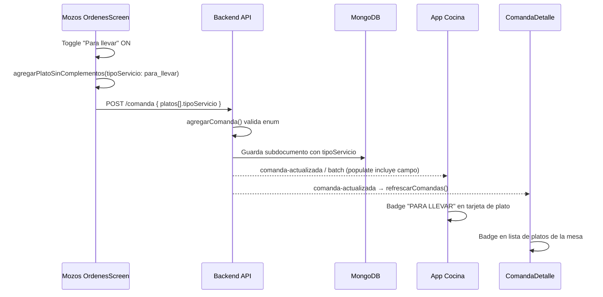

# Plan de implementación: Plato "Para Llevar" vs "Mesa"

**Versión:** 1.0  
**Fecha:** Junio 2026  
**Audiencia:** GLM-5.2 / equipo de desarrollo  
**Alcance:** App Mozos (`OrdenesScreen` + vistas relacionadas), Backend, App Cocina, `ComandaDetalleScreen`

---

## 1. Resumen ejecutivo

Hoy todos los platos que un mozo agrega a una comanda se tratan implícitamente como **servicio en mesa**. No existe un campo en el subdocumento de plato de comanda que distinga **Mesa** de **Para llevar**.

Este plan define cómo agregar un **Toggle Switch** en el modal de selección de platos (flujo "Agregar plato" → Carta o Desayuno) para que el mozo indique el tipo de servicio **antes de agregar cada plato**. El valor viaja al backend, se persiste en MongoDB, se muestra en cocina y se refleja en todas las vistas de mozos que listan líneas de comanda.

**Valor por defecto:** `mesa` (comportamiento actual sin cambios para comandas existentes).

---

## 2. Objetivo de negocio

| Necesidad | Descripción |
|-----------|-------------|
| Mozos | Pedir platos para llevar desde la misma mesa/comanda (ej. cliente en mesa pide un plato extra para llevar). |
| Cocina | Ver claramente qué ítems van empaquetados para llevar vs servidos en mesa. |
| Operación | Trazabilidad en comanda detalle, edición, pagos y vouchers sin confundir dos líneas del mismo plato con distinto destino. |

---

## 3. Estado actual del código (análisis)

### 3.1 App Mozos — `OrdenesScreen` (pantalla principal del requerimiento)

**Archivo:** `gambusinas/Pages/navbar/screens/OrdenesScreen.js`

Flujo actual:

1. Botón **"Agregar Plato"** → abre `modalPlatosVisible`.
2. Si `tipoPlatoFiltro === null` → selector **DESAYUNO** / **CARTA** (líneas ~1444–1462).
3. Si ya hay tipo → barra **"← Desayuno"** o **"← Carta Normal"** (`changeTipoButton`, líneas ~1466–1478), buscador, chips de categoría y lista filtrada.
4. `handleAddPlato` → complementos o `agregarPlatoSinComplementos`.
5. `handleEnviarComanda` arma el payload:

```javascript
// OrdenesScreen.js ~742-748 (estado actual)
const platosData = selectedPlatos.map(plato => ({
  plato: plato._id,
  platoId: plato.id || null,
  estado: "en_espera",
  complementosSeleccionados: plato.complementosElegidos || [],
  notaEspecial: plato.notaEspecial || ""
}));
```

**No existe** campo de tipo de servicio. La deduplicación al agregar compara `_id`, complementos y `notaEspecial` — habrá que incluir `tipoServicio`.

**Persistencia local:** `selectedPlates` y `cantidadesComanda` en AsyncStorage (líneas ~1041–1056). El nuevo campo debe serializarse ahí.

### 3.2 App Mozos — `ComandaDetalleScreen`

**Archivo:** `gambusinas/Pages/ComandaDetalleScreen.js`

- Flujo "Agregar Plato" usa `Alert.alert` para elegir Desayuno/Carta (líneas ~2373–2387), no un modal como `OrdenesScreen`.
- `agregarPlatoSinComplementos` (líneas ~678–731) y `handleGuardarEdicion` (líneas ~815–823) tampoco envían tipo de servicio.
- La lista de platos muestra nombre, estado, complementos y `notaEspecial` — **falta badge Para llevar**.

### 3.3 Otras pantallas mozos con el mismo patrón (secundarias)

| Pantalla | Archivo | Prioridad |
|----------|---------|-----------|
| InicioScreen | `Pages/navbar/screens/InicioScreen.js` | P2 — flujo legacy de agregar plato |
| SecondScreen | `Pages/navbar/screens/SecondScreen.js` | P3 |
| ThridScreen | `Pages/navbar/screens/ThridScreen.js` | P3 |

**Recomendación:** implementar primero en `OrdenesScreen` y `ComandaDetalleScreen`; replicar patrón en las demás si siguen en uso.

### 3.4 Backend — modelo de comanda

**Archivo:** `backend-gambusinas/src/database/models/comanda.model.js`

Subdocumento `platos[]` (líneas ~35–139) incluye: `estado`, `tiempos`, `complementosSeleccionados`, `notaEspecial`, auditoría de eliminación/anulación, `procesandoPor`, `procesadoPor`.

**No hay** campo `tipoServicio` ni `paraLlevar`.

**Puntos de escritura:**

| Función | Archivo | Uso |
|---------|---------|-----|
| `agregarComanda` | `src/repository/comanda.repository.js` ~538+ | POST nueva comanda |
| `editarConAuditoria` | mismo archivo ~1300+ | PUT editar comanda / agregar platos |

Ambos deben normalizar y validar el nuevo campo.

### 3.5 App Cocina

**Archivos principales:**

| Componente | Rol |
|------------|-----|
| `appcocina/src/components/Principal/comandastyle.jsx` | Vista KDS principal; render de cada plato |
| `appcocina/src/components/Principal/ComandastylePerso.jsx` | Variante personalizada |
| `appcocina/src/components/Principal/PlatoPreparacion.jsx` | Tarjeta de plato en preparación |
| `appcocina/src/components/Principal/RevertirModal.jsx` | Lista al revertir |
| `appcocina/src/components/pdf/pdfcomanda.jsx` | PDF de comanda |

Cocina ya muestra `complementosSeleccionados` y estados por color. **No muestra** indicador para llevar.

Los eventos socket `plato-actualizado` / `plato-actualizado-batch` propagan el documento de comanda desde el backend; si el campo existe en MongoDB y en las respuestas GET, cocina lo recibirá sin cambio de contrato de socket (solo hay que pintarlo).

### 3.6 Vouchers / admin

En `backend-gambusinas/public/bouchers.html` y documentación de vouchers existe `tipo: 'Para llevar'` a **nivel de comprobante** (dato de ejemplo), no por línea de plato. Es independiente del campo propuesto aquí (granularidad por ítem).

---

## 4. Diseño de datos

### 4.1 Campo propuesto (por línea de plato en comanda)

```javascript
// En comanda.model.js → platos[]
tipoServicio: {
  type: String,
  enum: ['mesa', 'para_llevar'],
  default: 'mesa'
}
```

**Alternativa descartada:** `paraLlevar: Boolean` — menos explícito en APIs y logs; el enum escala mejor si en el futuro hubiera más modos (delivery, etc.).

### 4.2 Reglas de negocio

| Regla | Detalle |
|-------|---------|
| Default | `'mesa'` si el cliente no envía el campo |
| Comandas existentes | Sin migración obligatoria; ausencia del campo = mesa |
| Deduplicación mozos | Mismo `plato._id` + mismos complementos + misma `notaEspecial` + mismo `tipoServicio` → incrementar cantidad; distinto `tipoServicio` → línea separada |
| Cocina | Misma cola KDS; solo cambia etiqueta visual |
| Estados | `tipoServicio` no cambia con `pedido` → `recoger` → `entregado` |

### 4.3 Payload API (ejemplo)

**POST `/api/comanda`**

```json
{
  "mozos": "...",
  "mesas": "...",
  "platos": [
    {
      "plato": "...",
      "platoId": 12,
      "estado": "en_espera",
      "tipoServicio": "para_llevar",
      "complementosSeleccionados": [],
      "notaEspecial": ""
    },
    {
      "plato": "...",
      "platoId": 5,
      "estado": "en_espera",
      "tipoServicio": "mesa",
      "complementosSeleccionados": [{ "grupo": "Proteína", "opcion": "Pollo", "cantidad": 1 }],
      "notaEspecial": "Sin cebolla"
    }
  ],
  "cantidades": [1, 2],
  "observaciones": "",
  "status": "en_espera"
}
```

**PUT `/api/comanda/:id`** — incluir `tipoServicio` en cada elemento de `platos[]` al editar.

---

## 5. Diseño UI/UX — Toggle en modal de platos

### 5.1 Ubicación exacta (requisito del usuario)

Dentro del modal **Menú**, cuando `tipoPlatoFiltro` ya está definido (vista con buscador + categorías + lista):

```
┌─────────────────────────────────────────────────────────────┐
│  Menú                                                    ✕  │
├─────────────────────────────────────────────────────────────┤
│  [← Carta Normal]              [ Mesa  ○━━●  Para llevar ] │  ← NUEVA FILA
│  ┌─────────────────────────────────────────────────────┐   │
│  │ Buscar plato...                                  ✕  │   │
│  └─────────────────────────────────────────────────────┘   │
│  [Todos] [🥩 Carnes] [🐟 Pescados] ...                     │
│  ... lista de platos ...                                    │
└─────────────────────────────────────────────────────────────┘
```

- **Izquierda:** botón existente `changeTipoButton` (volver a elegir Carta/Desayuno).
- **Derecha:** `Switch` de React Native (mismo patrón que `MasScreen.js` y `NotificationsScreen.js`).
- **OFF (default):** etiqueta activa **Mesa**.
- **ON:** etiqueta activa **Para llevar**.

### 5.2 Estado en React

```javascript
const [tipoServicioModal, setTipoServicioModal] = useState('mesa'); // 'mesa' | 'para_llevar'

// Al cerrar modal o cambiar tipo de menú (Carta ↔ Desayuno), resetear a 'mesa'
```

El toggle afecta **solo los platos que se agreguen mientras está en ese estado**, no los ya seleccionados en la lista de la orden.

### 5.3 Al agregar plato

En `agregarPlatoSinComplementos`:

```javascript
const platoConComplementos = {
  ...plato,
  instanceId,
  tipoServicio: tipoServicioModal, // 'mesa' | 'para_llevar'
  complementosElegidos: complementosNormalizados,
  notaEspecial,
};
```

Incluir `tipoServicio` en la función de comparación de duplicados.

### 5.4 Lista "Platos seleccionados" (fuera del modal)

Mostrar badge cuando `tipoServicio === 'para_llevar'`:

```
Lomo saltado
[🥡 Para llevar]  · Pollo x1
x1  S/. 28.00
```

Icono sugerido: `MaterialCommunityIcons` `bag-personal` o `package-variant`.

### 5.5 Estilos nuevos en `OrdenesScreenStyles`

- `tipoServicioRow`: `flexDirection: 'row'`, `justifyContent: 'space-between'`, `alignItems: 'center'`, `marginBottom`.
- `tipoServicioToggle`: contenedor del Switch + labels.
- `paraLlevarBadge`: chip naranja/ámbar coherente con `theme.colors.warning`.

---

## 6. Flujo de datos end-to-end



---

## 7. Cambios por capa (checklist de archivos)

### 7.1 Backend — P0

| # | Archivo | Cambio |
|---|---------|--------|
| 1 | `src/database/models/comanda.model.js` | Agregar `tipoServicio` al subdocumento `platos[]` |
| 2 | `src/repository/comanda.repository.js` | En `agregarComanda`: default `'mesa'`, validar enum |
| 3 | `src/repository/comanda.repository.js` | En `editarConAuditoria`: persistir al agregar/editar líneas |
| 4 | `src/controllers/comandaController.js` | Si hay DTO/validación Joi o similar, incluir campo |
| 5 | Tests existentes de comanda | Casos: default mesa, para_llevar explícito, enum inválido → 400 |

**Socket:** no requiere nuevo evento; los payloads de `comanda-actualizada` y batch ya envían el array `platos`. Verificar que `populate` y proyecciones lean no omitan el campo.

### 7.2 App Mozos — P0

| # | Archivo | Cambio |
|---|---------|--------|
| 1 | `Pages/navbar/screens/OrdenesScreen.js` | Estado `tipoServicioModal`, UI toggle, payload POST, dedup, badge en lista, AsyncStorage |
| 2 | `Pages/ComandaDetalleScreen.js` | Mismo toggle en sección agregar plato (inline o modal), payload PUT edición, badge en lista principal |

### 7.3 App Mozos — P1

| # | Archivo | Cambio |
|---|---------|--------|
| 1 | `Pages/navbar/screens/PagosScreen.js` | Si lista platos individuales, mostrar badge para llevar |
| 2 | `Pages/navbar/screens/InicioScreen.js` | Paridad con OrdenesScreen si el flujo sigue activo |

### 7.4 App Cocina — P0

| # | Archivo | Cambio |
|---|---------|--------|
| 1 | `src/components/Principal/PlatoPreparacion.jsx` | Prop `tipoServicio`; badge visible "🥡 PARA LLEVAR" |
| 2 | `src/components/Principal/comandastyle.jsx` | Pasar `tipoServicio` a `PlatoPreparacion` y tarjetas de cola |
| 3 | `src/components/Principal/ComandastylePerso.jsx` | Mismo cambio que comandastyle |
| 4 | `src/components/Principal/RevertirModal.jsx` | Mostrar indicador en líneas para llevar |
| 5 | `src/components/pdf/pdfcomanda.jsx` | Opcional P2: sufijo "(P.L.)" en nombre de producto |

**Estilo cocina sugerido:**

```jsx
{tipoServicio === 'para_llevar' && (
  <span className="text-xs font-bold text-amber-400 bg-amber-900/40 px-1.5 py-0.5 rounded">
    PARA LLEVAR
  </span>
)}
```

### 7.5 Admin / dashboard — P2

| # | Archivo | Cambio |
|---|---------|--------|
| 1 | `backend-gambusinas/public/comandas.html` | Columna o icono en detalle de plato |
| 2 | Generación de vouchers | Si se desea tipo comprobante "Para llevar" cuando **todos** los platos activos son para_llevar — lógica derivada, no obligatoria en v1 |

---

## 8. Vistas que deben mostrar "Para llevar"

| Vista | Qué mostrar | Prioridad |
|-------|-------------|-----------|
| OrdenesScreen — modal menú | Toggle (entrada) | P0 |
| OrdenesScreen — platos seleccionados | Badge por línea | P0 |
| ComandaDetalleScreen — lista platos | Badge por línea | P0 |
| ComandaDetalleScreen — agregar plato | Toggle | P0 |
| ComandaDetalleScreen — modal editar | Badge + toggle al agregar | P0 |
| ComandaDetalleScreen — modal eliminar/entregar | Badge en nombre | P1 |
| InicioScreen — detalle mesa | Badge | P1 |
| PagosScreen — selección de platos | Badge | P1 |
| Cocina KDS (comandastyle) | Badge destacado | P0 |
| Cocina RevertirModal | Texto/badge | P1 |
| PDF comanda cocina | Sufijo opcional | P2 |
| Admin comandas.html | Icono | P2 |

---

## 9. Detalle de implementación — `OrdenesScreen.js`

### 9.1 Imports

```javascript
import { Switch } from 'react-native';
```

### 9.2 Estado

```javascript
const [tipoServicioModal, setTipoServicioModal] = useState('mesa');
```

### 9.3 Reset del toggle

En `cerrarModalPlatos`, al pulsar `changeTipoButton` (volver a Carta/Desayuno), y tras enviar comanda exitosamente:

```javascript
setTipoServicioModal('mesa');
```

### 9.4 JSX — fila toggle (después de `changeTipoButton`)

```jsx
<View style={styles.tipoServicioRow}>
  <TouchableOpacity style={styles.changeTipoButton} /* ... existente, flex: 1 */>
    ...
  </TouchableOpacity>
  <View style={styles.tipoServicioToggle}>
    <Text style={[styles.tipoServicioLabel, tipoServicioModal === 'mesa' && styles.tipoServicioLabelActive]}>
      Mesa
    </Text>
    <Switch
      value={tipoServicioModal === 'para_llevar'}
      onValueChange={(v) => setTipoServicioModal(v ? 'para_llevar' : 'mesa')}
      trackColor={{ false: theme.colors.border, true: theme.colors.warning }}
      thumbColor={theme.colors.text.white}
      accessibilityLabel="Tipo de servicio: Mesa o Para llevar"
    />
    <Text style={[styles.tipoServicioLabel, tipoServicioModal === 'para_llevar' && styles.tipoServicioLabelActive]}>
      Para llevar
    </Text>
  </View>
</View>
```

**Nota de layout:** si en tablets el espacio es justo, `changeTipoButton` puede quedar en una fila y el toggle en una segunda fila alineada a la derecha; el requisito es que el toggle esté **a la derecha del botón de tipo de menú** en la misma zona superior del modal.

### 9.5 Dedup — fragmento a modificar

```javascript
// En existsWithSameComplements:
const pTipo = p.tipoServicio || 'mesa';
const newTipo = tipoServicioModal || 'mesa';
if (pTipo !== newTipo) return false;
```

### 9.6 Envío de comanda

```javascript
const platosData = selectedPlatos.map(plato => ({
  plato: plato._id,
  platoId: plato.id || null,
  estado: "en_espera",
  tipoServicio: plato.tipoServicio || 'mesa',
  complementosSeleccionados: plato.complementosElegidos || [],
  notaEspecial: plato.notaEspecial || ""
}));
```

---

## 10. Detalle de implementación — Backend

### 10.1 Modelo

Insertar después de `notaEspecial` en `comanda.model.js`:

```javascript
tipoServicio: {
  type: String,
  enum: ['mesa', 'para_llevar'],
  default: 'mesa'
},
```

### 10.2 Repository — normalización en loop de platos

```javascript
const TIPOS_SERVICIO_VALIDOS = ['mesa', 'para_llevar'];
// dentro del for de data.platos:
plato.tipoServicio = TIPOS_SERVICIO_VALIDOS.includes(plato.tipoServicio)
  ? plato.tipoServicio
  : 'mesa';
```

### 10.3 `editarConAuditoria` — al push de plato nuevo

```javascript
const platoAgregado = {
  plato: platoCompleto._id,
  platoId: platoCompleto.id,
  estado: nuevoPlato.estado || 'en_espera',
  tipoServicio: nuevoPlato.tipoServicio || 'mesa',
  complementosSeleccionados: nuevoPlato.complementosSeleccionados || [],
  notaEspecial: nuevoPlato.notaEspecial || ''
};
```

---

## 11. Detalle de implementación — `ComandaDetalleScreen.js`

### 11.1 Diferencia de UX respecto a OrdenesScreen

Hoy usa `Alert.alert` para Carta/Desayuno. Opciones:

| Opción | Pros | Contras |
|--------|------|---------|
| A) Replicar modal de OrdenesScreen | UX consistente | Más refactor |
| B) Toggle inline debajo del selector Alert | Menor diff | Alert no permite toggle junto a botones |
| **C) Recomendada:** tras elegir tipo en Alert, mostrar barra con toggle igual que OrdenesScreen en la sección `tipoPlatoFiltro &&` | Alineado al requisito con cambio acotado | — |

### 11.2 Render en lista de platos activos

Junto al nombre (`plato.plato.nombre`), si `(plato.tipoServicio || 'mesa') === 'para_llevar'`:

```jsx
<View style={styles.paraLlevarBadge}>
  <Text style={styles.paraLlevarBadgeText}>🥡 Para llevar</Text>
</View>
```

### 11.3 Guardar edición

En `platosData` del PUT (~815):

```javascript
tipoServicio: p.tipoServicio || 'mesa',
```

---

## 12. Plan de fases sugerido

| Fase | Entregable | Estimación |
|------|------------|------------|
| **F1** | Modelo + repository + tests API | 0.5–1 día |
| **F2** | OrdenesScreen: toggle, dedup, POST, badges | 1 día |
| **F3** | ComandaDetalleScreen: toggle, PUT, badges | 1 día |
| **F4** | Cocina: PlatoPreparacion + comandastyle | 0.5–1 día |
| **F5** | PagosScreen, InicioScreen, admin | 0.5 día |
| **F6** | QA integrado mozo → cocina → detalle | 0.5 día |

**Orden de dependencias:** F1 → F2 y F3 en paralelo → F4 → F5 → F6.

---

## 13. Casos de prueba

| # | Escenario | Resultado esperado |
|---|-----------|-------------------|
| 1 | Agregar plato con toggle en Mesa (default) | `tipoServicio: 'mesa'` en DB; sin badge en cocina |
| 2 | Toggle Para llevar, agregar mismo plato dos veces | Una línea, cantidad 2 |
| 3 | Mismo plato: uno Mesa y uno Para llevar | Dos líneas distintas en comanda |
| 4 | Mismo plato para llevar, distinta nota | Dos líneas |
| 5 | Comanda antigua sin campo | Se muestra como Mesa en todas las vistas |
| 6 | Cocina marca listo plato para llevar | Estado `recoger` + badge para llevar visible en ComandaDetalle |
| 7 | Editar comanda y agregar plato para llevar | PUT persiste; cocina actualiza por socket |
| 8 | Cerrar y reabrir modal menú | Toggle vuelve a Mesa |
| 9 | AsyncStorage: borrador de orden con para llevar | Al reabrir app, badges y campo conservados |
| 10 | Enum inválido en API (`"delivery"`) | 400 o normalizado a `mesa` según política elegida |

---

## 14. Riesgos y mitigaciones

| Riesgo | Mitigación |
|--------|------------|
| Confundir `tipoServicio` del plato con `tipo` del catálogo (`plato-carta normal` / `platos-desayuno`) | Nombres distintos; documentar en código |
| Duplicados incorrectos al olvidar `tipoServicio` en comparación | Test unitario de `agregarPlatoSinComplementos` |
| Cocina no repinta badge tras socket | El badge lee `plato.tipoServicio` del objeto en memoria; verificar que GET/populate no lo strip |
| ComandaDetalle pierde eventos en tablet (ver `COMANDA_DETALLE_TIEMPO_REAL.md`) | Independiente de esta feature; pull-to-refresh debe mostrar badge |

---

## 15. Criterios de aceptación

- [ ] Toggle visible a la derecha del botón Carta/Desayuno dentro del modal de menú en `OrdenesScreen`.
- [ ] Default Mesa; al activar, los platos agregados llevan `tipoServicio: 'para_llevar'`.
- [ ] Backend persiste el campo por línea de plato.
- [ ] App cocina muestra indicador claro en platos para llevar.
- [ ] `ComandaDetalleScreen` muestra badge en cada línea para llevar.
- [ ] Comandas existentes sin el campo siguen funcionando como Mesa.
- [ ] Dos líneas del mismo plato con distinto tipo de servicio no se fusionan.

---

## 16. Documentos relacionados

| Documento | Relación |
|-----------|----------|
| [COMANDA_DETALLE_TIEMPO_REAL.md](./COMANDA_DETALLE_TIEMPO_REAL.md) | Sincronización socket ComandaDetalle ↔ cocina |
| [APP_MOZOS_DOCUMENTACION_COMPLETA.md](./APP_MOZOS_DOCUMENTACION_COMPLETA.md) | Arquitectura general app mozos |
| [App Mozos, App Cocina, Backend Las Gambusinas.md](./App%20Mozos%2C%20App%20Cocina%2C%20Backend%20Las%20Gambusinas.md) | Flujo de notificaciones |
| [PLAN_PAGOS_PARCIALES_Y_VOUCHERS_AGRUPADOS.md](./PLAN_PAGOS_PARCIALES_Y_VOUCHERS_AGRUPADOS.md) | Pagos por plato (badge también en selección) |

---

## 17. Resumen para GLM-5.2 (orden de ejecución)

1. **Backend primero:** `tipoServicio` en schema + repository (`agregarComanda`, `editarConAuditoria`).
2. **OrdenesScreen:** `tipoServicioModal` + Switch en fila del `changeTipoButton` + propagar a `agregarPlatoSinComplementos`, dedup, `handleEnviarComanda`, badges.
3. **ComandaDetalleScreen:** mismo patrón en sección agregar plato + PUT edición + badges en lista.
4. **Cocina:** badge en `PlatoPreparacion` y paso de prop desde `comandastyle.jsx`.
5. **QA:** crear comanda mixta (mesa + para llevar), verificar en cocina y detalle en tiempo real y tras refresh.

Este documento es la especificación única para la feature; no implementar campos alternativos (`paraLlevar` boolean suelto, tipo a nivel comanda completa) sin acuerdo explícito.
