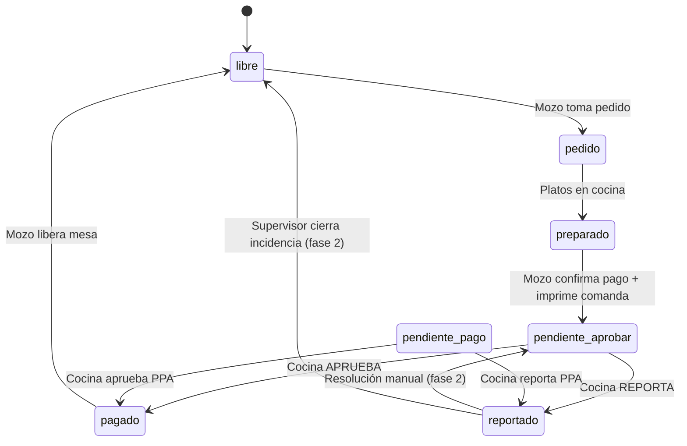
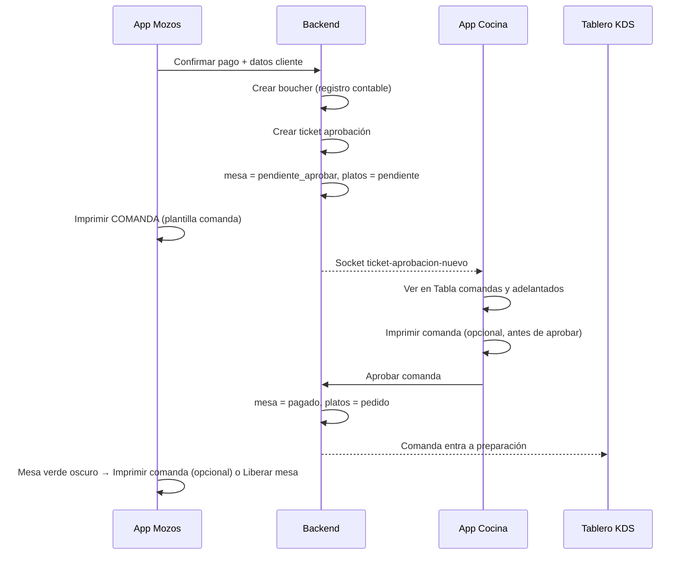
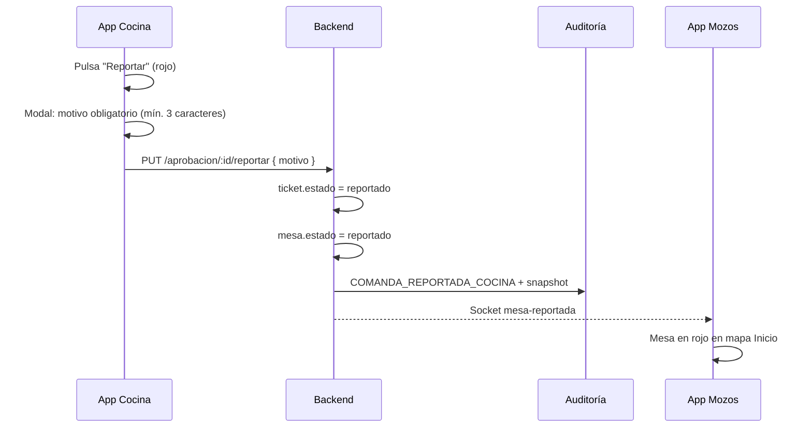

# Plan de implementación — Plantilla Comandas, aprobación cocina y reporte

**Versión:** 1.1  
**Fecha:** Junio 2026  
**Cambios v1.1:** Mesa `pagado` permite reimprimir comanda en mozos; regla global: todo lo que hoy es boucher en App Mozos pasa a ser imprimir comanda.
**Alcance:** Backend Las Gambusinas (`backend-gambusinas`), App Mozos (`gambusinas`), App Cocina (`appcocina`)  
**Documentación relacionada:**
- [PLAN_PAGOS_ADELANTADOS.md](./PLAN_PAGOS_ADELANTADOS.md) — flujo PPA existente
- [PLAN_PAGOS_PARCIALES_Y_VOUCHERS_AGRUPADOS.md](./PLAN_PAGOS_PARCIALES_Y_VOUCHERS_AGRUPADOS.md) — `PagosScreen` y bouchers
- [PLAN_METODO_PAGO_Y_VUELTO_GLM-5.2.md](./PLAN_METODO_PAGO_Y_VUELTO_GLM-5.2.md) — método de pago y vuelto
- [APP_MOZOS_DOCUMENTACION_COMPLETA.md](./APP_MOZOS_DOCUMENTACION_COMPLETA.md)
- [App Mozos, App Cocina, Backend Las Gambusinas.md](./App%20Mozos,%20App%20Cocina,%20Backend%20Las%20Gambusinas.md)

---

## 1. Resumen ejecutivo

### Objetivo

Introducir un nuevo ciclo operativo en Las Gambusinas:

1. **Plantilla Comandas** — ticket térmico 80 mm configurable en `comandas.html`, orientado a comanda de cocina/servicio (no comprobante fiscal).
2. **Impresión Comanda en lugar de Boucher (App Mozos)** — en el app de mozos **no existe impresión de boucher/voucher**: toda acción, botón, modal o flujo que hoy diga o use boucher para imprimir/compartir pasa a **imprimir comanda** con la plantilla configurada. El boucher sigue creándose y persistiéndose en backend solo como registro contable y de auditoría.
3. **Aprobación obligatoria en cocina** — tras confirmar pago e imprimir comanda, la mesa queda en `pendiente_aprobar` hasta que cocina apruebe.
4. **Bandeja unificada en cocina** — renombrar y ampliar "Tickets de Pagos Adelantados" para aprobar comandas normales y pagos adelantados.
5. **Acción Reportar** — cocina puede reportar una comanda con motivo obligatorio; la mesa pasa a estado `reportado` (rojo) visible para mozos y queda en auditoría.

### Principio clave

| Acción | Boucher en BD | Impresión en App Mozos |
|--------|---------------|------------------------|
| Mozo confirma pago normal | ✅ Creado | Comanda (plantilla comanda) |
| Mozo confirma PPA | ✅ Creado (`esPagoAdelantado: true`) | Comanda |
| Mesa `pendiente_aprobar` / `pendiente_pago` | ✅ Registro existente | Comanda (reimpresión opcional) |
| Mesa `pagado` (tras aprobación cocina) | ✅ Registro existente | **Comanda (reimpresión opcional si el mozo lo desea)** |
| Mesa `reportado` | ✅ Registro intacto | Comanda (reimpresión opcional) |
| Dashboard `comandas.html` | — | Comanda |
| Dashboard `bouchers.html` | Consulta / edición | Voucher (solo admin, sin cambio) |

> **Regla App Mozos:** cualquier pantalla, alert, modal o servicio que hoy exponga *Imprimir Boucher*, *Imprimir Ticket*, *Compartir boucher* o equivalente debe renombrarse y ejecutar **imprimir comanda**. Los datos del boucher asociado (moneda, método de pago, cliente) se usan solo como **fuente de datos** para rellenar la plantilla de comanda, no para generar un ticket fiscal.

### Flujo de alto nivel

```
Mozo confirma pago → POST /boucher (registro) → mesa = pendiente_aprobar → imprime COMANDA
       ↓
Cocina ve en "Tabla de comandas y pagos adelantados"
       ↓
  [Imprimir] [Aprobar] [Reportar]
       ↓                    ↓
mesa = pagado          mesa = reportado (rojo)
platos = pedido        auditoría + motivo visible para mozos
entra al KDS           (mozo puede reimprimir comanda si quiere)
```

---

## 2. Referencia del código actual

| Componente | Ubicación | Rol actual |
|------------|-----------|------------|
| Tab + editor voucher | `backend-gambusinas/public/bouchers.html` | UI Alpine.js con preview 80 mm |
| Tabla comandas | `backend-gambusinas/public/comandas.html` | Sin tabs; solo gestión de comandas |
| Schema plantilla voucher | `configuracionSistema.model.js` → `voucherPlantilla` | MongoDB |
| API plantilla voucher | `GET/PUT /api/configuracion/voucher-plantilla` | `configuracionController.js` |
| Generador HTML boucher (mozos) | `gambusinas/utils/boucherHtml.js` | PDF / compartir |
| Servicio impresión mozos | `gambusinas/services/boucherPrint/index.js` | Post-pago |
| Logo compartido | `gambusinas/utils/logoPlantilla.js` | PNG/base64 en móvil |
| Pago y mesa pagada | `gambusinas/Pages/navbar/screens/PagosScreen.js` | Tras pago → imprimir boucher (→ **migrar a imprimir comanda**) |
| Mapa de mesas | `gambusinas/Pages/navbar/screens/InicioScreen.js` | Estados y colores |
| Bandeja PPA cocina | `appcocina/src/components/pages/TicketsPpaPage.jsx` | Aprobación pagos adelantados |
| Sidebar PPA | `appcocina/src/components/Principal/PpaSidebar.jsx` | Acceso rápido en KDS |
| Hook PPA | `appcocina/src/hooks/useTicketsPPA.js` | API `/pago-adelantado` |
| Estados mesa | `backend-gambusinas/src/database/models/mesas.model.js` | Sin `pendiente_aprobar` ni `reportado` |
| Auditoría | `backend-gambusinas/src/database/models/auditoriaAcciones.model.js` | Acciones del sistema |

---

## 3. Plantilla Comandas (Backend + Dashboard)

### 3.1 Objetivo

Copiar el patrón de **Plantilla Voucher** (`bouchers.html` tab "Plantilla Voucher") hacia `comandas.html` como tab **"Plantilla Comandas"**. Es una plantilla estricta de comanda, no de comprobante fiscal.

### 3.2 Diferencias: Voucher vs Comanda

| Incluir en comanda | Excluir explícitamente |
|--------------------|------------------------|
| Logo PNG (desde `voucherPlantilla.logo`) | Boleta de venta electrónica |
| Nombre comercial + eslogan (opcional) | RUC, dirección, teléfono |
| Título: `COMANDA` | IGV, RC, ICBPER, propina, total en letras |
| Nº comanda, fecha/hora, mesa, mozo, área | Serie / correlativo fiscal |
| Detalle platos + complementos + notas + `(P.L.)` | Bloque promoción / QR / URL SUNAT |
| Total (una sola línea, sin desglose IGV) | Voucher ID / Nro. Voucher / fecha de pago |
| Moneda, tipo de pago | |
| Nombre cliente, DNI | |
| Observaciones de comanda | |

### 3.3 Wireframe del ticket

```
┌──────────────────────────────┐
│         [LOGO PNG]           │
│      LAS GAMBUSINAS          │
│  * Comidas Típicas y Parrilla*│
├ ─ ─ ─ ─ ─ ─ ─ ─ ─ ─ ─ ─ ─ ─ ┤
│         C O M A N D A        │
├ ─ ─ ─ ─ ─ ─ ─ ─ ─ ─ ─ ─ ─ ─ ┤
│ Comanda:        152          │
│ Fecha:    19/06/2026 14:30   │
│ Mesa:              M05       │
│ Mozo:         Juan Pérez     │
│ Área:           Terraza      │
│ Moneda:           Soles      │
│ Pago:           Efectivo     │
├ ─ ─ ─ ─ ─ ─ ─ ─ ─ ─ ─ ─ ─ ─ ┤
│ Producto      Cant.    Total │
│ 1/4 pollo       1    19.90   │
│  └ Pollo extra               │
│ Lomo saltado    2    45.00   │
│   (P.L.)                     │
├ ─ ─ ─ ─ ─ ─ ─ ─ ─ ─ ─ ─ ─ ─ ┤
│ TOTAL:              S/.64.90 │
├ ─ ─ ─ ─ ─ ─ ─ ─ ─ ─ ─ ─ ─ ─ ┤
│ Cliente:    María García     │
│ DNI:        12345678         │
│ Obs: Sin cebolla en lomo     │
└──────────────────────────────┘
```

### 3.4 Schema `comandaPlantilla` (nuevo en `configuracionSistema.model.js`)

```javascript
comandaPlantilla: {
  // logo: NO persistir aquí — se referencia desde voucherPlantilla.logo
  restaurante: {
    nombre: String,
    eslogan: String
    // sin ruc, direccion, telefono
  },
  encabezado: {
    titulo: { type: String, default: 'COMANDA' }
  },
  bloques: {
    mostrarEncabezado: Boolean,
    mostrarDatosComanda: Boolean,
    mostrarDetalleProductos: Boolean,
    mostrarTotal: Boolean,
    mostrarDatosCliente: Boolean,
    mostrarObservaciones: Boolean
  },
  visibilidad: {
    nombre, eslogan,
    comandaNumero, fechaPedido, mesa, mozo, area,
    moneda, tipoPago, cliente, dniCliente,
    observaciones, total
  },
  espaciado: { lineHeight, tamanoFuente, espacioDivider },
  mensajes: {
    pie: String  // opcional, ej: "Entregar en cocina"
  },
  etiquetas: {
    comandaNumero, fechaPedido, mesa, mozo, area,
    moneda, tipoPago, total, cliente, dni, observaciones
  }
}
```

### 3.5 API plantilla comanda

| Método | Ruta | Comportamiento |
|--------|------|----------------|
| `GET` | `/api/configuracion/comanda-plantilla` | Devuelve `comandaPlantilla` + inyecta `logo` desde `voucherPlantilla.logo` |
| `PUT` | `/api/configuracion/comanda-plantilla` | Guarda solo campos de comanda; **no sobrescribe logo** |

Sincronización al GET (igual que voucher):

```javascript
plantilla.logo = config.voucherPlantilla?.logo || config.datosFiscales?.logoUrl || '';
plantilla.restaurante.nombre = config.datosFiscales?.nombreComercial || plantilla.restaurante.nombre;
```

### 3.6 Estrategia del logo compartido

```
bouchers.html (Tab Voucher)  ──upload PNG──►  voucherPlantilla.logo
                                                      │
                                         GET sync logo │
                                                      ▼
                              comandas.html (Tab Plantilla Comandas)
                              Solo preview + enlace "Editar logo en Vouchers"
```

- El upload del logo **permanece solo en Plantilla Voucher**.
- Al guardar plantilla comanda: no enviar `logo` en el body del PUT (o ignorarlo en backend).

### 3.7 Cambios en `comandas.html`

**Sistema de tabs** (patrón `bouchers.html`):

```
[📋 Tabla]  [🍽️ Plantilla Comandas ●]
```

**Estado Alpine nuevo en `comandasApp()`:**

```javascript
activeTab: 'tabla',           // 'tabla' | 'plantilla'
plantillaModificada: false,
plantilla: { /* comandaPlantilla */ },
plantillaOriginal: null,
previewZoom: 100,
datosEjemplo: { /* mock comanda */ },
```

**Sidebar del editor** (versión reducida vs voucher):

| Sección | Contenido |
|---------|-----------|
| Logo | Solo preview + enlace a `/bouchers.html` |
| Restaurante | Nombre + eslogan |
| Encabezado | Título editable (default `COMANDA`) |
| Visibilidad | Toggles por campo |
| Secciones | Checkboxes: encabezado, datos, detalle, total, cliente, observaciones |
| Productos de prueba | Selector de platos (como voucher) |
| Espaciado | Sliders lineHeight / fuente / divider |
| Etiquetas | Personalización de labels |
| Acciones | Restablecer / Guardar |

**Secciones que NO copiar del voucher:** datos fiscales, tipo comprobante, impuestos, promoción/QR, URL consulta SUNAT.

**Funciones JS** (adaptar desde `bouchersApp`):

| Función voucher | Equivalente comanda |
|-----------------|---------------------|
| `cargarPlantillaLocal()` | `cargarPlantillaComanda()` → `GET /comanda-plantilla` |
| `guardarPlantilla()` | `PUT /comanda-plantilla` + `localStorage: comandaPlantilla` |
| `generarPreviewVoucher()` | `generarPreviewComanda()` |
| `imprimirPreview()` | `imprimirPreviewComanda()` |
| `obtenerEtiqueta()` / `deepMerge()` | Reutilizar tal cual |

**Acción Imprimir en tabla** — columna Acciones (junto a 👁 ✏️ 🗑️):

```html
<button @click.stop="imprimirComanda(row.comanda)" title="Imprimir comanda">🖨️</button>
```

Flujo `imprimirComanda(comanda)`:

1. `GET /api/configuracion/comanda-plantilla`
2. `GET /api/comanda/:id` (detalle con platos, cliente, boucher asociado)
3. `mapComandaATicket()` + `generarPreviewComanda()`
4. `window.open()` → `window.print()` (80 mm)

También en modal de detalle: botón **🖨️ Imprimir comanda**.

### 3.8 Mapeo datos reales → ticket

```javascript
function mapComandaATicket(comanda, boucherOpcional, config) {
  return {
    comandaNumero: comanda.comandaNumber,
    fechaPedido: formatFecha(comanda.createdAt),
    mesa: formatearNombreMesa(comanda.mesaNumero, comanda.mesas),
    mozo: comanda.mozoNombre || comanda.mozos?.name,
    area: comanda.areaNombre,
    moneda: boucherOpcional?.moneda || config.moneda || 'Soles',
    tipoPago: boucherOpcional?.metodoPagoLabel || boucherOpcional?.metodoPago || 'Pendiente',
    observaciones: comanda.observaciones,
    productos: comanda.platos.filter(p => !p.eliminado && !p.anulado).map(/* ... */),
    total: calcularTotalPlatos(comanda),
    cliente: {
      nombre: comanda.clienteNombre || comanda.cliente?.nombre || 'Invitado',
      dni: comanda.cliente?.dni || ''
    }
  };
}
```

---

## 4. Nuevos estados y colores

### 4.1 Estado de mesa

**Schema `mesas.model.js`** — agregar al enum:

```javascript
enum: [
  'libre', 'esperando', 'pedido', 'preparado',
  'pagado', 'reservado', 'pendiente_pago',
  'pendiente_aprobar',  // NUEVO — tras pago normal + imprimir comanda
  'reportado'           // NUEVO — tras reporte de cocina
]
```

| Estado | Cuándo | Color en mapa mozos |
|--------|--------|---------------------|
| `pendiente_aprobar` | Mozo confirma pago e imprime comanda | Verde claro `#4CAF50` (color actual de Pagado) |
| `pendiente_pago` | PPA registrado (sin cambio) | Naranja `#FF9800` |
| `pagado` | Cocina aprueba la comanda | Verde oscuro/saturado `#1B5E20` o `#2E7D32` |
| `reportado` | Cocina reporta con motivo | **Rojo `#F44336`** |

### 4.2 Estado de platos

**Nuevo valor en enum** de `comanda.model.js` → `platos.estado`:

```javascript
enum: ['pendiente', 'pedido', 'en_espera', 'recoger', 'salio', 'entregado', 'pagado']
```

| Momento | Estado plato |
|---------|--------------|
| Mozo confirma pago (esperando cocina) | `pendiente` |
| Cocina aprueba | `pedido` (entra al KDS) |
| PPA aprobado (flujo existente) | Sin cambio |

Los platos en `pendiente` **no deben aparecer** en el tablero KDS hasta la aprobación.

### 4.3 Diagrama de estados de mesa



### 4.4 Acciones al tocar mesa en InicioScreen (App Mozos)

| Estado mesa | Opciones en alert |
|-------------|-------------------|
| `pendiente_aprobar` | **Imprimir comanda** + **Ver pedido** |
| `pendiente_pago` (PPA) | **Imprimir comanda** + **Ver pedido** (antes "Imprimir Ticket") |
| `pagado` (verde oscuro) | **Imprimir comanda** + **Ver pedido** + **Liberar mesa** |
| `reportado` (rojo) | **Imprimir comanda** + **Ver pedido** + mensaje con motivo del reporte |

En todos los estados anteriores, **Imprimir comanda** es opcional: el mozo decide si reimprime; no es obligatorio tras la aprobación.

---

## 5. Flujo de aprobación cocina

### 5.1 Secuencia completa



### 5.2 Cambios en `procesarPagoBoucher()` (pago normal, no PPA)

| Antes | Después |
|-------|---------|
| Marca platos `pagado` | Marca platos `pendiente` |
| Mesa → `pagado` | Mesa → `pendiente_aprobar` |
| Emite socket mesa pagada | Emite socket `ticket-aprobacion-nuevo` |
| Retorna boucher para imprimir voucher | Retorna boucher + ticket; mozos imprimen **comanda**, no voucher |

El boucher se crea **igual** — no se elimina lógica contable.

### 5.3 Modelo de ticket de aprobación

**Opción recomendada — bandeja unificada `TicketAprobacion`:**

```javascript
{
  tipo: 'comanda_completa' | 'pago_adelantado',
  estado: 'pendiente_aprobacion' | 'aprobado' | 'rechazado' | 'reportado',
  mesaId, mesaNumero,
  comandasIds: [],
  boucherId,
  platos: [{ comandaId, platoIndex, nombre, cantidad, ... }],
  cliente: { nombre, dni },
  moneda, metodoPago, total,
  aprobadoPor, aprobadoAt,
  reportadoPor, reportadoAt,
  motivoReporte,    // obligatorio si estado = reportado
  rechazadoMotivo
}
```

Los `TicketPagoAdelantado` existentes pueden mapearse a `tipo: 'pago_adelantado'` en la misma vista, o unificarse solo en frontend (menor riesgo).

### 5.4 Endpoints de aprobación

| Método | Ruta | Descripción |
|--------|------|-------------|
| `GET` | `/api/aprobacion/pendientes` | Lista unificada: comandas + PPA pendientes |
| `PUT` | `/api/aprobacion/:id/aprobar` | Aprueba comanda o PPA |
| `PUT` | `/api/aprobacion/:id/reportar` | Reporta con motivo obligatorio |
| `PUT` | `/api/aprobacion/:id/rechazar` | Rechaza (opcional; puede unificarse con reportar) |
| `GET` | `/api/comanda/:id/ticket-imprimible` | Datos mapeados para plantilla comanda |

**Al aprobar comanda completa:**

1. Ticket → `aprobado`
2. Platos `pendiente` → `pedido`
3. Mesa `pendiente_aprobar` → `pagado`
4. Socket `comanda-aprobada` → KDS + Mozos

---

## 6. App Mozos — cambios detallados

### 6.0 Regla global: boucher → imprimir comanda

En **todo** el App Mozos, la impresión/compartición al usuario final es siempre **comanda** (plantilla `comandaPlantilla`). No hay flujo de usuario que genere PDF/XML de voucher/boucher.

| Ámbito | Antes | Después |
|--------|-------|---------|
| Textos UI | "Imprimir Boucher", "Imprimir Ticket", "Compartir boucher" | **"Imprimir comanda"** (único término) |
| `PagosScreen` post-pago | `generarBoucher()` | `generarComanda()` |
| `ModalPagoExitoso` | Compartir/imprimir boucher | Imprimir comanda |
| `InicioScreen` mesa `pagado` | Imprimir boucher + Liberar | **Imprimir comanda** + Ver pedido + Liberar |
| `InicioScreen` mesa `pendiente_aprobar` / PPA | Imprimir ticket | Imprimir comanda |
| AsyncStorage `boucherParaImprimir` | Payload para impresión voucher | Renombrar a `comandaParaImprimir` o reutilizar con datos mapeados a comanda |
| Servicio `boucherPrint` | Orquestador de impresión | `comandaPrint` (o adaptar `boucherPrint` para delegar en `comandaHtml`) |

**Se mantiene en backend/código interno (no visible como impresión al mozo):**

- `POST /boucher`, `boucherData`, `ultimoBoucher` — registro y datos de pago para rellenar la comanda
- Lógica de pagos parciales y consolidado de bouchers en API

**Deprecar en mozos (no invocar desde UI):**

- `generarHtmlBoucher`, `compartirBoucherPdf`, impresión ePOS de voucher
- Mensajes de error del tipo "No se pudo compartir el boucher" → "No se pudo imprimir la comanda"

### 6.1 Impresión: migración técnica Boucher → Comanda

| Archivo | Cambio |
|---------|--------|
| `services/boucherPrint/index.js` | Migrar a `services/comandaPrint/index.js` → `mostrarOpcionesComanda()` / `imprimirComanda()` |
| `utils/boucherHtml.js` | Nuevo `utils/comandaHtml.js` — HTML 80 mm con plantilla comanda |
| `utils/logoPlantilla.js` | Reutilizar (logo del voucher) |
| `PagosScreen.js` → `generarBoucher()` | → `generarComanda()`; `onImprimir` del modal llama comanda |
| `ModalPagoExitoso.js` | Botón y callbacks → **"Imprimir comanda"** |
| `InicioScreen.js` | Todos los alerts y navegaciones con boucher de impresión → comanda |
| `ComandaDetalleScreen.js` | Si existe reimpresión ligada a boucher, unificar en comanda |

**No eliminar del dominio de pagos:**

- `POST /boucher` en `procesarPagoConCliente`
- `setBoucherData`, `ultimoBoucher` en AsyncStorage (fuente de moneda, pago, totales)
- Archivos `boucherPdfNative.js`, `boucherEposXml.js` pueden quedar en repo para dashboard/admin, pero **sin imports desde pantallas mozos**

### 6.2 Flujo post-pago en `PagosScreen.js`

```
procesarPagoConCliente()
  ├─ POST /boucher  ✅ (registro backend)
  ├─ Backend: { boucher, ticketAprobacion, mesaEstado: 'pendiente_aprobar' }
  ├─ NO actualizar mesa a "pagado" localmente
  ├─ ModalPagoExitoso:
  │    ├─ "Imprimir comanda"  → generarComanda({ comandas, boucher, plantilla })
  │    └─ "Ir al inicio"
  └─ InicioScreen: mesa en verde claro (pendiente_aprobar)
```

Eliminar el bloque de retry de mesa a `"pagado"` en flujo de pago normal (~líneas 1756–1880); eso ocurre **solo tras aprobación de cocina** vía socket.

### 6.3 PPA — ajustes

- "Imprimir Ticket" → **"Imprimir comanda"** (misma plantilla)
- El ticket PPA sigue en la bandeja unificada de cocina

### 6.4 Socket / tiempo real (mozos)

| Evento | Acción |
|--------|--------|
| `ticket-aprobacion-nuevo` | Refrescar mesa si es la del mozo |
| `comanda-aprobada` | Mesa `pendiente_aprobar` → `pagado` (verde oscuro) |
| `mesa-reportada` | Mesa → `reportado` (rojo) + mostrar motivo |
| `comanda-rechazada` | Alert al mozo (si se mantiene rechazo separado) |

### 6.5 Cambios en `InicioScreen.js`

- `getEstadoColor()`: casos `pendiente_aprobar`, `pagado` (verde oscuro), `reportado` (rojo)
- `getEstadoMesa()`: reconocer `pendiente_aprobar` y `reportado`
- `handleSelectMesa()`: alerts según tabla §4.4
- Tema: `theme.colors.mesaEstado.reportado = '#F44336'`

**Mesa `pagado` — alert actualizado (reemplaza "Imprimir Boucher"):**

```
Título:  Mesa {n} — Pagado
Mensaje: La comanda fue aprobada por cocina. Puedes liberar la mesa cuando corresponda.
Botones:
  · Imprimir comanda   → generarComanda({ mesa, comandas, boucher asociado })
  · Ver pedido         → ComandaDetalle / comandas pagadas
  · Liberar mesa       → flujo existente de liberación
  · Cerrar
```

La opción **Imprimir comanda** carga comandas + boucher de la mesa (mismo ciclo de pago), aplica `mapComandaATicket()` y la plantilla desde `GET /comanda-plantilla`. Es **opcional**; el mozo no está obligado a imprimir para liberar.

---

## 7. App Cocina — cambios detallados

### 7.1 Renombrado en menú y UI

| Ubicación actual | Texto nuevo |
|------------------|-------------|
| `MenuPage.jsx` — ítem menú | **"Tabla de comandas y pagos adelantados"** |
| `TicketsPpaPage.jsx` — título | **"Tabla de comandas y pagos adelantados"** |
| `PpaSidebar.jsx` — header | **"Comandas y adelantados"** (sidebar compacto) |
| `comandastyle.jsx` / `ComandastylePerso.jsx` — botón toolbar | Mismo rename + badge pendientes |

Ruta interna: `TICKETS_PPA` → `TABLA_APROBACION` (refactor cosmético opcional).

### 7.2 Bandeja unificada

Dos tipos de filas:

| Tipo | Badge | Acciones |
|------|-------|----------|
| Comanda completa | `COMANDA` | Imprimir · Aprobar · **Reportar** |
| Pago adelantado | `ADELANTADO` | Imprimir · Aprobar · **Reportar** |

**Columnas sugeridas:** Hora · Mesa · Mozo · Cliente · Tipo · Total · Moneda · Pago · Estado · Acciones

### 7.3 Botones por fila

```
[ 🖨️ Imprimir ]  [ ✅ Aprobar ]  [ 🔴 Reportar ]
```

| Botón | Color | Cuándo habilitado |
|-------|-------|-------------------|
| Imprimir | Neutro / dorado | Siempre (antes y después de aprobar/reportar) |
| Aprobar | Verde | Solo `pendiente_aprobacion` |
| Reportar | **Rojo** | Solo `pendiente_aprobacion` |

### 7.4 Impresión de comanda en cocina

Nuevo util `appcocina/src/utils/comandaPrint.js`:

```javascript
async function imprimirComanda(ticketOComanda) {
  const plantilla = await apiGet('/api/configuracion/comanda-plantilla');
  const datos = mapTicketAComandaTicket(ticketOComanda);
  const html = generarHtmlComanda({ datos, plantilla });
  // jsPDF 80mm o window.print
}
```

### 7.5 Hook unificado

Extender `useTicketsPPA.js` → `useTablaAprobacion.js`:

```javascript
{
  items,                    // comandas + adelantados
  loading,
  aprobarItem(id, tipo),
  reportarItem(id, tipo, motivo),
  imprimirComanda(item),
  fetchItems()
}
```

### 7.6 KDS — filtrado de platos

Además del filtro PPA existente:

```javascript
// Ocultar platos en estado "pendiente" (comanda esperando aprobación)
if ((p.estado || '').toLowerCase() === 'pendiente') return false;
```

### 7.7 Socket cocina

| Evento | Acción |
|--------|--------|
| `ticket-aprobacion-nuevo` | `fetchItems()` + sonido |
| `pago-adelantado-nuevo` | Mantener existente |
| `ticket-reportado` | Actualizar lista |

---

## 8. Acción «Reportar»

### 8.1 Flujo de usuario (cocina)



**Validación UI** (patrón `PpaSidebar.jsx` rechazo):

- Textarea motivo obligatorio, mínimo 3 caracteres
- Confirmación: *"¿Reportar la comanda de Mesa X? El mozo será notificado."*

### 8.2 Endpoint Reportar

```
PUT /api/aprobacion/:ticketId/reportar
```

**Body:**

```json
{
  "motivo": "Cliente no coincide con el pedido",
  "usuarioId": "...",
  "usuarioNombre": "Cocina - Juan"
}
```

**Validaciones:**

- `motivo` requerido, `trim().length >= 3`
- Ticket en `pendiente_aprobacion` únicamente

**Efectos:**

| Entidad | Cambio |
|---------|--------|
| `TicketAprobacion` | `estado → reportado`, guardar motivo y usuario |
| `Mesa` | `estado → reportado` |
| `Comanda(s)` | Platos permanecen en `pendiente` |
| `Boucher` | **Sin anular** — registro intacto |
| Auditoría | Registro completo con snapshot |
| Socket | `mesa-reportada` + `ticket-reportado` |

### 8.3 Auditoría

Nuevas acciones en `auditoriaAcciones.model.js`:

```javascript
'COMANDA_REPORTADA_COCINA',
'PPA_REPORTADO_COCINA',
'MESA_ESTADO_REPORTADO'
```

Registro al reportar:

```javascript
{
  accion: 'COMANDA_REPORTADA_COCINA',  // o PPA_REPORTADO_COCINA
  entidadId: comandaId,
  entidadTipo: 'comanda',
  usuario: cocineroId,
  motivo: motivo.trim(),
  datosAntes: { mesaEstado, ticketEstado, comandas, boucherId },
  datosDespues: { mesaEstado: 'reportado', ticketEstado: 'reportado' },
  metadata: { mesaId, mesaNumero, mozoNombre, clienteNombre, total, platos, reportadoPorNombre }
}
```

Visibilidad en `auditoria.html`: filtro por acción + columna Motivo + enlace a comanda.

### 8.4 Reportar vs Rechazar (PPA actual)

| | **Reportar** (nuevo) | **Rechazar** (PPA actual) |
|--|----------------------|---------------------------|
| Propósito | Incidencia visible para mozo | Cancelar ticket PPA |
| Color mesa | Rojo `reportado` | Según lógica PPA |
| Auditoría | `COMANDA_REPORTADA_COCINA` | Acción rechazo PPA |
| Mozo ve mesa | Sí, en rojo con motivo | Variable |

**Recomendación:** unificar en UI bajo **Reportar** (rojo) para comandas y adelantados; deprecar **Rechazar** o mapearlo internamente a `reportar`.

### 8.5 Vista mozo — mesa reportada

```
Título:  Mesa {n} — Reportada
Mensaje: Cocina reportó un problema con esta comanda.
         Motivo: "{motivoReporte}"
Botones:
  · Ver pedido
  · Imprimir comanda
  · Cerrar
```

---

## 9. Casos borde

| Caso | Propuesta |
|------|-----------|
| Pagos parciales | Solo generar ticket de aprobación cuando `mesaPagadaCompletamente === true` |
| Rechazo / reporte | Boucher no se anula; mesa en `reportado`; resolución manual en fase 2 |
| Mesa PPA + pago final | Dos tickets en bandeja |
| Comanda sin cliente | DNI vacío; nombre "Invitado" |
| Mozo reimprime tras aprobación (mesa `pagado`) | **Permitido** desde alert de Inicio ("Imprimir comanda") o desde Ver pedido |
| Cualquier reimpresión en mozos | Siempre plantilla comanda, nunca voucher |
| Precios en comanda de cocina | Toggle `mostrarPrecios` en plantilla (definir con negocio) |

---

## 10. Archivos a modificar

### Backend (`backend-gambusinas`)

| Archivo | Cambio |
|---------|--------|
| `public/comandas.html` | Tabs, plantilla, imprimir, acción 🖨️ |
| `src/database/models/configuracionSistema.model.js` | `comandaPlantilla` |
| `src/database/models/mesas.model.js` | `pendiente_aprobar`, `reportado` |
| `src/database/models/comanda.model.js` | `platos.estado: pendiente` |
| `src/database/models/auditoriaAcciones.model.js` | Acciones reporte |
| `src/database/models/ticketAprobacion.model.js` | Nuevo (o extensión PPA) |
| `src/controllers/configuracionController.js` | GET/PUT comanda-plantilla |
| `src/services/boucherPagoService.js` | Flujo pendiente_aprobar |
| `src/services/aprobacionComanda.service.js` | Nuevo |
| `src/controllers/aprobacionController.js` | aprobar / reportar |
| `src/socket/events.js` | Eventos nuevos |

### App Mozos (`gambusinas`)

| Archivo | Cambio |
|---------|--------|
| `Pages/navbar/screens/PagosScreen.js` | Comanda print; eliminar UI de boucher; sin mesa pagado inmediato |
| `Pages/navbar/screens/InicioScreen.js` | Estados, colores, alerts; **pagado** incluye Imprimir comanda |
| `Pages/navbar/screens/ModalPagoExitoso.js` | Solo imprimir comanda |
| `Pages/ComandaDetalleScreen.js` | Revisar y unificar cualquier acción de impresión → comanda |
| `utils/comandaHtml.js` | Nuevo |
| `services/comandaPrint/index.js` | Nuevo |
| `hooks/useSocketMozos.js` | Handlers aprobación y reporte |

### App Cocina (`appcocina`)

| Archivo | Cambio |
|---------|--------|
| `src/components/pages/MenuPage.jsx` | Rename menú |
| `src/components/pages/TicketsPpaPage.jsx` | Bandeja unificada + Reportar |
| `src/components/Principal/PpaSidebar.jsx` | Rename + Reportar |
| `src/components/Principal/comandastyle.jsx` | Filtro platos pendiente |
| `src/components/Principal/ComandastylePerso.jsx` | Idem |
| `src/hooks/useTablaAprobacion.js` | Nuevo |
| `src/utils/comandaPrint.js` | Nuevo |

---

## 11. Fases de implementación

| Fase | Alcance | Días est. |
|------|---------|-----------|
| **A** | Backend: `comandaPlantilla`, estados mesa/plato, tickets aprobación, modificar `procesarPagoBoucher` | 3–4 |
| **A.1** | Backend: endpoint reportar + auditoría + sockets | +1 |
| **B** | Dashboard `comandas.html`: tab Plantilla + acción imprimir | 2–3 |
| **C** | App Mozos: `comandaPrint`, estados, colores, sockets | 3–4 |
| **D** | App Cocina: bandeja unificada, Reportar, imprimir comanda | 3–4 |
| **E** | QA integral | 2 |
| | **Total estimado** | **~14–18 días** |

### Orden recomendado dentro de cada fase

**Fase A:**
1. Schema `comandaPlantilla` + endpoints GET/PUT
2. Enum `pendiente_aprobar`, `reportado` en mesas
3. Enum `pendiente` en platos
4. Modelo `TicketAprobacion`
5. Modificar `procesarPagoBoucher` (pago normal)
6. Endpoints aprobar / reportar
7. Eventos Socket.io

**Fase B:**
1. Tabs en `comandas.html`
2. Editor plantilla + preview
3. `generarPreviewComanda()` + `imprimirComanda()` en tabla y modal

**Fase C:**
1. `comandaHtml.js` + `comandaPrint` (reemplazo total de impresión boucher en UI)
2. PagosScreen + ModalPagoExitoso → solo imprimir comanda
3. InicioScreen: estados/colores/alerts; **mesa `pagado` con Imprimir comanda opcional**
4. Barrido de strings y rutas "boucher" de impresión en todo el app mozos
5. Sockets

**Fase D:**
1. Rename UI cocina
2. Bandeja unificada
3. Botones Imprimir / Aprobar / Reportar
4. Filtro KDS platos `pendiente`

---

## 12. Checklist QA

### Plantilla e impresión
- [ ] Tab "Plantilla Comandas" no rompe tabla existente
- [ ] Preview sin RUC, IGV, boleta electrónica
- [ ] Preview con moneda, tipo pago, cliente, DNI
- [ ] Logo del voucher visible sin subirlo en comandas
- [ ] Guardar plantilla persiste en MongoDB
- [ ] Imprimir desde `comandas.html` acopla datos reales

### Flujo aprobación
- [ ] Pago normal → mesa `pendiente_aprobar` (verde claro)
- [ ] Cocina aprueba → mesa `pagado` (verde oscuro) → liberable
- [ ] Platos no entran al KDS hasta aprobación
- [ ] PPA sigue funcionando en bandeja unificada
- [ ] Boucher creado en backend; mozos **nunca** imprimen voucher (solo comanda)
- [ ] Mesa `pagado`: alert muestra **Imprimir comanda** + Liberar mesa
- [ ] Reimpresión en mesa `pagado` genera ticket con plantilla comanda correcta
- [ ] No quedan strings "Imprimir Boucher" / "Compartir boucher" en UI mozos

### Reportar
- [ ] Botón Reportar rojo junto a Aprobar e Imprimir
- [ ] Motivo obligatorio (mín. 3 caracteres)
- [ ] Mesa roja en InicioScreen de mozos
- [ ] Mozo ve motivo al tocar mesa reportada
- [ ] Registro en auditoría con comanda, mesa, mozo
- [ ] Boucher no se elimina al reportar
- [ ] Socket actualiza mozos sin refresh manual

### Pagos parciales
- [ ] Solo último pago del ciclo genera ticket de aprobación
- [ ] Consolidado boucher sigue en backend

---

## 13. Decisiones pendientes con negocio

1. **¿Mostrar precios en comanda de cocina?** — Toggle `mostrarPrecios` en plantilla.
2. **¿Resolución de mesa reportada?** — Quién y cómo pasa de `reportado` a otro estado.
3. **¿Unificar Rechazar con Reportar?** — Recomendado: solo Reportar en UI.
4. **¿Imprimir tras aprobación desde mozos?** — **Resuelto:** opcional desde alert de mesa `pagado` ("Imprimir comanda") o desde Ver pedido; nunca automático ni obligatorio para liberar.

---

*Documento generado a partir del plan de implementación acordado en sesión de diseño — Junio 2026.*
